# 计算机组成原理

## 第一章 计算机系统概述

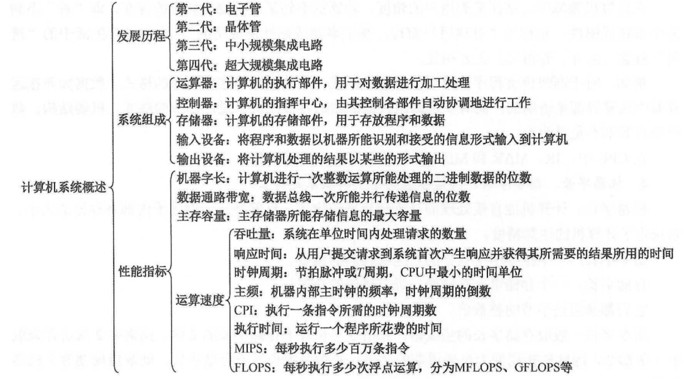

1. 计算机由哪几部分组成？以哪部分为中心？
2. 主频高的CPU一定比主频低的CPU快吗？为什么？
3. 翻译程序、汇编程序、编译程序、解释程序有什么差别？各自的特性是什么？
4. 不同级别的语言编写的程序有什么区别？哪种语言编写的程序能被硬件直接执行？

### 1.1 计算机发展历程

#### 1.1.1  计算机硬件的发展

计算机系统=硬件+软件

计算机硬件的发展：
+ 第一代计算机：(使用电子管)
+ 第二代计算机：(使用晶体管)
+ 第三代计算机：(使用较小规模的集成)
+ 第四代计算机：(使用较大规模的集成)

已经经历了4代，计算机的速度越来越快，并且体积变得越来越小。

**发展趋势：更微型、多用途；更巨型、超高速**

摩尔定律，集成电路上的晶体管数量每18月就会翻一翻，所以每18月计算机的处理效率就会提高一倍。

#### 1.1.2 计算机软件的发展
计算机软件技术的发展，促进计算机系统的发展。

计算机语言的发展经历了面向机器的机器语言和汇编语言、面向问题的高级语言。其中高级语言的发展真正促进了软件的发展，它经历了从科学计算和工程计算的 FORTRAN、结构化程序设计的 PASCAL到面向对象的C++和适应网络环境的Java。

同时，直接影响计算机系统性能提升的各种系统软件也有了长足的发展，特别是操作系统，如 Windows、UNIX、 Linux等。

#### 1.1.3 计算机的分类与发展方向
可以分为：

+ 电子模拟计算机（依赖电子管，用连续变化的物理量）
+ 电子**数字计算机**

**数字计算机**又可以按照用途分为：
+ 专用计算机（是针对单一或少数特定任务设计的定制化计算机。
硬件结构简化，无需复杂编程，适合重复执行同一类任务）
+ **通用计算机**

**通用计算机**又分为：
+ 巨型机（“天河” 系列超算）
+ 大型机（IBM 4300 系列，常用于银行、航空公司等大型企业的数据中心，承担海量数据处理和高并发业务）
+ 中型机（多应用于中型企业的核心业务系统）
+ 小型机（在工业自动化控制、医疗设备数据采集等场景中较为常见，比如工厂的生产流程控制）
+ 微型机（个人电脑（如台式机、笔记本电脑）、服务器（如戴尔、惠普的机架式服务器））
+ 单片机（51 单片机）

按照指令和数据流可以分为：

+ 单指令流和单数据流系统（SISD），即传统的冯·诺依曼体系结构。
+ 单指令流和多数据流系统（SIMD），包括阵列处理器和向量处理器系统。
+ 多指令流和单数据流系统（MISD），这种计算机实际上不存在。
+ 多指令流和多数据流系统（MIMD），包括多处理器和计算机系统。

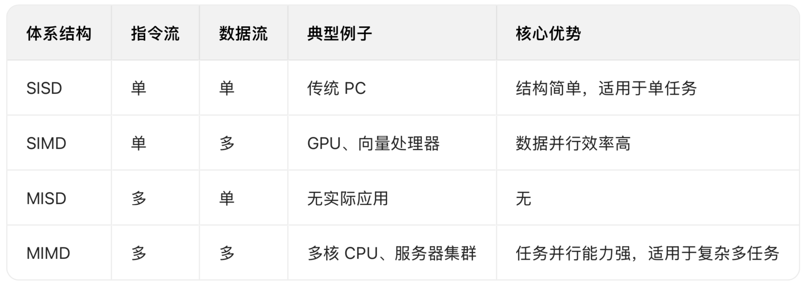

### 1.2 计算机系统层次结构

#### 1.2.1计算机系统的组成

计算机系统由硬件系统和软件系统共同构建起来

#### 1.2.2 计算机硬件的基本组成

**1.早期的冯·诺依曼机**

美籍匈牙利科学家冯·诺依曼最先提出**“程序存储”**的思想，并成功将其运用在计算机的设计之中，根据这一原理制造的计算机被称为冯·诺依曼结构计算机。由于他对现代计算机技术的突出贡献，因此冯·诺依曼又被称为“现代计算机之父”。

什么是存储程序原理？按此原理，计算机应具有哪几大功能？

“程序存储”：指令以代码的形式事先输入到计算机的主存储器中，然后按其在存储器中的首地址执行程序的第一条指令，以后就按该程序的规定顺序执行其他指令，直至程序执行结束。即按地址访问并顺序执行指令。

计算机按照此原理应具有5大功能：**数据传送功能、数据存储功能、数据处理功能、操作控制功能、操作判断功能**

**冯诺曼体系结构特点:**
+ 计算机硬件系统由五大部件组成(存储器、运算器、控制器、输出设备、输入设备)
+ 指令和数据以同等地位存于存储器，可按地址寻访
+ 指令和数据用二进制表示
+ 指令由操作码和地址码组成
+ 存储程序
+ 以运算器为中心

早期的冯·诺依曼机以运算器为中心，且是单处理机，最根本的特征是采用“存储程序”原理，基本工作方式是**控制流驱动方式**！
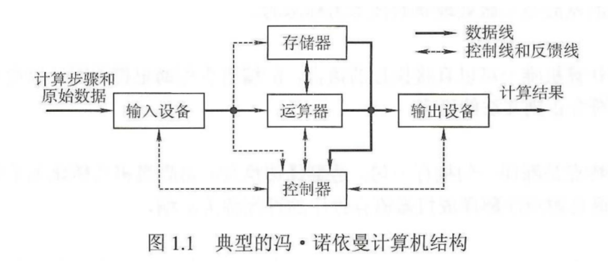

**2.现代计算机的组织结构**

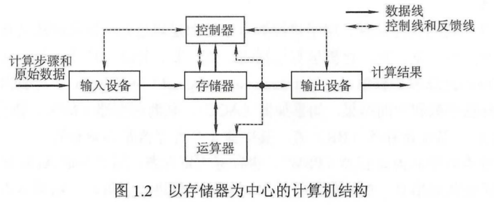

**3.计算机的功能部件**

主机：主存、运算器、控制器

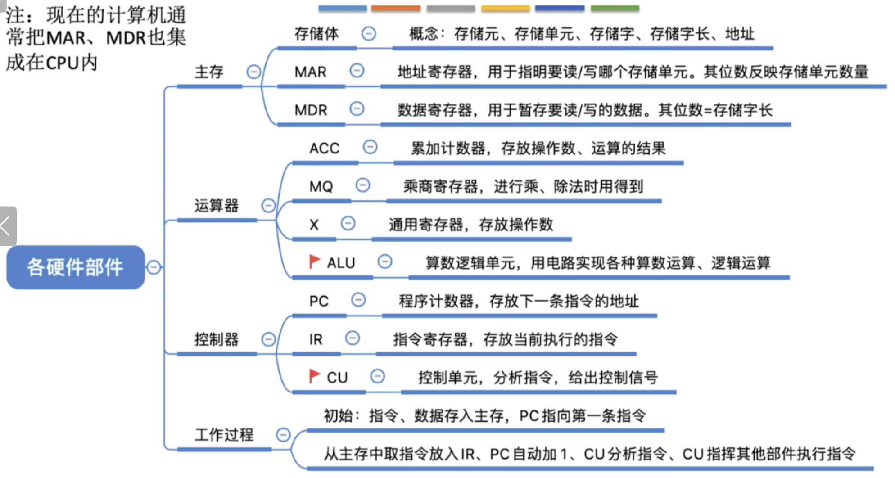

**五大部分：**

1. 输入设备，是指将外部信息以计算机能读懂的方式输入进来，如键盘，鼠标等

2. 输出设备，就是将计算机处理的信息以人所能接受的方式输出出来，比如显示屏，打印机。

3. 存储器，存储器分为 **主存储器**(内存储器，CPU能直接访问)和 **辅助存储器**(外存储器，协助主存储器记忆更多的信息，辅助存储器的信息需要导入到主存储器中，才可以被CPU访问)。

> 主存储器的工作方式是按存储单元的地址进行存取，这种存取方式称为**按地址存取方式**(相联存储器既可以既可以按照地址寻址，又可以按照内容寻址，为了与传统存储器区别，又称为内容寻址的存储器！)

> 主存储器是由地址寄存器(MAR)，数据寄存器(MDR)，存储体，时序控制逻辑，地址寄存器存放访存地址，经过地址译码后找到所选的存储单元。数据寄存器，是存储器与其他部件的中介，用于暂存要从存储器读或写的信息。时序控制逻辑用于产生存储器操作所需的各种时序信号。在现代CPU，MAR和MDR是在CPU中的。

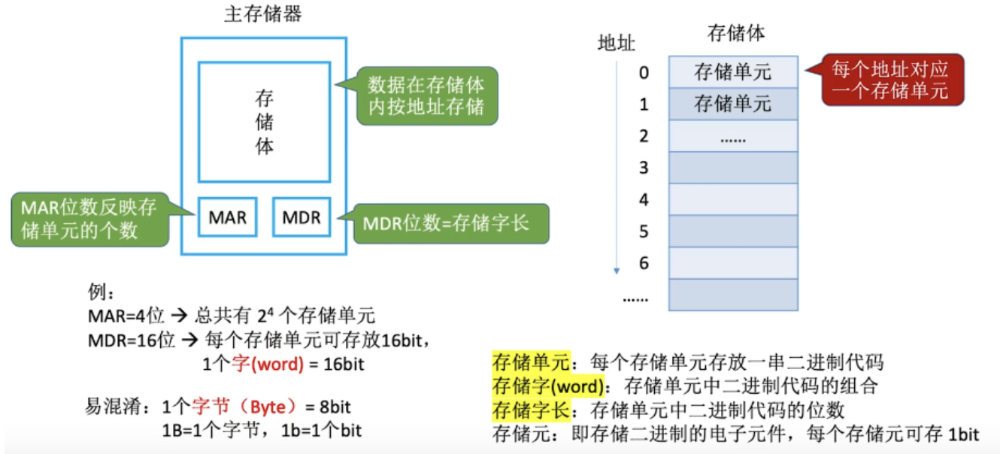

4.运算器，是计算机的运算单元，用于算术运算和逻辑运算
运算器的核心单元是**算术逻辑单元**(ALU)

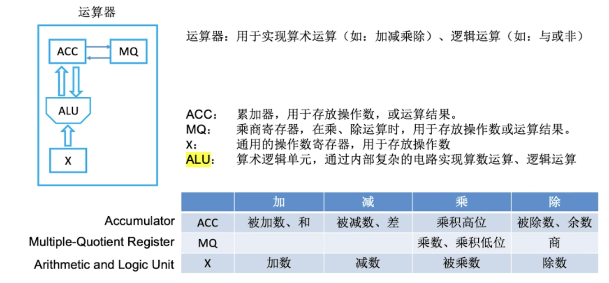

5.控制器，控制器是计算机的指挥中心，有其指挥各部件自动协调第进行工作，**现代计算机将运算器和控制器集成到一个芯片上，合成为中央处理器，简称CPU**。有程序计数器(PC)、指令寄存器(IR)和控制单元(CU)。

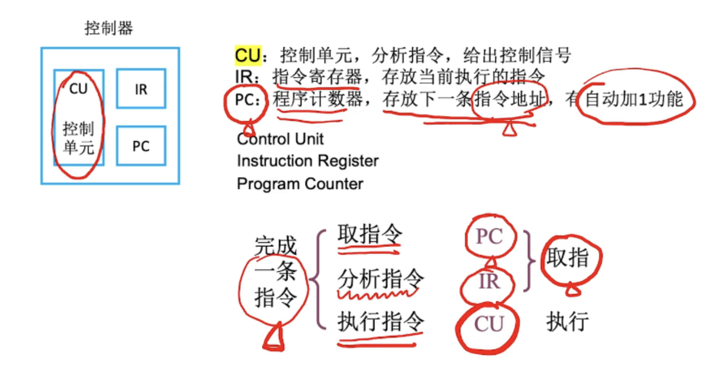

图1.4所示为冯・诺依曼结构的模型机。**CPU包含ALU、通用寄存器组GPRs、标志寄存器、控制器、指令寄存器IR、程序计数器PC、存储器地址寄存器MAR和存储器数据寄存器MDR**。图中从控制器送出的虚线就是控制信号，可以控制如何修改PC以得到下一条指令的地址，可以控制ALU执行什么运算，可以控制主存是进行读操作还是写操作(读/写控制信号)。

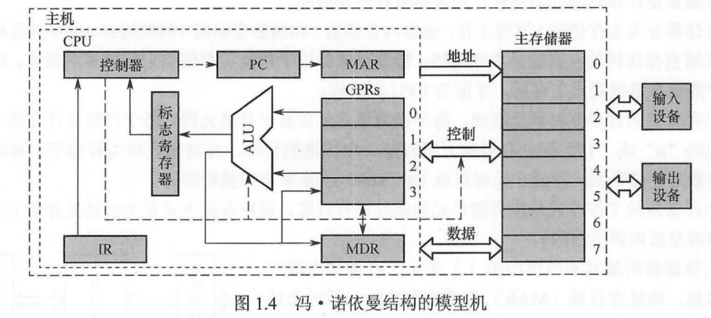

CPU和主存之间通过一组总线相连，总线中有地址、控制和数据3组信号线。MAR中的地址信息会直接送到地址线上，用于指向读/写操作的主存存储单元；控制线中有读/写信号线，指出数据是从CPU写入主存还是从主存读出到CPU,根据是读操作还是写操作来控制将MDR中的数据是直接送到数据线上还是将数据线上的数据接收到MDR中。

**三条总线的传输特点：**
+ 地址总线：单向传输，仅从 CPU 的 MAR（存储器地址寄存器）指向主存储器，用于传递要访问的存储单元地址。
+ 控制总线：双向传输，CPU 和主存储器之间通过控制总线传递控制信号（如读、写命令等）。
+ 数据总线：双向传输，CPU 和主存储器之间通过数据总线传递数据（如指令、运算数据等）。

#### 1.2.3 计算机软件的分类

**1.系统软件和应用软件**

计算机软件，一般分为系统软件和应用软件

系统软件包括 **操作系统，数据库管理系统，语言处理系统(比如编译器)，分布式软件系统，网络软件系统，标准库系统，服务性系统(比如连接程序)**。

应用软件包括各种**科学计算类程序，工程设计类程序，数据统计与处理程序**。

注意：数据库管理系统和数据库系统是有区别的。数据库管理系统是系统软件。而数据库系统一般是由数据库，数据库管理系统，数据库管理员和应用系统构成。所以只能说它里面有系统软件，但并不能说它为系统软件。

**2.三个级别的语言**

1. **机器语言**。又称二进制代码语言，需要编程人员记忆每条指令的二进制编码。机器语言是计算机唯一可以直接识别和执行的语言。
2. **汇编语言**。汇编语言用英文单词或其缩写代替二进制的指令代码，更容易为人们记忆和理解。使用汇编语言编辑的程序，必须经过一个称为汇编程序的系统软件的翻译，将其转换为计算机的机器语言后，才能在计算机的硬件系统上执行。
3. **高级语言**。高级语言(如C、C++、Java等)是为方便程序设计人员写出解决问题的处理方案和解题过程的程序。通常高级语言需要经过编译程序编译成汇编语言程序，然后经过汇编操作得到机器语言程序，或直接由高级语言程序翻译成机器语言程序。

由高级语言转换到汇编语言的过程叫做**编译**，由汇编语言转换到机器语言的过程叫做**汇编**，边翻译边执行的叫做**解析**。

机器语言是唯一可以控制cpu的语言，因为它的符号不利于人识别和书写，为了方便理解和记忆，将机器语言换一些通俗易懂的符号，这就变成了汇编语言。一般来说在在编译器中高级语言先转换为汇编在转换为机器语言，也有直接转换为机器语言的情况。

> 机器语言是计算机唯一可以直接执行的语言，汇编语言用助记符编写，以便记忆。而正则语言是编译原理中符合正则文法的语言。

> 解释程序的特点是翻译一句执行一句，边翻译边执行：由高级语言转化为汇编语言的过程称为编译，把汇编语言源程序翻译成机器语言程序的过程称为汇编。

#### 1.2.4 计算机的工作过程
指令执行过程的描述
https://www.bilibili.com/video/BV1BE411D7ii?p=5

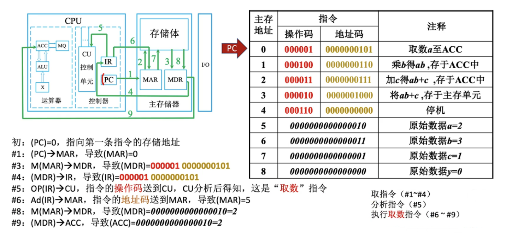

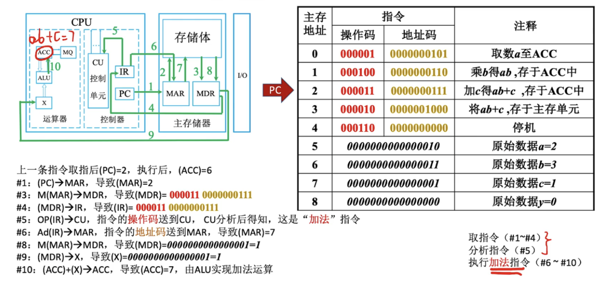

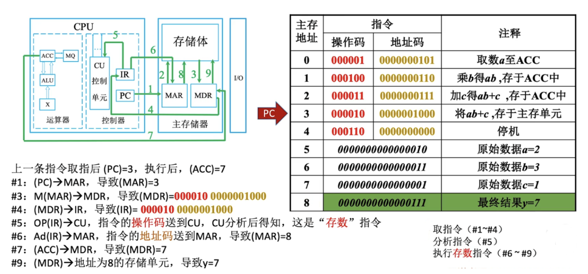

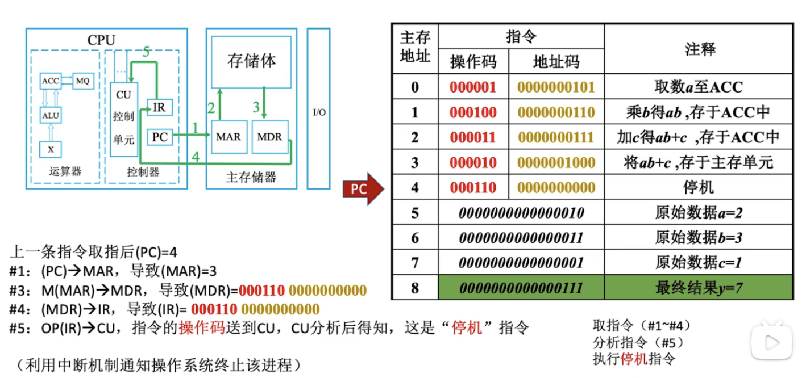

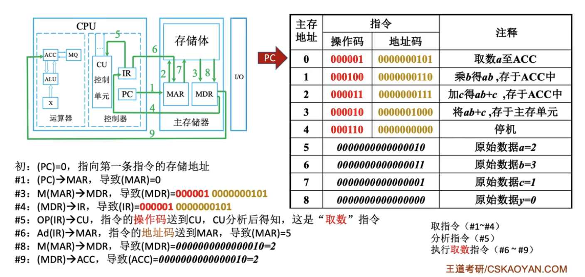

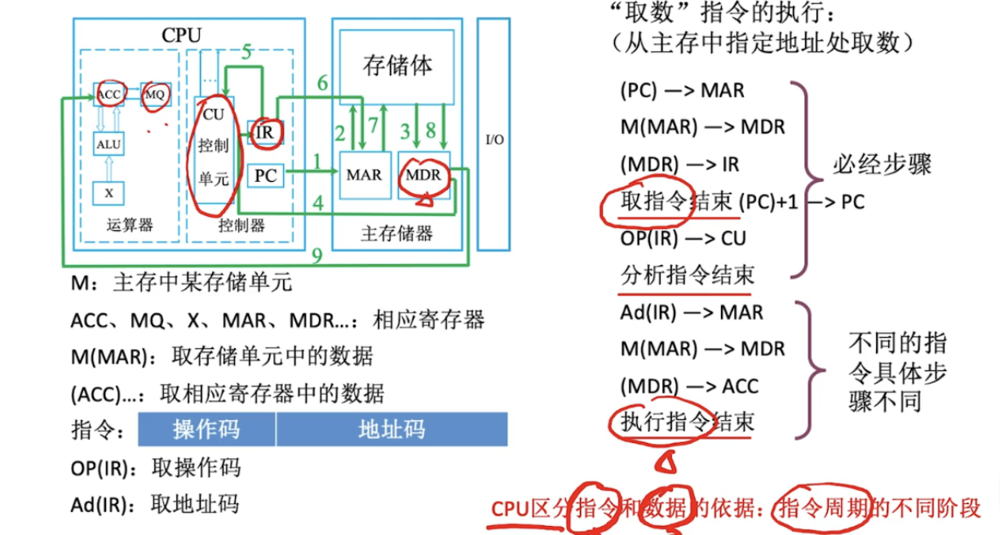

IR存放当下欲执行的指令；PC存放下一条指令的地址；

MAR存放欲访问的存储单元地址；MDR存放从存储单元取来的数据！

地址译码器是主存的构成部分，不属于CPU；地址寄存器虽然一般属于主存，但是现代计算机中绝大多数CPU内集成了地址寄存器！

关于CPU存取速度的比较：寄存器（CPU内部）> Cache(高速的SRAM) > 内存 （SDRAM）

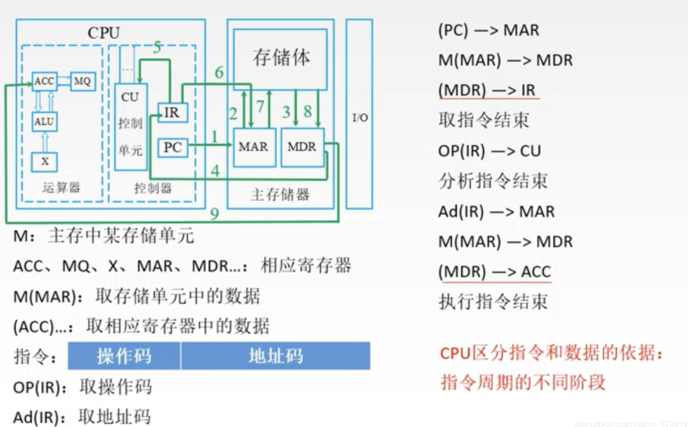

上图是计算机的工作流程，首先PC将指令地址发送给MAR，MAR根据地址在存储体中找到指令数据存放在MDR中，之后MDR将指令存放在IR中，取指令结束，之后指令中的操作码进入CU中，地址码重复上述取指令步骤，将数据发送到ACC中，执行指令结束。注意区分指令和数据的依据:指令周期的不同阶段

### 1.3 计算机性能指标
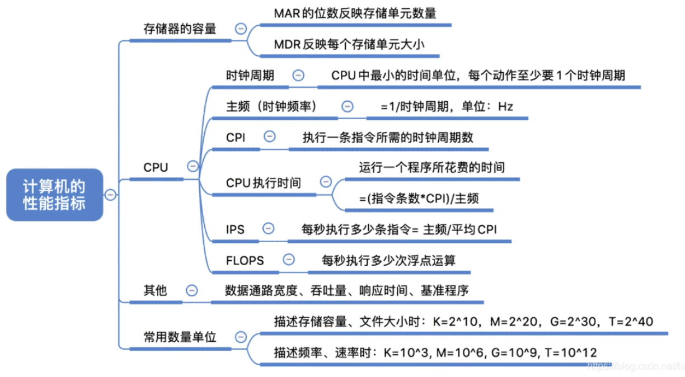

#### 1.3.1 机器字长
计算机的位数（机器字长），表示计算机进行一次整数运算(即定点整数运算)所能处理的二进制数据的位数。计算机字长通常选定为字节(8位)的整数倍，通常是2,4,8倍。不同的计算机，字节可能不同

**机器字长、指令字长、存储字长的区别和联系是什么？**
+ 机器字长：计算机能直接处理的二进制数据的位数，机器字长一般等于内部寄存器的大小，它决定了计算机的运算精度。
+ 指令字长：一个指令字中包含的二进制代码的位数。
+ 存储字长：一个存储单元存储的二进制代码的长度。等于MDR的位数， 它们都必须是字节的整数倍。
+ 数据字长：数据总线一次能传送信息的位数，它可以不等于MDR的位数。

指令字长一般取存储字长的整数倍，若指令字长等于存储字长的2倍，则需要2次访存来取出一条指令，因此取指周期为机器周期的2倍；若指令字长等于存储字长，则取指周期等于机器周期。

早期的计算机存储字长一般和机器的指令字长与数据字长相等，因此访问一次主存便可取出一条指令或一个数据。随着计算机的发展，指令字长可变，数据字长也可变，但它们必须都是字节的整数倍。

请注意64位操作系统是指特别为64位架构的计算机而设计的操作系统，它能够利用64位处理器的优势。但64位机器既可以使用64位操作系统，又可以使用32位操作系统。而32位处理器是无法使用64位操作系统的。

#### 1.3.2 数据通路带宽
数据总线一次所能传送信息的位数。

#### 1.3.3 主存容量
MAR的位数反映存储单元的个数，如MAR为16位，表示存储单元为$2^{16}$ = 64K;若MDR为32位，则存储容量为$2^{16}$x32.
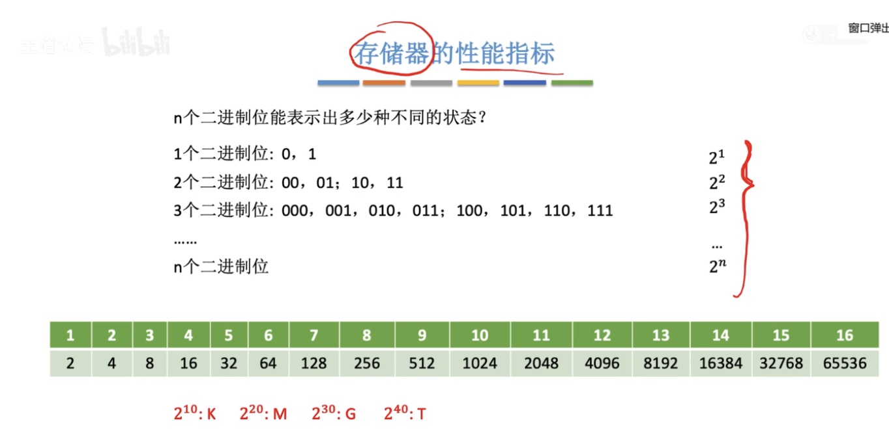

#### 1.3.4 运算速度

**时间相关概念（从最小单位到系统交互）**
1. CPU时钟周期
   - 定义：CPU中最小的时间单位（即主频的倒数），是节拍脉冲的周期，每个硬件动作至少需要1个时钟周期。
   - 例：若主频是1GHz（10⁹Hz），则时钟周期为1ns（10⁻⁹秒）。

2. CPU周期（机器周期）
   - 定义：由**多个时钟周期**组成，是CPU完成一个基本操作（如取指令、访存）的时间。

3. 指令周期
   - 定义：执行**一条指令**所需的时间，包含多个CPU周期。
   - 关系：**指令周期 > CPU周期 > 时钟周期**。

4. CPU执行时间
   - 定义：运行一个程序所花费的总时间。
   - 公式：\( \text{CPU执行时间} = \frac{\text{CPU时钟周期数}}{\text{主频}} = \frac{\text{指令条数} \times \text{CPI}}{\text{主频}} \)

5. 响应时间
   - 定义：从用户发送请求到系统返回响应的总等待时间（含CPU处理、I/O等所有环节）。

**CPU核心参数（决定性能的三大要素）**

1. 主频（CPU时钟频率）
   - 定义：CPU内部主时钟的频率，是衡量CPU速度的直接参数。
   - 与时钟周期的关系：\( \text{时钟周期} = \frac{1}{\text{主频}} \)
   - 例：主频2GHz表示每秒产生2×10⁹个时钟周期。

2. CPI（Clock cycle Per Instruction）
   - 定义：执行**一条指令**所需的时钟周期数。
   - 意义：CPI越小，单条指令耗时越短。

3. 指令条数
   - 定义：一个程序包含的指令总数量。

**性能指标（从不同维度衡量系统能力）**

1. 吞吐量
   - 定义：系统**单位时间内处理的请求数量**（如每秒处理的任务数、数据量）。
   - 视角：从系统整体效率出发，是综合性能的体现。

2. **IPS（Instructions Per Second）**
   - 定义：CPU**每秒执行的指令数**。
   - 公式：\( \text{IPS} = \frac{\text{主频}}{\text{平均CPI}} \)

3. **MIPS（Million Instructions Per Second）**
   - 定义：CPU**每秒执行的百万条指令数**（是IPS的衍生指标，用于简化大数表达）。

4. **浮点运算性能（MFLOPS/GFLOPS/TFLOPS）**
   - 定义：衡量CPU处理浮点运算的能力（如科学计算、AI训练等场景的核心指标）。
     - \( \text{MFLOPS} = \frac{\text{浮点操作次数}}{\text{执行时间} \times 10^6} \)（每秒百万次浮点运算）
     - \( \text{GFLOPS} = \frac{\text{浮点操作次数}}{\text{执行时间} \times 10^9} \)（每秒十亿次浮点运算）
     - \( \text{TFLOPS} = \frac{\text{浮点操作次数}}{\text{执行时间} \times 10^{12}} \)（每秒万亿次浮点运算）

### 本章开头提出的问题回答
+ **计算机由哪几部分组成？以哪部分为中心？**
计算机由运算器、控制器、存储器、输入设备及输出设备五大部分构成，现代计算机通常把运算器和控制器集成在一个芯片上，合称为中央处理器。
而在微处理器面世之前(早期的冯·诺依曼机)，运算器和控制器分离，而且存储器的容量很小，因此设计成以运算器为中心的结构，其他部件都通过运算器完成信息的传递。
随着微电子技术的进步，同时计算机需要处理、加工的信息量也与日俱增，大量IO设备的速度和CPU的速度差距悬殊，因此以运算器为中心的结构不能满足计算机发展的要求。现代计算机已经发展为以存储器为中心，使IO操作尽可能地绕过CPU,直接在IO设备和存储器之间完成，以提高系统的整体运行效率。
+ **主频高的CPU一定比主频低的CPU快吗？为什么？**
衡量CPU运算速度的指标有很多，不能以单独的某个指标来判断CPU的好坏。CPU的主频，即CPU内核工作的时钟频率。CPU的主频表示CPU内数字脉冲信号振荡的速度，主频和实际的运算速度存在一定的关系，但目前还没有一个确定的公式能够定量两者的数值关系，因为CPU的运算速度还要看CPU的流水线的各方面的性能指标（架构、缓存、指令集、CPU的位数、 Cache大小等）。由于主频并不直接代表运算速度，因此在一定情况下很可能会出现主频较高的CPU实际运算速度较低的现象
+ **翻译程序、汇编程序、编译程序、解释程序有什么差别？各自的特性是什么？**
翻译程序是指把高级语言源程序翻译成机器语言程序（目标代码）的软件。
翻译程序有两种：一种是编译程序，它将高级语言源程序一次全部翻译成目标程序，每次执行程序时，只需执行目标程序，因此只要源程序不变，就无须重新翻译，请注意同一种高级语言在不同体系结构下，编译成目标程序是不一样的，目标程序与体系结构相关，但仍不是计算机硬件能够直接执行的程序。另一种是解释程序，它将源程序的一条语句翻译成对应的机器目标代码，并立即执行，然后翻译下一条源程序语句并执行，直至所有源程序语句全部被翻译并执行完。所以解释程序的执行过程是翻译一句执行一句，并且不会生成目标程序。
汇编程序也是一种语言翻译程序，它把汇编语言源程序翻译为机器语言程序。汇编语言是种面向机器的低级语言，是机器语言的符号表示，与机器语言一一对应。
编译程序与汇编程序的区別：若源语言是诸如C、C++、Java等“高级语言”，而目标语言是诸如汇编语言或机器语言之类的“低级语言”，则这样的一个翻译程序称为编译程序。若源语言是汇编语言，而目标语言是机器语言，则这样的一个翻译程序称为汇编程序。
+ **不同级别的语言编写的程序有什么区别？哪种语言编写的程序能被硬件直接执行？**
机器语言和汇编语言与机器指令对应，而高级语言不与指令直接对应，具有较好的可移植性。其中机器语言可以被硬件直接执行。

