# 三、存储系统

## 3.1 存储器概述

### 3.1.1 存储系统的定义与功能
- **定义**：存储系统是计算机系统中用于存储程序和数据的部件，是计算机的重要组成部分
- **功能**：
  - 保存数据和程序
  - 提供数据的访问和修改能力
  - 在断电情况下能够保持数据的存储（针对非易失性存储）
  - 与CPU协同工作，形成完整的计算系统

### 3.1.2 存储器的层次结构
- **层次结构概念**：为了解决速度、成本和容量之间的矛盾，计算机系统采用多级存储层次

存储器层次结构的主要思想是**上一层的存储器作为低一层存储器的高速缓存**。当CPU要从存储器中存取数据时，先访间Cache，若不在Cache中，则访问主存，若不在主存中，则访问磁盘，此时，操作数从磁盘读出送到主存，然后从主存送到Cache。从CPU 的角度看，Cache-主存层的速度接近于Cache，容量和位价却接近于主存。从主存一辅存层分析，其速度接近于主存，容量和位价却接近于辅存。这就解决了速度、容量、成本这三者之间的矛盾。

**Cache-主存层主要解决CPU和主存速度不匹配的问题**，主存和Cache之间的数据调动是**由硬件自动完成**的，对所有程序员均是透明的。主存一辅存层主要解决存储系统的容量问题，主存和辅存之间的数据调动是**由硬件和操作系统共同完成**的，对应用程序员是透明的。

在主存-辅存层的不断发展中，逐渐形成了虚拟存储系统，在这个系统中程序员编程的地址范围与虚拟存储器的地址空间相对应，编程时可用的地址空间远大于主存空间。

**注意：在Cache-主存层和主存一辅存层中，上一层中的内容都只是下一层中的内容的副本，也即Cache（或主存）中的内容只是主存（或辅存）中的内容的一部分。**

### 3.1.3 存储器的分类
- **按存取方式分类**：
  - 随机存取存储器（RAM）：存储器的任何一个单元都可随机存取，存取时间与存储单元位置无关，**主要用作主存或高速缓冲存储器**。
  - 只读存储器（ROM）：存储器的内容在制造时已写入，用户只能读取，不能修改，**主要用作存放固化程序和数据**。也是随机存取的。可通过电擦除的方式写入。
  - 串行访问存储器：存储器的内容必须按顺序访问，**主要用作磁带等顺序存取设备**。
    - 顺序存取存储器（SAM）：如磁带，必须按顺序访问
    - 直接存取存储器（DAM）：如磁盘/光盘，可定位到大致位置后顺序访问
- **按存储介质分类**：
  - 半导体存储器：如RAM、ROM，cache，速度快，成本高
  - 磁表面存储器：如硬盘、磁带，容量大，成本低
  - 光学存储器：如CD、DVD，容量大，便携性
  - 磁芯存储器：早期存储器，现已基本淘汰

- **按信息保存方式分类**：
  - 易失性存储器：断电后信息丢失，如RAM
  - 非易失性存储器：断电后信息不丢失，如ROM、硬盘

> **相联存储器（Associative Memory）** 是一种按内容寻址的特殊存储器，它不依赖传统的地址来定位数据，而是通过数据的部分或全部内容直接检索并匹配目标信息，也常被称为内容寻址存储器（CAM，Content-Addressable Memory）。
> 
> 相联存储器是按内容寻址：用户输入待匹配的数据（或数据特征），存储器会并行检索所有存储单元，将每个单元的数据与输入内容比对，直接返回匹配成功的存储单元信息（如地址、完整数据）。
>
> **CPU 高速缓存（Cache）的地址映射** , 这是相联存储器最典型的应用。CPU 缓存的快表（TLB，转换检测缓冲区） 本质是小容量相联存储器，用于存储虚拟地址与物理地址的映射关系：
> + 当 CPU 访问内存时，会先将虚拟地址送入 TLB；
> + TLB 并行比对所有存储项的虚拟地址字段，若匹配成功则直接返回物理地址，避免了耗时的页表查询，大幅降低访存延迟。

### 3.1.4 存储系统的性能指标
存储器系统所追求的就是高容量、高速度、低成本和高可靠性，主要性能指标包括：
- **存储容量**：存储器可容纳的二进制信息量，**存储容量**=**地址线数量的2次方**（存储字数，表示存储器的地址空间大小）×**每个存储单元的位数**（存储字长，表示每个存储单元能存储的信息量，也表示一次存取的数据位数）
- **单位成本**：每位二进制位的平均价格，通常以美元/兆位（$ / Mb）表示
- **存取速度**：数据传输率=数据的宽度/存取周期
  - **存取时间（$T_a$）**：存取时间是指从CPU发出存储器请求到存储器完成数据传输所需的时间，包括寻址时间和传输时间,通常以纳秒（ns）为单位表示,分为读出时间和写入时间。
  - **存取周期（$T_m$）**：是指存储器进行一次完整的读/写操作所需要的完整时间，即连续两次独立访问存储器操作之间所需的最小时间间隔。
  
  - **主存带宽**：表示每秒钟主存能够传输的数据量，通常以MB/s或GB/s为单位
- **可靠性**：通常用MTBF（平均无故障时间）来衡量

## 3.2 主存储器

### 3.2.1 SRAM和DRAM
半导体存储器分为随机存储器（RAM）和只读存储器（ROM）。随机存储器（RAM）又分为**静态随机存取存储器（SRAM）** 和 **动态随机存取存储器（DRAM）**。主存储器主要采用DRAM，因为DRAM具有较高的存储密度和较低的成本，适合大容量存储需求，而SRAM则因其高速访问特性，主要用于CPU缓存（Cache）等对速度要求较高的场合。他们都是易失性存储器。ROM是非易失性存储器，主要用于存放固化程序和数据，如BIOS。

> **存储元**是物理基础，存储单元是逻辑集合。通常把存放一个二进制位的物理器件称为存储元，是存储器的最基本构件，是最小的、不可再分的存储单位；
> **存储单元**是由多个存储元组合而成的一个逻辑单位，它是CPU访问存储器（进行读/写操作）的基本单位。用于存储一个数据单元，这个数据单元通常是一个字节或其倍数（如字、双字等）。通常由 8个、16个、32个或64个存储元并排组成。

#### SRAM

**SRAM基本结构**
是由6个晶体管(6T)组成的存储元，由交叉耦合反相器结构形成双稳态电路，两个访问晶体管控制数据的读写

**SRAM工作原理**
- 数据存储原理
  - 交叉耦合的反相器组成的双稳态电路存储数据
  - 一个状态代表0，另一个状态代表1
- 读操作
  - 字线选通，位线预充电
  - 数据通过位线读取
  - 读取过程不破坏原有数据
- 写操作
  - 字线选通
  - 通过位线写入新数据
  - 强制改变交叉耦合反相器的状态

**SRAM特性**
- 优点
  - 读取速度快，不需要刷新
  - 非破坏性读出
  - 可靠性高
- 缺点
  - 单元面积大(约为DRAM的6-8倍)
  - 集成度低
  - 功耗较高
  - 价格昂贵，成本高
- 应用场景
  - CPU高速缓存
  - 寄存器
  - 小容量高速存储需求

#### DRAM 

**DRAM基本结构**
由1个晶体管和1个电容(1T1C)组成的存储元，电容存储电荷代表数据，晶体管作为开关控制电容的充放电

**DRAM工作原理**
- 数据存储原理
  - 电容中存储电荷代表数据(有电荷=1，无电荷=0)
  - 电容会自然放电，需要定期刷新
- 读操作
  - 字线选通，晶体管导通
  - 电容电荷传递到位线
  - 读取后电容放电(破坏性读出)，需要恢复
- 写操作
  - 字线选通，晶体管导通
  - 通过位线向电容充电或放电
  - 写入新数据

**DRAM特性**
- 优点
  - 单元面积小
  - 集成度高
  - 功耗低(静态时)
  - 成本低
- 缺点
  - 读取速度相对较慢
  - 需要定期刷新
  - 破坏性读出，需要恢复
  - 数据会随时间流失
- 应用场景
  - 主内存
  - 大容量存储需求
  - 低成本应用

**需要刷新的存储芯片SDRAM**

DRAM 电容上的电荷一般只能维持1～2ms，因此即使电源不断电，信息也会自动消失。此外，读操作会使其状态发生改变（破坏性读出），需读后再生，这也是称其动态存储器的原因。刷新可以采用读出的方法进行，根据读出内容对相应单元进行重写，即读后再生。对同一行进行相邻两次刷新的时间间隔称为刷新周期，通常取2ms。常用的刷新方式有以取3种；
1. 集中刷新：在一个刷新周期内，利用一段固定的时间，依次对存储器的所有行进行逐一再生，在此期间停止对存储器的读/写操作，称为死时间，也称访存死区。优点是读/写操作期间不受刷新操作的影响：缺点是在集中刷新期间（死区）不能访问存储器。
2. 分散刷新：将一个存储器系统的工作周期分为两部分：前半部分用于正常的读/写操作；后半部分用于刷新。这种刷新方式增加了系统的存取周期，如存储芯片的存取周期为0.5uS，则系统的存取周期为IuS。优点是没有死区；缺点是加长了系统的存取周期。
3. 异步刷新：结合了前两种方法，使得在一个刷新周期内每一行仅刷新一次。具体做法是将刷新周期除以行数，得到相邻两行之间刷新的时间间隔t，每隔时间t产生一次刷新请求。这样就使“死时间”的分布更加分散，避免让CPU 连续等待过长的时间。

**DRAM 的刷新需要注意以下问题**：1. 刷新对CPU是透明的，即刷新不依赖于外部的访问；2. DRAM的刷新单位是行，由芯片内部自行生成行地址；3. 刷新操作类似于读操作，但又有所不同。另外，刷新时不需要选片，即整个存储器中的所有芯片同时被刷新。

**DRAM芯片的地址引脚复用技术（2014）**

DRAM芯片容量较大，地址位数较多，为了减少引脚数，通常采用地址引脚复用技术。即将地址分为行地址和列地址两部分，分别在不同的时间送入同一组地址引脚。具体做法是：在存取周期的前半部分，将行地址送入地址引脚，并通过行地址锁存器锁存；在存取周期的后半部分，将列地址送入同一组地址引脚，并通过列地址锁存器锁存。这样就实现了用较少的引脚传输更多的地址信息。

**DRAM芯片行、列数的优化原则（2018）**

假定有一个$2^n$xB位DRAM 芯片的存储阵列，其行数为r，列数为c，则$2^n$=r*c。存储阵列的地址位数为n，其中行地址位数为log2r，列地址位数为log2c，则n=log2r+log2c。由于 DRAM芯片采用地址引脚复用技术，为减少地址引脚数，应尽量使行、列位数相同，即满足|r-c|最小。又由于 DRAM按行刷新，为减少刷新开销，应使行数较少，因此还需满足r≤c。

**DRAM 芯片行缓冲器容量的计算（2022）**

DRAM 芯片的内部结构示意图如图3.4所示。芯片容量为16x8位，存储阵列为4行×4列，地址引脚采用复用技术，因此仅需2根地址线，分时传送2位行地址和2位列地址。每个存储元有8位，需要8根数据线，芯片内部有一个行缓冲器，用来缓存指定行中每列的数据，其大小为列数x存储元的位数，常用SRAM 实现。选中某行后，该行的所有数据都被送到行缓冲器，以后每个时钟都可以连续地从 DRAM中输出一个数据，因此可支持突发传输（突发传输方式是指在寻址阶段给出数据的首地址，在传输阶段可传送多个连续存储单元的数据）。

目前**更常用的是 SDRAM（同步DRAM）芯片**，与传统的异步 DRAM 不同，SDRAM与CPU的数据交换同步于系统的时钟信号，并且以 CPU-主存总线的最高速度运行，而不需要插入等待状态。在传统 DRAM 中，CPU将地址和控制信号送至存储器后，需经过一段延迟时间，数据才读出或写入。在此期间，CPU 不断采样 DRAM的完成信号，在读写完成之前，CPU 不能做其他工作，降低了 CPU 的执行速度。而SDRAM 在系统时钟的控制下进行数据的读出和写入，它将CPU 发出的地址和控制信号锁存起来，经过指定的时钟周期数后再响应，此时CPU 可执行其他操作。

#### SRAM与DRAM的比较

- 速度
  - SRAM访问速度快(通常1-10ns)
  - DRAM访问速度较慢(通常50-100ns)
- 带宽
  - SRAM带宽较高
  - DRAM带宽相对较低
- 功耗成本
  - SRAM静态功耗较高
  - DRAM静态功耗低，但有刷新功耗

#### 存储器芯片的内部结构

1. **存储体（存储矩阵）**。存储体是存储单元的集合，它由行选择线（X）和列选择线（Y）来选择所访问单元，存储体的相同行、列上的多位（位平面数）同时被读出或写入。
2. **地址译码器**。用来将地址转换为译码输出线上的高电平，以便驱动相应的读/写电路。地址译码有单译码法（一维译码）和双译码法（二维译码）两种方式。
   + 单译码法。只有一个行译码器，同一行中所有存储单元的字线连在一起，同一行中的各单元构成一个字，被同时读出或写入。缺点是地址译码器的输出线数过多。
   + 双译码法。如图3.5所示，地址译码器分为X和Y两个译码器，在选中的行和列交叉点上能确定一个存储单元，这是DRAM芯片目前普遍采用的译码结构。
3. **1/0电路**。用以控制被选中的单元的读出或写入，具有放大信号的作用。
4. **片选控制线**。单个芯片容量太小，往往满足不了计算机对存储器容量的要求，因此需用一定数量的芯片进行存储器的扩展。在访问某个字时，必须“选中”该存储字所在的芯片，而其他芯片不被“选中”，因此需要有片选控制信号（经片选控制线传输）。
5. **读/写控制线**。根据CPU给出的读命令或写命令，经读/写控制线控制被选中单元进行读或写。

### 3.2.2 只读存储器

#### 只读存储器的特点
ROM是一种非易失性存储器，断电后数据不会丢失。ROM的内容在制造时已写入，用户只能读取，不能修改。主要用于存放固化程序和数据，如BIOS。ROM具有两个显著的优点：
- 结构简单，所以位密度比可读/写存储器高。
- 具有非易失性，所以可靠性高。

#### ROM的类型
根据制造工艺的不同，ROM可分为以下几种类型：
- **掩模式只读存储器（MROM）**：在制造过程中将数据直接写入存储器芯片中，用户无法修改。适用于大批量生产的固定程序存储。
- **一次可编程只读存储器（PROM）**：用户可以在购买后通过专用设备将数据写入存储器，但写入后数据不可修改。适用于小批量定制程序存储。
- **可擦除可编程只读存储器（EPROM）**：用户可以通过紫外线照射将数据擦除，然后重新编程。适用于需要多次修改程序。EPROM虽然可以擦除和重写，但擦除过程较为复杂且耗时。且编程次数有限，一般为1000次左右。无法替代RAM。
- **Flash存储器**：一种电可擦除可编程只读存储器（EEPROM），可以通过电信号进行擦除和编程，速度较快，广泛应用于固态硬盘、U盘等存储设备。Flash存储器是目前应用最广泛的非易失性存储器之一，具有较高的存储密度和较低的成本。Flash存储器按擦除方式可分为NOR Flash和NAND Flash两种类型。NOR Flash适用于代码存储，NAND Flash适用于大容量数据存储。
- **固态硬盘（SSD）**：基于Flash存储器技术的存储设备，具有高速读写性能和高可靠性，逐渐取代传统机械硬盘。基于闪存的固态硬盘是用固态电子存储芯片阵列制成的硬盘，由控制单元和存储单元组成。保留了Flash存储器的非易失性和高密度特点，同时通过优化控制器设计，实现了更高的读写速度和更好的耐用性。缺点是价格较高。

### 3.2.3 主存储器的基本组成

图3.6是主存储器（Main Memory，MM）的基本框图，其中由一个个存储0或1的记忆单元（也称存储元件、存储单元）构成的存储矩阵（也称存储体、存储阵列）是存储器的核心部件。存储元件是具有两种稳态的能表示二进制0和1的物理器件。为了存取存储体中的信息，必须对存储单元编号（也称编址）。编址单位是指具有相同地址的那些存储元件构成的一个单位，可以按字节编址，也可以按字编址。现代计算机**通常采用字节编址**方式，此时存储体内的一个地址中有1字节。

**MAR和MDR位数与地址线/数据线的关系、寻址范围的计算（2021）**

MAR和MDR位数与地址线/数据线的宽度相同。地址线的宽度决定了存储器的寻址范围，数据线的宽度决定了每次存取的数据量。

具体来说：指令执行过程中需要访问主存时，CPU首先把被访问单元的地址送到 MAR 中，然后通过地址线将主存地址送到主存中的地址寄存器，以便地址译码器进行译码，选中相应单元，同时CPU将读/写控制信号通过控制线送到主存的读/写控制电路。若是写操作，则CPU同时将要写的信息送到 MDR 中，在读/写控制电路的控制下，经数据线将信号写入选中的单元：若是读操作，则主存读出选中单元的内容送至数据线，然后被送到MDR 中。MDR的位数与数据线的位数相同，MAR 的位数与地址线的位数相同。图3.6采用64位数据线，所以在按字节编址方式下，每次最多可以存取8个单元的内容。地址线的位数决定了主存地址空间的最大可寻址范围。例如，36 位地址的最大寻址范围为0~$2^{36}$-1，即地址从0开始编号。

### 3.2.4 多模块存储器
多模块存储器是一种空间并行技术，利用多个结构完全相同的存储模块同时工作来提高存储器的带宽和访问速度。每个存储模块都有独立的地址线和数据线，可以并行处理多个存储请求，从而实现更高的数据传输速率。常用的有**单体多字存储器**和**多体并行存储器**。

#### 单体多字存储器
单体多字存储器是将多个字（通常为2的整数次方）存储在同一个存储模块中，通过增加数据线的宽度来实现并行访问。例如，一个4字存储器可以同时存取4个字的数据，从而提高数据传输速率。单体多字存储器的地址线数量与存储字数的对数成正比，而数据线数量则与每次存取的字数成正比。

在一个存取周期内，从同一地址取出m条指令，然后依次送到CPU中执行，这样就提高了存储器的带宽，缩短了指令的取指时间。每隔1/m个存储周期，CPU向主存存取一条指令，显然提高了单体存储器的工作速度。

**缺点**：只有数据和指令在在主存中是连续存放的情况下，才能发挥单体多字存储器的优越性，否则就失去了意义。一旦遇到转移指令，单体多字存储器就无法发挥作用。

#### 多体并行存储器
多体并行存储器由多体模块组成，每个模块都有相同的容量和存取速度，各模块都有独立的读/写控制电路，地址寄存器和数据寄存器。他们既能并行工作，也能交叉工作。

**多体并行寄存器分为两种类型**：
1. 高位交叉编址（顺序方式）：将地址的高位部分用来选择存储模块，低位部分用来选择模块内的存储单元。例如，假设有4个存储模块，每个模块有256个存储单元，则地址的前2位用于选择模块，后8位用于选择模块内的单元。
2. 低位交叉编址（交错方式）：将地址的低位部分用来选择存储模块，高位部分用来选择模块内的存储单元。例如，假设有4个存储模块，每个模块有256个存储单元，则地址的后2位用于选择模块，前8位用于选择模块内的单元。

**交叉存储器中数据的存放方式（2017）：**

低位地址为模块号，高位地址为模块内地址。总是把高位的体内地址送到由低位地址号所选中的模块内进行译码。程序连续存放在相邻模块中，因此称为交错存储器。

**交叉存储器可以采用轮流启动和同时启动两种方式工作。**

+ 轮流启动方式是指在一个存取周期内，只启动一个模块进行存取操作，而其他模块处于空闲状态；若每个模块一次读/写的位数正好等于数据总线位数，模块的存取周期为T，总线周期为r，为实现轮流启动方式，存储器交叉模块数应大于或等于T/r。

+ 同时启动方式是指在一个存取周期内，所有模块同时进行存取操作，从而实现更高的数据传输速率。设每个模块一次读/写的位数正好等于数据总线位数，则可以同时启动所有模块进行读写。
 

**交叉存储器存取时间和带宽的计算（2012、2013）**

低位交叉存储器中，设单个模块存取周期为\( T \)、模块数为\( m \)，模块启动间隔（流水节拍）\( r = T/m \)，每个字的位数为\( b \)。连续存取\( m \)个字时，交叉方式的总时间是\( t_{\text{交叉}} = T + (m-1)r \)（第一个字需等1个周期\( T \)，后续\( m-1 \)个字各等1个节拍\( r \)），而顺序方式需串行执行\( m \)个周期，总时间\( t_{\text{顺序}} = mT \)。

存取带宽指单位时间内传输的总数据量：顺序方式的带宽为\( W_{\text{顺序}} = \frac{mb}{mT} = \frac{b}{T} \)；交叉方式在模块全部启动后的稳定流水线阶段，每经过\( r \)时间就能输出1个字，稳定带宽为\( W_{\text{稳定}} = \frac{b}{r} = \frac{mb}{T} \)，是顺序方式的\( m \)倍，这也对应了“存取速度提高\( m \)倍”的结论。

## 3.3 主存储器与CPU的连接

### 3.3.1 连接原理
+ 主存储器通过数据总线、地址总线和控制总线与CPU连接。
+ 数据总线的位数与工作频率的乘积正比于数据传输速率。
+ 地址总线的位数决定了可寻址的最大内存空间。
+ 控制总线（读/写）指出总线周期的类型和本次输入/输出操作完成的时刻。

主存储器与CPU的连接如图
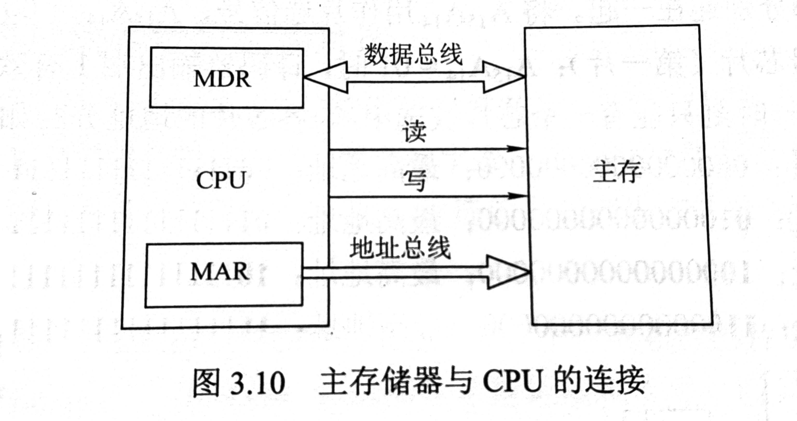
单个芯片的容量是有限的，因此通过存储器芯片扩展技术，将多个芯片集成在一个内存条上，然后由多个内存条及主板上的ROM芯片组成计算机所需的主存空间，再通过总线与CPU连接。

### 3.3.2 主存容量的扩展
单个存储芯片的容量是有限的，它在字数或者字长方面与实际存储器的要求都有差距，因此需要在**字和位两方面进行扩充**才能满足实际存储器的容量要求。

#### 位扩展法

位扩展是指对字长进行扩展（增加存储字长）。当CPU的系统数据线多于存储芯片的数据位数时，必须对存储芯片扩位，使其数据位数与CPU的数据线数相等。

位扩展的连接方式：各**芯片的地址线、片选控制线和读/写控制线与系统总线并联连接**；各芯片的数据线单独引出，分别连接系统的数据线。各个芯片同时工作。

如图，用8片8K×1位存储芯片组成一个8K×8位的存储器。每片芯片的地址线`A0~A12`与系统地址线`A0~A12`并联连接，片选控制线CS和读/写控制线R/W也与系统总线并联连接；各片芯片的数据线`D0~D7`、`D8~D15`、`D16~D23`、`D24~D31`、`D32~D39`、`D40~D47`、`D48~D55`、`D56~D63`分别连接系统数据线`D0~D63`。这样，在一个存取周期内，各芯片同时工作，共同完成一个64位字的读/写操作。

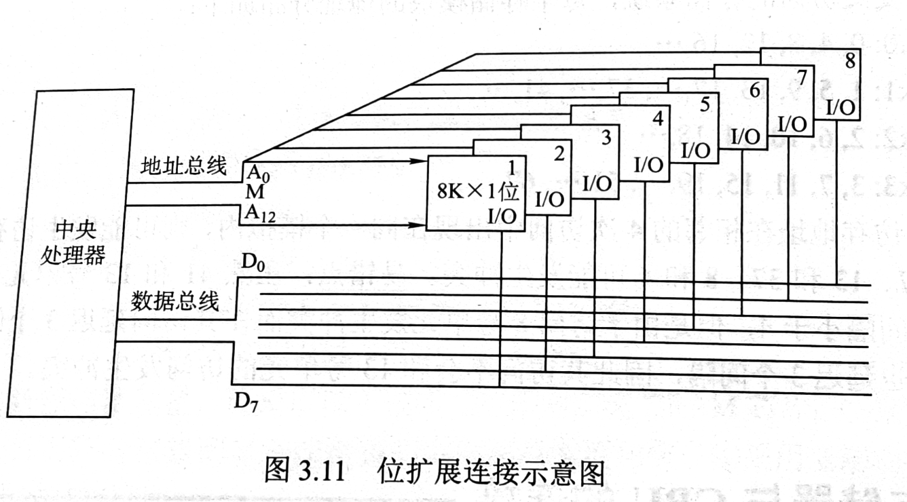

#### 字扩展法
字扩展是指对存储字的数量进行扩展，而存储字的位数满足系统要求。系统数据线位数等于芯片数据线位数，系统地址线位数多于芯片地址线位数。

字扩展的连接方式：**各芯片的地址线与系统地址线的低位对应相连**；芯片的数据线和读/写控制线与系统总线相应并联；由系统地址线的高位译码得到各芯片的片选信号。各芯片分时工作。

**字扩展法后存储芯片的地址范围**

如图所示，用4片16K×8位存储芯片组成一个64K×8位的存储器。每片芯片的数据线`D0~D7`与系统数据线`D0~D7`并联连接，读/写控制线R/W也与系统总线并联连接；各片芯片的地址线`A0~A13`与系统地址线`A0~A13`并联连接；系统地址线的高2位`A14`和`A15`经2-4译码器译码后，得到4个片选信号CS0~CS3，分别送到4片芯片的片选控制线。

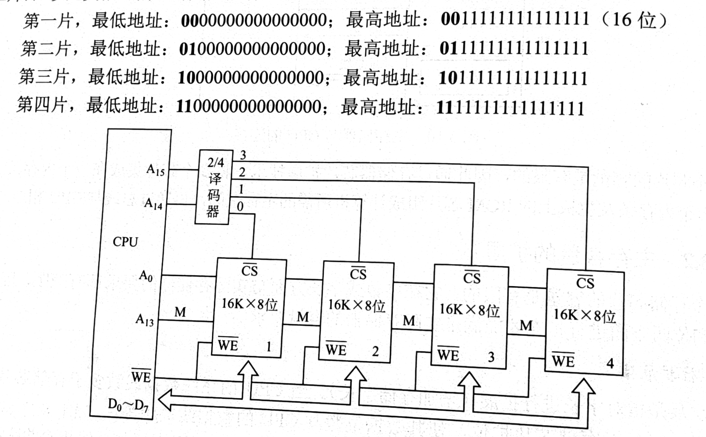

#### 字位同时扩展法

字位同时扩展是前两种扩展的组合，即既对存储字的位数进行扩展，又对存储字的数量进行扩展。当CPU的数据线位数多于存储芯片的数据位数，且CPU的地址线位数多于存储芯片的地址线位数时，必须采用字位同时扩展法。

连接方式：将进行位扩展的芯片作为一组，各组的连接方式与位扩展的相同；由系统地址线高位译码产生若干片选信号，分别接到各组芯片的片选控制线。各组芯片分时工作。

如图所示，用8片16K×4位的RAM芯片组成64K×8位的存储器。每两片构成一组，共4组。每组芯片的数据线分别连接系统数据线的低4位和高4位，读/写控制线R/W与系统总线并联连接；每片芯片的地址线`A0~A13`与系统地址线`A0~A13`并联连接；系统地址线的高2位`A14`和`A15`经2-4译码器译码后，得到4个片选信号CS0~CS3，分别送到4组芯片的片选控制线。

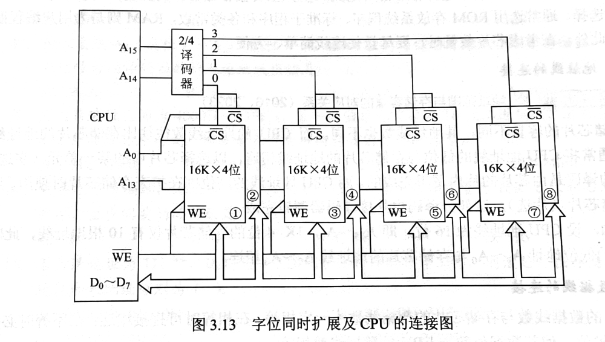

### 3.3.3 存储芯片的地址分配和片选
CPU要实现对存储单元的访问，首先要选择存储芯片，即进行片选；然后在选定的芯片中选择具体的存储单元，以进行数据的
读/写，即进行字选。芯片内的字选通常是由CPU送出的N条低位地址线完成（N由片内存储容量$2^N$决定。）片选信号的产生方法分为**线选法和译码片选法**。

#### 线选法
线选法用除片内寻址外的高位地址线直接作为片选控制信号。适用于存储芯片数量较少的情况。

#### 译码片选法
以74LS38译码器为例，

### 3.3.4 存储器与CPU的连接

#### 合理选择存储芯片
要组成一个主存系统，选择存储芯片是第一步，主要指存储芯片的类型（RAM或ROM）和数量的选择。通常选择ROM存放系统程序、标准子程序和各类常数，RAM则是为用户编程而设置的。此外，在考虑芯片数量时，还尽量使连线简单、方便。

#### 地址线的连接
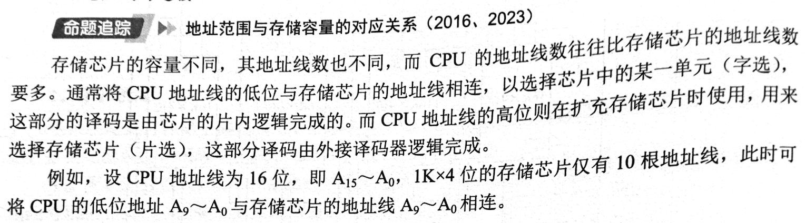

#### 数据线的连接
CPU的数据线数与存体芯片的数据线数不一定相等，在相等时可直接相连：在不等时必须对存储芯片扩位，使其数据位数与CPU 的数据线数相等。

#### 读/写控制线的连接
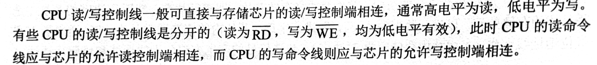

#### 片选控制线的连接

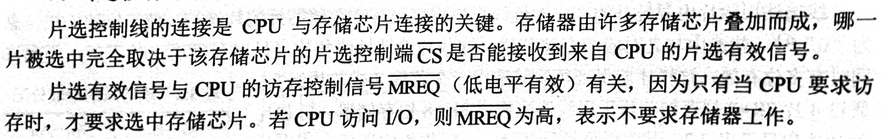

## 3.4 外部存储器

### 3.4.1 磁盘存储器

磁盘存储器是以磁盘为介质的存储器，其主要优点：
1. **存储容量大**:单块机械硬盘的容量现在可以达到 20TB 甚至更高，而且可以通过磁盘阵列的方式，进一步扩展总存储容量，适合存储大量的视频、文件、备份数据等。
2. **位价低**:对比固态硬盘（SSD），相同存储容量的情况下，机械硬盘的价格更低，在需要大容量低成本存储的场景里性价比很高。
3. **数据可恢复性较好**：如果是出现逻辑故障（比如误删除、分区丢失），或者是部分硬件的轻微故障，通过专业的数据恢复手段，有较大概率找回数据。
4. 录信息可以长期保存而不丢失，甚至可以脱机存档；
5. 非破坏性读出，读出时不需要再生。 

缺点：
1. **存取速度慢**:因为机械硬盘是依靠磁头的物理移动来读写数据，读写速度远低于固态硬盘，随机读写的差距尤其明显，会影响需要频繁读写数据的程序的运行效率。
2. **抗震性差**：内部有高速运转的盘片和移动的磁头，受到震动、碰撞的时候，很容易出现盘片划伤、磁头损坏的情况，导致数据丢失或者设备损坏。
3. **功耗与噪音问题**：运行的时候盘片和磁头的运转会产生一定的噪音，同时功耗也比固态硬盘更高，会产生更多的热量。
4. **体积与重量较大**：对比固态硬盘，机械硬盘的体积和重量都更大，不利于在轻薄的设备中使用。

现在仍然在使用，不过使用的场景和占比在变化：
+ 仍在广泛使用的场景：数据中心的冷存储（不经常访问的备份数据、归档数据）、个人用户的大容量数据备份仓库、对存储成本敏感的企业存储服务器等，这些场景更看重容量和成本，对速度的要求不高。
+ 逐渐被替代的场景：个人电脑的系统盘、笔记本电脑的内置存储、对读写速度要求高的工作站存储等，这些场景现在更多使用固态硬盘。

#### 磁盘存储器的基本结构

**磁盘存储器的组成**

磁盘存储器由**磁盘驱动器、磁盘控制器和盘片**组成。

+ 磁盘驱动器。驱动磁盘转动并在盘面上通过磁头进行读/写操作的装置，如图所示。
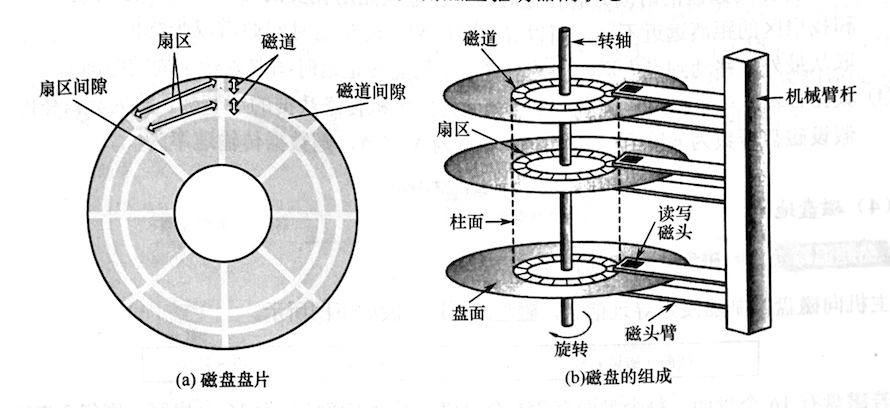
+ 磁盘控制器。磁盘驱动器与主机的接口，负贵接收并解释 CPU 发来的命令，向磁盘驱动器发出各种控制信号，并负责检测磁盘驱动器的状态。

**存储区域**

一个磁盘含有若干记录面，每个记录面划分为若干圆形的磁道，而每条磁道又划分为若干扇区，扇区（也称块）是磁盘读/写的最小单位，即磁盘按块存取。
+ 磁头数（Heads）：即记录面数，表示磁盘共有多少个磁头，磁头用于读取盘片上记录面的信息和写入信息，一个记录面对应一个磁头。
+ 柱面数（Cylinders）：表示磁盘每面盘片上有多少条磁道。在一个盘组中，不同记录面的相同编号（位置）的诸磁道构成一个圆柱面。
+ 扇区数（Sectors）：表示每条磁道上有多少个扇区。相邻磁道及相邻扇区间通过一定的间隙分隔开，以避免精度错误。扇区按固定圆心角度划分，因此位密度从最外道向里道增加，磁盘的存储能力受限于最内道的最大记录密度

**磁盘高速缓存**

在内存中开辟一部分区域，用于缓冲将被送到磁盘上的数据。优点：写磁盘时是按“簇”进行的，可以避免频繁地用小块数据写盘；有些中间结果数据在写回磁盘之前可被快速地再次使用。

#### 磁记录原理
磁记录的核心是利用**磁性材料的磁滞特性**，通过磁化的方式来记录和读取二进制数据，以机械硬盘（最常见的磁记录存储设备）为例，原理可以分为记录（写入）和读取两个部分：

1. 写入原理
机械硬盘的盘片上有一层磁性材料，这层材料会被分成无数个微小的磁畴，每个磁畴可以看作一个最小的磁性单元。写入数据时，硬盘的写入磁头会通电，产生变化的磁场，当磁头经过盘片上的磁畴时，磁场会改变磁畴的磁化方向：通常会把某一种磁化方向定义为二进制的`0`，另一种相反的磁化方向定义为二进制的`1`。磁头会根据要写入的二进制数据，改变自身的磁场方向，以此改变对应位置磁畴的磁化方向，完成数据的记录，而且磁畴的磁化方向在断电之后也会保持，实现数据的持久化存储。

2. 读取原理
读取数据时，硬盘的读取磁头会靠近高速运转的盘片，当被磁化的磁畴经过读取磁头时，磁畴的磁场会让磁头产生感应电流：不同的磁化方向，会产生方向不同的感应电流,硬盘的控制电路会将电流的方向转换为对应的二进制信号（`0`或者`1`），以此完成数据的读取。

**磁记录方式**

磁记录方式是指将二进制的数字信息，转换为磁介质上的磁化状态的具体实现方案，目的是提升记录密度、读写的可靠性，以及抗干扰能力，常见的磁记录方式可以分为传统的归零制、不归零制，以及后来优化的改进类型，核心是通过不同的磁场变化规则，来定义二进制的0和1：

+ **归零制（RZ）**：这是最早的磁记录方式之一，写入数据时：
  - 表示二进制`1`时，写入磁头会产生一个持续时间较短的正向（或反向）磁场脉冲，之后磁场会回到零（磁头断电，磁场消失）
  - 表示二进制`0`时，磁头不产生磁场，或者只产生反向的短脉冲后回到零
  - 这种方式的缺点是磁头的动作频繁，会浪费存储空间，而且抗干扰能力差，现在已经不再使用。

+ **不归零制（NRZ）**：是对归零制的优化，写入数据时磁场不会回到零：
  - 预先定义一个初始的磁化方向为基准，比如正向磁场表示`0`
  - 当需要写入`1`时，就改变磁场的方向（变为反向）；写入`0`时，保持当前的磁场方向不变
  - 这种方式解决了归零制的空间浪费问题，但是如果连续写入多个`0`，磁场方向不会发生变化，读取的时候无法判断数据的位数，需要额外的时钟信号来同步。

+  **不归零1制（NRZ1）**：也叫见1就翻的不归零制，是现在磁记录设备中常用的基础方式：
   - 写入`0`时，保持当前的磁场方向不变
   - 写入`1`时，改变磁场的方向
   - 这种方式既解决了连续`0`的同步问题，又减少了磁头的动作次数，同时提升了记录的密度，在此基础上，还发展出了更先进的编码方式，比如
      - **调频制（FM）**：在每个位的起始位置都添加一个时钟脉冲，进一步提升同步的稳定性，常用于早期的软盘
      - **改进型调频制（MFM）**：只在连续出现`0`的时候，在位的起始位置添加时钟脉冲，进一步提升了记录密度，是早期机械硬盘的常用方式
      - **游程长度受限码（RLL）**：现在机械硬盘的主流记录方式，它会将原始的二进制数据，转换为一组符合特定规则的编码，既可以保证读写的同步，又能最大化的提升磁介质的记录密度，减少误读的概率

#### 磁盘的性能指标
+ **记录密度**：记录密度是指盘片单位面积上记录的二进制数据量，通常以道密度、位密度和面密度表示。道密度是沿磁盘半径方向单位长度上的磁道数，位密度是磁道单位长度上能记录的二进制代码位数，面密度是位密度和道密度的乘积。
+ **磁盘的容量**：磁盘容量有非格式化容量和格式化容量之分。非格式化容量是指磁记录表面可利用的磁化单元总数，非格式化容量=记录面数x柱面数x每条磁道的磁化单元数。格式化容量是指按照某种特定的记录格式所能存储信息的总量。格式化容量=记录面数x柱面数x每道扇区数×每个扇区的容量。格式化后的容量比非格式化容量要小。
+ **存取时间**：存取时间由寻道时间（磁头移动到目的磁道的时间）、旋转延迟时间（磁头定位到要读/写扇区的时间）和传输时间（传输数据所花费的时间）三部分构成。因寻道和找扇区的距离远近不一，所以寻道时间和旋转延迟时间通常取平均值（平均寻道时间取从最外道移动到最内道时间的一半，平均旋转延迟时间取旋转半周的时间）。
+ **数据传输速率**：磁盘存储器在单位时间内向主机传送数据的字节数，称为数据传输速率。假设磁盘转数为r转/秒，每条磁道容量为N字节，则数据传输速率为D = rN

#### 磁盘地址
主机向磁盘控制器发送寻址信息，磁盘的地址一般如下图所示
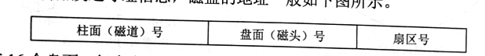

若磁盘有16个盘面，每个盘面有256 个磁道，每个磁道划分为16个扇区，则每个扇区地址为16位二进制代码，其格式如下图所示。
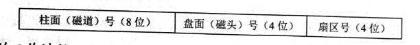

#### 磁盘的工作过程

磁盘的主要操作是寻址、读盘、写盘。每个操作都对应一个控制字，磁盘工作时，第一步是取控制字，第二步是执行控制字。磁盘属于机械式部件，其读/写操作是串行的，不可能在同一时刻既读又写，也不可能在同一时刻读两组数据或写两组数据。

这里的 “控制字” 是计算机给磁盘下达操作指令的二进制代码（或指令数据），可以理解为磁盘工作的 “任务指令”。

#### 磁盘阵列
RAID（Redundant Array of Independent Disks，独立磁盘冗余阵列）是一种将多个物理磁盘组合成一个逻辑磁盘，以提高存储性能和数据可靠性的技术。RAID通过数据分布和冗余存储，实现了更高的读写速度和容错能力。常见的RAID级别包括RAID 0、RAID 1、RAID 5、RAID 6和RAID 10等，每种级别都有不同的数据分布和冗余策略，适用于不同的应用场景。

+ RAIDO：无冗余和无校验的磁盘阵列。
+ RAIDI：镜像磁盘阵列。
+ RAID2：采用纠错的海明码的磁盘阵列。
+ RAID3：位交叉奇偶校验的磁盘阵列。
+ RAID4：块交叉奇偶校验的磁盘阵列。
+ RAID5：无独立校验的奇偶校验磁盘阵列。

RAID0把连续多个数据块交替地存放在不同物理磁盘的扇区中，几个磁盘交叉并行读/写，即**条带化技术**，这样不仅扩大了存储容量，还提高了磁盘存取速度，但RAID0没有容错能力。为了提高可靠性，RAID1使两个磁盘同时进行读/写，互为备份，若一个磁盘出现故障，可从另一磁盘中读出数据。两个磁盘当一个磁盘使用，意味着容量减少一半。

总之，RAID 通过同时使用多个磁盘，提高了传输速率；通过在多个磁盘上并行存取来大幅提高存储系统的数据吞吐量；通过镜像功能，提高安全可靠性：通过数据校验，提供容错能力。

### 3.4.2 固态硬盘

#### 固态硬盘的特性

固态硬盘（SSD）是一种基于**闪存技术**的存储器。它与U盘并无本质差别，只是容量更大，存取性能更好。一个 SSD 由一个或多个闪存芯片和闪存翻译层组成，如图所示。闪存芯片替代传统旋转磁盘中的机械驱动器，而闪存翻译层将来自 CPU 的逻辑块读/写请求翻译成对底层物理设备的读/写控制信号，因此，这个闪存翻译层相当于代替了磁盘控制器的角色。

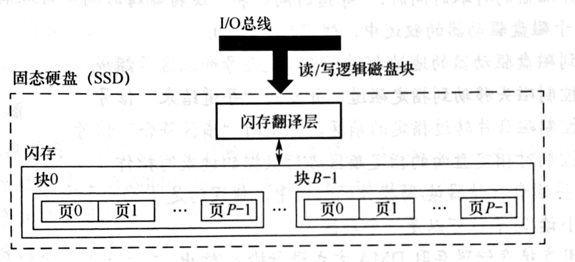

在图中，一个闪存由B个块组成，每块由P页组成。通常，页的大小是`512B~4KB`，每块由`32～128`页组成，块的大小为`16KB~512KB`。数据是以页为单位读/写的。以块单位擦除，只有在一页所属的块整个被擦除后，才能写这一页。一旦一个块被擦除，块中的每个页就都可以直接再写一次。某个块进行了若干次重复写之后，就会磨损坏，不能再使用。

随机写很慢，有两个原因。首先，擦除块比较慢，通常比访问页高一个数量级。其次，若写操作试图修改一个包含已有数据的页P，则这个块中所有含有用数据的页都必须被复制到一个新（擦除过的）块中，然后才能进行对页P，的写操作。

比起传统磁盘，SSD 有很多优点，它由半导体存储器构成，没有移动的部件，因此随机访问时间比机械磁盘要快很多，也没有任何机械噪声和振动，能耗更低，抗震性好，安全性高等。

#### 磨损均衡

固态硬盘也有缺点，闪存的擦写寿命是有限的，一般是几百次到几千次。若直接用普通闪存组装SSD，则实际的寿命表现可能非常令人失望—一读/写数据时会集中在SSD 的一部分闪存，这部分闪存的寿命会损耗得特别快。一旦这部分闪存损坏，整块SSD也就损坏了。这种磨损不均衡的情况，可能导致一块256GB 的SSD，只因数兆字节空间的闪存损坏而整块损坏。

为了弥补SSD 的寿命缺陷，引入了磨损均衡。SSD 磨损均衡技术大致分两种：

1. 动态磨损均衡。写入数据时，优先选择擦除次数少的新闪存块，老的闪存块先歇一歇。
2. 静态磨损均衡。这种技术更为先进，就算没有数据写入，SSD 也会监测并自动进行数据分配，让老的闪存块承担以读为主的存储任务。同时让较新的闪存块腾出空间，以承担更多以写为主的存储任务。如此一来，各闪存块的寿命损耗就都差不多。
有了这种算法加持，SSD 的寿命就比较可观了。例如，对于一个 256GB 的SSD，若闪存的擦写寿命是500次，则需要写入125TB 数据，才寿终正寝。就算每天写入10GB 数据，也要三十多年才能将闪存磨损坏，更何况很少有人每天往SSD中写入10GB 数据。

## 3.5 高速缓冲存储器

程序的转移概率不会很低，CPU在执行程序时，往往需要多次访问主存中的同一段程序或数据。如果每次都从主存中取指令或数据，势必影响CPU的工作速度。为此，在CPU和主存之间设置一块**高速缓冲存储器（Cache Memory，简称Cache）**，用来存放CPU近期经常使用的指令和数据，以提高存储器的访问速度。高速缓冲存储器是一种小容量、高速的存储器，通常采用SRAM芯片制造，容量一般为几KB到几MB，通常集成在CPU芯片内部或与CPU封装在同一芯片组内。

### 3.5.1 程序访问的局部性原理

程序访问的局部性原理包括时间局部性和空间局部性。

时间局部性是指最近的未来要用到的信息，很可能是现在正在使用的信息，因为程序中存在循环和需要多次重复执行的子程序段，以及对数组的存储和访问操作。空间局部性是指最近的未来要用到的信息，很可能与现在正在使用的信息在存储空间上是邻近的，因为指令通常是顺序存放、顺序执行的，数据一般也是以向量、数组等形式簇聚地存储的。

高速缓冲技术就是利用局部性原理，把程序中正在使用的部分数据存放在一个高速的、容量较小的Cache 中，使CPU 的访存操作大多数针对Cache 进行，从而提高程序的执行速度。

假设数组元素按行优先方式存储，对于下面的两个程序：
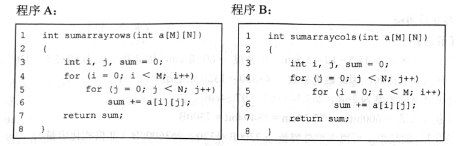

1. 对于数组a的访问，哪个空间局部性更好？哪个时间局部性更好？
2. 对于指令访问来说，for 循环体的空间局部性和时间局部性如何？

解：假定 M、N 都为2048，按字节编址，每个数组元素占 4字节，则指令和数据在主存中的存放情况如图所示。

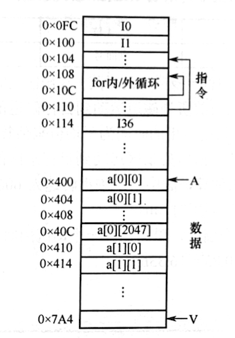

**针对第一问**

对于数组a，程序A 和程序B 的空间局部性相差较大。
程序A对数组a的访问顺序为a[0][0]，a[0][1]......a[0][2047]；a[1][0]，a[1][1]......a[1][2047]由此可见，访问顺序与存放顺序是一致的，因此空间局部性好。

程序B对数组a的访问顺序为a[0][0]，a[1][0]......a[0][2047]；a[0][0]，a[0][1]......a[0][2047]由此可见，访问顺序与存放顺序不一致，每次访问都要跳过2048个数组元素，即8192字节，若主存与 Cache 的交换单位小于 8KB，则每访问一个数组元素都需要将一个主存块装入Cache，因此没有空间局部性。

两个程序中，数组a的时间局部性都差，因为每个数组元素都只被访问一次。

**针对第二问**

对于for循环体，程序A和程序B中的访问局部性是一样的。因为循环体内指令按序连续存放，所以空间局部性好：内循环体被连续重复执行 2048x2048次，因此时间局部性也好。

由上述分析可知，虽然程序A和程序 B 的功能相同，但因内、外两重循环的顺序不同而导致两者对数组a访问的空间局部性相差较大，从而带来执行时间的巨大差异。

### 3.5.2 Cache的基本工作原理
为便于Cache与主存交换信息，Cache和主存都被划分为大小相等的块，Cache块也称 Cache行，每块由若干字节组成，块的长度称为块长（也称行长）。因为 Cache 的容量远小于主存的容量，所以 Cache 中的块数要远少于主存中的块数，Cache 中仅保存主存中最活跃的若干块的副本。

因此，可按照某种策略预测CPU 在未来一段时间内欲访存的数据，将其装入Cache。图所示为Cache 的基本结构。

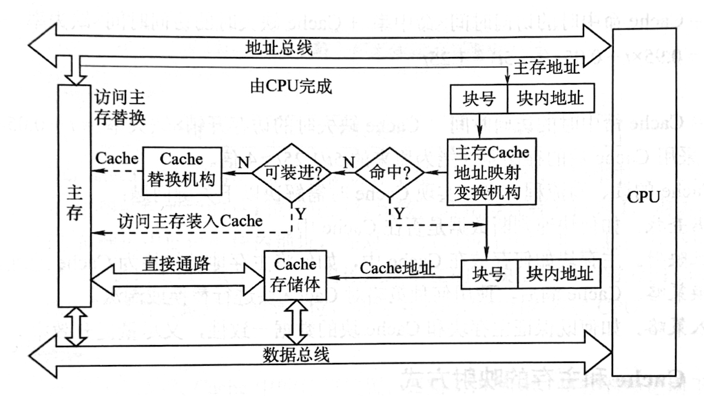

当CPU发出读请求时，若访存地址在Cache 中命中（也称Cache 命中），就将此地址转换成Cache地址，直接对Cache 进行读操作，与主存无关；若Cache 不命中，则仍需访问主存，并把此字所在的块一次性地从主存调入Cache。若此时 Cache 已满，则需根据某种替换算法，用这个块替换 Cache 中原来的某块信息。**整个过程全部由硬件实现**。

值得注意的是，**CPU 与 Cache 之间的数据交换以字为单位，而Cache 与主存之间的数据交换则以 Cache 块次单位。**

当CPU 发出写请求时，若Cache 命中，有可能遇到 Cache与主存中的内容不一致的问题。例如，CPU 写 Cache，把 Cache 某单元中的内容从X修改成X，而主存对应单元中的内容仍然是X，没有改变，若 Cache 命中，则需要按照一定的写策略处理，常见的处理方法有全写法和回写法，详见本节的Cache 写策略部分。

某些计算机中也采用同时访问 Cache和主存的方式，若Cache 命中，则终止访存。

CPU 欲访问的信息已在Cache 中的比率称为Cache 的命中率。设一个程序执行期间，Cache的总命中次数为$N_c$，访问主存的总次数为$N_m$，则命中率H为：$$H = \frac{N_c}{N_m+N_c}$$

可见为提高访问效率，命中率H越接近1越好。设$t_c$为命中时的Cache 访问时间，$t_m$为未命中（也称缺失）时的访问时间，1-H表示未命中率（也称缺失率），则Cache-主存系统的平均访问时间$T_a$为：$$T_a = Ht_c + (1-H)t_m$$

假设 Cache的速度是主存的5倍，且Cache 的命中率为95%，则采用 Cache 后，存储器性能提高多少（假设采用先访问 Cache，Cache 不命中时，才采用访问主存的方式）？

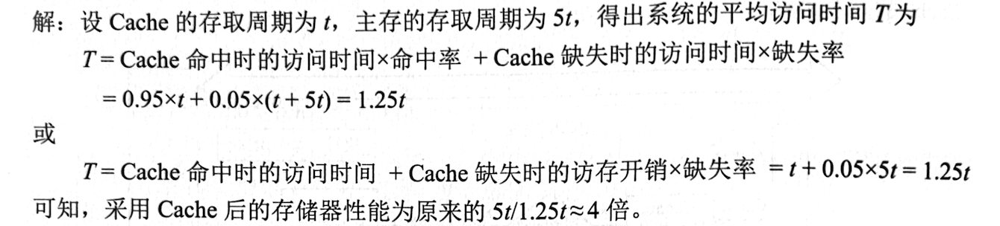

根据 Cache的读、写流程，可知实现Cache 时需解决以下关键问题：
1. 数据查找。如何快速判断数据是否在 Cache 中。
2. 地址映射。主存块如何存放在Cache 中，如何将主存地址转换为Cache 地址。
3. 替换策略。Cache 满后，使用何种策略对Cache 块进行替换或淘汰。
4. 写入策略。如何既保证主存块和 Cache 块的数据一致性，又尽量提升效率。

### 3.5.3 Cache 和主存的映射方式
Cache 行数比主存块数少得多，因此主存中只有一部分块的信息可在 Cache 中，因此在Cache 中要为每块加一个标记位，指明它是主存中哪一块的副本。该标记的内容相当于主存中块的编号。为了说明Cache 行中的信息是否有效，每个 Cache 行需要一个有效位。

Cache 行中的信息是主存中某个块的副本，地址映射是指把主存地址空间映射到Cache地址空间，即把存放在主存中的信息按照某种规则装入Cache。地址映射的方法有以下3种。

#### 直接映射
主存中的每一块只能装入Cache 中的唯一位置。若这个位置已有内容，则产生块冲突，原来的块将无条件地被替换出去（无须使用替换算法）。直接映射实现简单，但不够灵活，即使Cache的其他许多地址空着也不能占用，这使得直接映射的块冲突概率最高，空间利用率最低。

直接映射的关系可定义为

**Cache 行号 =主存块号 mod Cache 总行数**

假设Cache 共有$2^c$行，主存有$2^m$块，在直接映射方式中，主存的第0块、第$2^c$块、第$2^{c+1}$块•••只能映射到 Cache的第0行；而主存的第1块、第$2^c+1$块、第$2^{c+1}+1$块•••••只能映射到 Cache 的第1行，以此类推。由映射函数可看出，主存块号的低位正好是它要装入的Cache行号。给每个 Cache行设置一个长为t=m-c的标记（tag），当主存某块调入Cache 后，就将其块号的高t位设置在对应 Cache 行的标记中，如图所示。

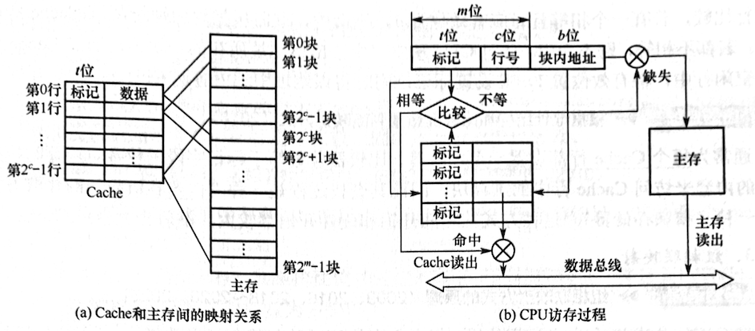

直接映射的地址结构为
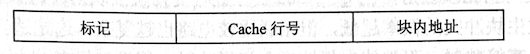

CPU 访存过程如图所示。首先根据访存地址中间的c位，找到对应的Cache行，将对应Cache 行中的标记和主存地址的高t位标记进行比较，若相等且有效位为1，则访问Cache“命中”，此时根据主存地址中低位的块内地址，在对应的Cache 行中存取信息：若不相等或有效位为0，则“不命中”，此时 CPU从主存中读出该地址所在的一块信息送到对应的Cache 行中，将有效位置1，并将标记设置为地址中的高t位，同时将该地址中的内容送 CPU。

#### 全相联映射
主存中的每一块可以装入Cache 中的任何位置，如图3.19所示，每行的标记用于指出该行来自主存的哪一块，因此CPU 访存时需要与所有Cache行的标记进行比较。

优点：①Cache 块的冲突概率低，只要有空闲Cache 行，就不会发生冲突：②空间利用率高；③命中率高。缺点：①标记的比较速度较慢：②实现成本较高，通常需采用按内容寻址的相联存储器。

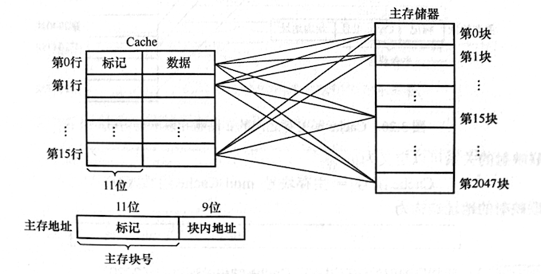

全相联映射的地址结构为
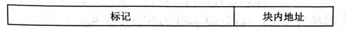

CPU 访存过程如下：首先将主存地址的高位标记（位数=log2主存块数）与Cache 各行的标记进行比较，若有一个相等且对应有效位为1，则命中，此时根据块内地址从该Cache 行中取出信息；若都不相等，则不命中，此时 CPU从主存中读出该地址所在的一块信息送到Cache 的任意一个空闲行中，将有效位置1，并设置标记，同时将该地址中的内容送 CPU。

通常为每个 Cache 行都设置一个比较器，比较器位数等于标记字段的位数。访存时根据标记字段的内容来访问 Cache 行中的主存块，因此其查找过程是一种“按内容该问”的存取方式，所以是一种“相联存储器”。这种方式的时间开销和硬件开销都较大，不适合大容量 Cache

#### 组相联映射
将 Cache 分成Q个大小相等的组，每个主存块可以装入固定组中的任意一行，即组间采用直接映射、而组内采用全相联映射的方式，如图所示。它是对真接映射利全相联映射的一种折史，当**Q=1时变为全相联映射，当Q= Cache 行数时变为直接映射**。路数越大，即每组 Cache行的数量越大，发生块冲突的概率越低，但相联比较电路也越复杂。选定适当的数量，可使组相联映射的成本接近直接映射，而性能上仍接近全相联映射。假设每组有r个Cache 行，则称为r路组相联，图中每组有两个 Cache 行，因此称为2路组相联。

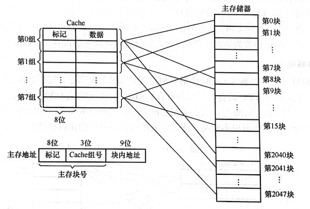

组相联映射的关系可以定义为

**Cache 组号 = 主存块号 mod Cache 组数（Q）**

组相联映射的地址结构为
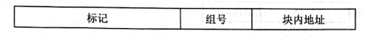

CPU 访存过程如下：首先根据访存地址中间的组号找到对应的 Cache 组；将对应 Cache 组中每个行的标记与主存地址的高位标记进行比较；若有一个相等且有效位为1，则访问 Cache 命中，此时根据主存地址中的块内地址，在对应 Cache 行中存取信息：若都不相等或虽相等但有效位0，则不命中，此时 CPU 从主存中读出该地址所在的一块信息送到对应 Cache 组的任意一个空闲行中，将有效位置1，并设置标记，同时将该地址中的内容送 CPU。

直接映射因为每块只能映射到唯一的Cache行，因此只需设置1个比较器。而r路组相联映射需要在对应分组中与r个Cache 行进行比较，因此需设置r个比较器。

**三者对比总结**

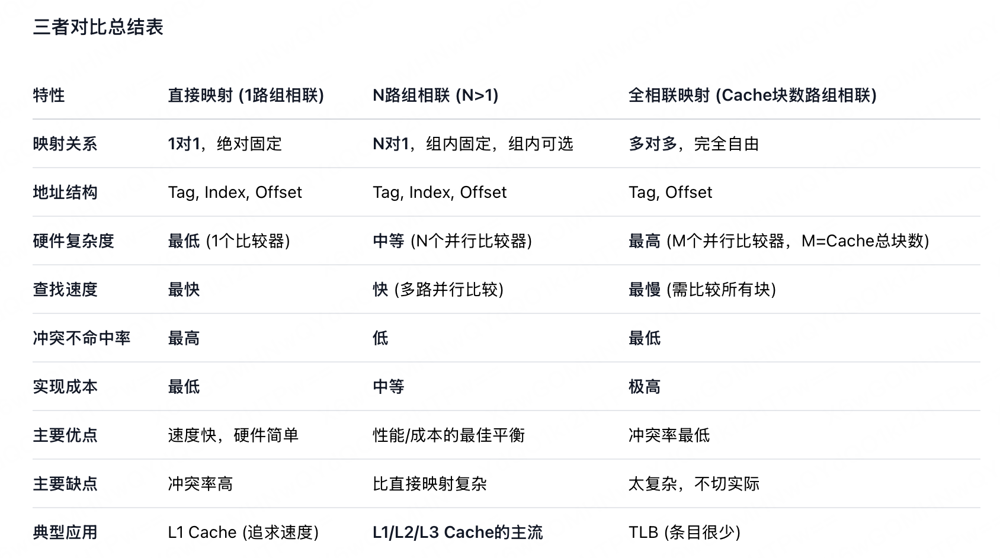

> **什么是L1、L2、L3 Cache**
> L1、L2、L3 Cache都是位于CPU和主存（内存条）之间的高速缓存，它们构成了一个层次化的存储体系（Cache Hierarchy）。这个体系的目标是：用一小部分极快、极贵的SRAM（静态随机存取存储器）作为缓存，来弥补CPU超高速与主存相对低速之间的巨大鸿沟，从而让CPU尽可能地“吃饱”，发挥出最强性能。

#### Cache的标记阵列
每个 Cache行对应一个标记项（包括有效位、脏位、替换算法位、标记位），采用组相联方式时，将每组各行的标记项排成一行，将各组从上到下排列，构成一个二维的标记阵列。查找 Cache 时就是查找标记阵列的标记项是否符合要求。2路组相联映射方式的标记阵列如图所示。

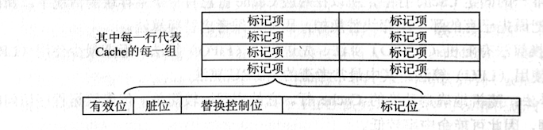

图中的这几个位在Cache（高速缓存）中承担不同功能：

- **有效位**：标记对应Cache项中的数据是否“有效”。如果有效位为1，说明该Cache项存储的是主存中有效数据；若为0，则表示该Cache项的数据无效（比如刚初始化、被替换后未更新）。

- **脏位（也叫修改位）**：记录Cache项中的数据是否被“修改过”。如果脏位为1，说明Cache中的数据已经被修改（与主存对应位置的数据不一致）；后续若要替换该Cache项，需要先把修改后的数据写回主存，避免数据丢失。

- **替换控制位**：用于Cache的“替换算法”（比如LRU最近最少使用、FIFO先进先出等）。通过该位记录Cache项的使用情况（如最近是否被访问），帮助选择“应该被替换的Cache项”。

- **标记位**：存储主存地址的“高位部分”，用于和CPU访问地址的对应高位对比，判断当前Cache项中存储的是否是CPU要访问的主存数据（配合Cache的组索引，完成地址匹配）。

#### 一道例题

假设某个计算机的主存地址空间大小为 256MB，按字节编址，其数据 Cache 有8个 Cache 行，行长为 64B。

1. 若不考虑用于 Cache 的一致维护性位（脏位）和替换算法控制位，并且采用直接映射方式，则该数据Cache 的总容量为多少？
2. 若该 Cache采用直接映射方式，则主存地址为3200（十进制）的主存块对应的Cache 行号是多少？采用2路组相联映射时又是多少？
3. 以直接映射方式为例，简述访存过程（设访存的地址为0123456H）。
解：
4. 因为 Cache 包括了可以对 Cache 中所包含的存储器地址进行跟踪的硬件，即 Cache 的总容量=存储容量+标记阵列容量（有效位、标记位），本题不考虑脏位和替换算法位。

**解答：**

1. 因为 Cache 包括了可以对 Cache 中所包含的存储器地址进行跟踪的硬件，即 Cache 的总容量=存储容量+标记阵列容量（有效位、标记位），本题不考虑脏位和替换算法位。因此本题中每行相关的存储器容量如图所示。
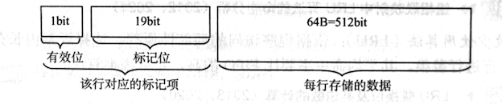

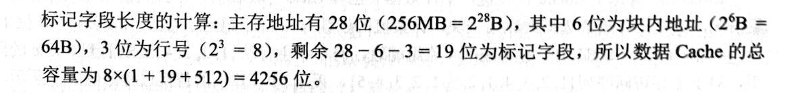
2. 直接映射方式中，主存按照块的大小划分，主存地址3200对应的字块号为3200B/64B=50。而 Cache 只有8行，则50mod8=2，因此对应的Cache 行号为2。2路组相联映射方式，实质上就是将两个 Cache 行合并，内部采用全相联映射方式，外部采用直接映射方式，50 mod 4 =2，对应的组号为2，即对应的 Cache 行号为4或5。
3. 直接映射方式中，28位主存地址可分为19位的主存标记位，3位的块号，6位的块内地址，即0000 000100100011010为主存标记位，001为块号，010110为块内地址。首先根据块号，查Cache （001号 Cache 行）中对应的主存标记位，看是否相同。若相同，再看Cache 行中的有效位是否1，若是，称此访问命中，按块内地址010110读出 Cache行所对应的单元并送入CPU中，完成访存。
若出现标记位不相等或有效位为0的情况，则不命中，访问主存将数据取出并送往CPU和 Cache 对应块中，把主存地址的高19位写入001行的标记位，并将有效位置1。

## 3.6 虚拟存储器

