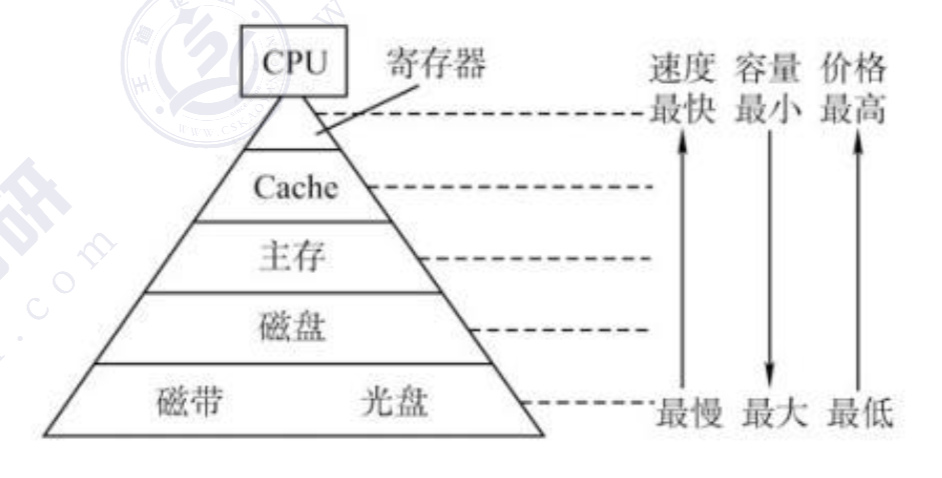
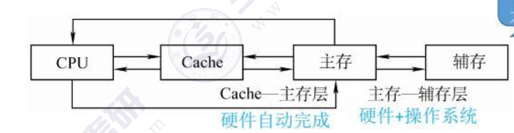
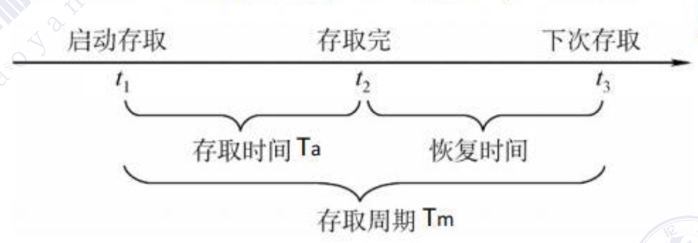
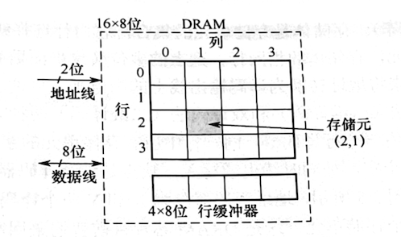
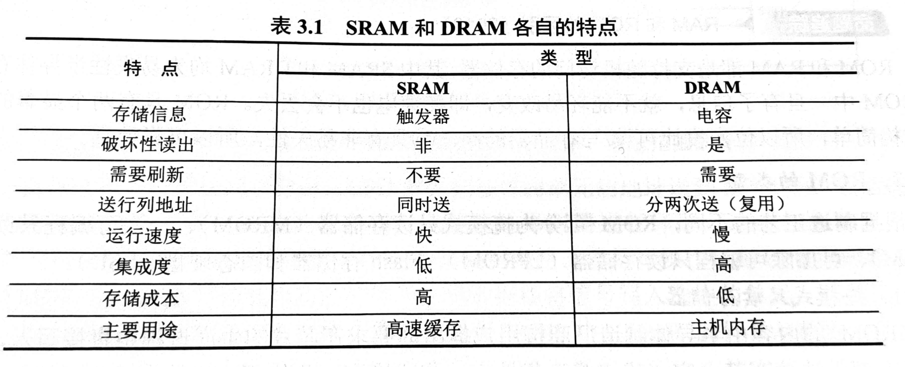
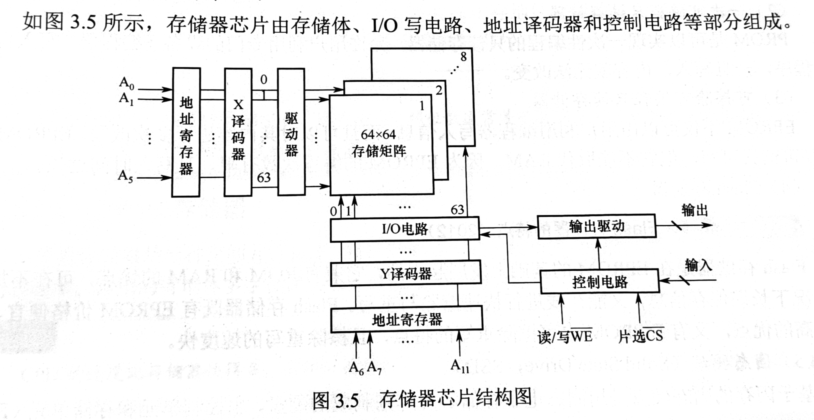
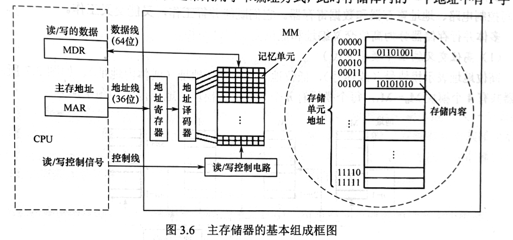
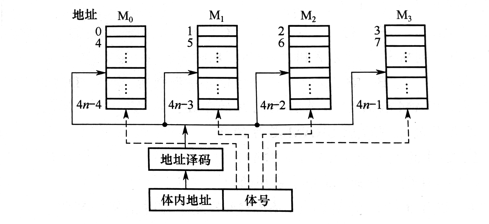
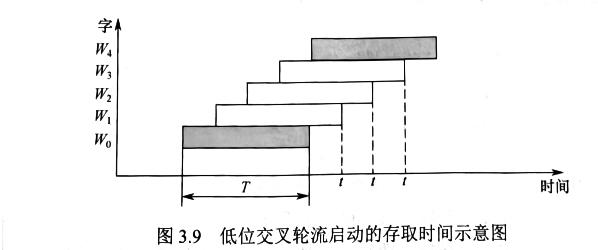

# 三、存储系统

## 3.1 存储器概述

### 3.1.1 存储系统的定义与功能
- **定义**：存储系统是计算机系统中用于存储程序和数据的部件，是计算机的重要组成部分
- **功能**：
  - 保存数据和程序
  - 提供数据的访问和修改能力
  - 在断电情况下能够保持数据的存储（针对非易失性存储）
  - 与CPU协同工作，形成完整的计算系统

### 3.1.2 存储器的层次结构
- **层次结构概念**：为了解决速度、成本和容量之间的矛盾，计算机系统采用多级存储层次

存储器层次结构的主要思想是**上一层的存储器作为低一层存储器的高速缓存**。当CPU要从存储器中存取数据时，先访间Cache，若不在Cache中，则访问主存，若不在主存中，则访问磁盘，此时，操作数从磁盘读出送到主存，然后从主存送到Cache。从CPU 的角度看，Cache-主存层的速度接近于Cache，容量和位价却接近于主存。从主存一辅存层分析，其速度接近于主存，容量和位价却接近于辅存。这就解决了速度、容量、成本这三者之间的矛盾。

**Cache-主存层主要解决CPU和主存速度不匹配的问题**，主存和Cache之间的数据调动是**由硬件自动完成**的，对所有程序员均是透明的。主存一辅存层主要解决存储系统的容量问题，主存和辅存之间的数据调动是**由硬件和操作系统共同完成**的，对应用程序员是透明的。

在主存-辅存层的不断发展中，逐渐形成了虚拟存储系统，在这个系统中程序员编程的地址范围与虚拟存储器的地址空间相对应，编程时可用的地址空间远大于主存空间。

**注意：在Cache-主存层和主存一辅存层中，上一层中的内容都只是下一层中的内容的副本，也即Cache（或主存）中的内容只是主存（或辅存）中的内容的一部分。**

### 3.1.3 存储器的分类
- **按存取方式分类**：
  - 随机存取存储器（RAM）：存储器的任何一个单元都可随机存取，存取时间与存储单元位置无关，**主要用作主存或高速缓冲存储器**。
  - 只读存储器（ROM）：存储器的内容在制造时已写入，用户只能读取，不能修改，**主要用作存放固化程序和数据**。也是随机存取的。可通过电擦除的方式写入。
  - 串行访问存储器：存储器的内容必须按顺序访问，**主要用作磁带等顺序存取设备**。
    - 顺序存取存储器（SAM）：如磁带，必须按顺序访问
    - 直接存取存储器（DAM）：如磁盘/光盘，可定位到大致位置后顺序访问
- **按存储介质分类**：
  - 半导体存储器：如RAM、ROM，cache，速度快，成本高
  - 磁表面存储器：如硬盘、磁带，容量大，成本低
  - 光学存储器：如CD、DVD，容量大，便携性
  - 磁芯存储器：早期存储器，现已基本淘汰

- **按信息保存方式分类**：
  - 易失性存储器：断电后信息丢失，如RAM
  - 非易失性存储器：断电后信息不丢失，如ROM、硬盘

> **相联存储器（Associative Memory）** 是一种按内容寻址的特殊存储器，它不依赖传统的地址来定位数据，而是通过数据的部分或全部内容直接检索并匹配目标信息，也常被称为内容寻址存储器（CAM，Content-Addressable Memory）。
> 
> 相联存储器是按内容寻址：用户输入待匹配的数据（或数据特征），存储器会并行检索所有存储单元，将每个单元的数据与输入内容比对，直接返回匹配成功的存储单元信息（如地址、完整数据）。
>
> **CPU 高速缓存（Cache）的地址映射** , 这是相联存储器最典型的应用。CPU 缓存的快表（TLB，转换检测缓冲区） 本质是小容量相联存储器，用于存储虚拟地址与物理地址的映射关系：
> + 当 CPU 访问内存时，会先将虚拟地址送入 TLB；
> + TLB 并行比对所有存储项的虚拟地址字段，若匹配成功则直接返回物理地址，避免了耗时的页表查询，大幅降低访存延迟。

### 3.1.4 存储系统的性能指标
存储器系统所追求的就是高容量、高速度、低成本和高可靠性，主要性能指标包括：
- **存储容量**：存储器可容纳的二进制信息量，**存储容量**=**地址线数量的2次方**（存储字数，表示存储器的地址空间大小）×**每个存储单元的位数**（存储字长，表示每个存储单元能存储的信息量，也表示一次存取的数据位数）
- **单位成本**：每位二进制位的平均价格，通常以美元/兆位（$ / Mb）表示
- **存取速度**：数据传输率=数据的宽度/存取周期
  - **存取时间（$T_a$）**：存取时间是指从CPU发出存储器请求到存储器完成数据传输所需的时间，包括寻址时间和传输时间,通常以纳秒（ns）为单位表示,分为读出时间和写入时间。
  - **存取周期（$T_m$）**：是指存储器进行一次完整的读/写操作所需要的完整时间，即连续两次独立访问存储器操作之间所需的最小时间间隔。
  
  - **主存带宽**：表示每秒钟主存能够传输的数据量，通常以MB/s或GB/s为单位
- **可靠性**：通常用MTBF（平均无故障时间）来衡量

## 3.2 主存储器

### 3.2.1 SRAM和DRAM
半导体存储器分为随机存储器（RAM）和只读存储器（ROM）。随机存储器（RAM）又分为**静态随机存取存储器（SRAM）** 和 **动态随机存取存储器（DRAM）**。主存储器主要采用DRAM，因为DRAM具有较高的存储密度和较低的成本，适合大容量存储需求，而SRAM则因其高速访问特性，主要用于CPU缓存（Cache）等对速度要求较高的场合。他们都是易失性存储器。ROM是非易失性存储器，主要用于存放固化程序和数据，如BIOS。

> **存储元**是物理基础，存储单元是逻辑集合。通常把存放一个二进制位的物理器件称为存储元，是存储器的最基本构件，是最小的、不可再分的存储单位；
> **存储单元**是由多个存储元组合而成的一个逻辑单位，它是CPU访问存储器（进行读/写操作）的基本单位。用于存储一个数据单元，这个数据单元通常是一个字节或其倍数（如字、双字等）。通常由 8个、16个、32个或64个存储元并排组成。

#### SRAM

**SRAM基本结构**
是由6个晶体管(6T)组成的存储元，由交叉耦合反相器结构形成双稳态电路，两个访问晶体管控制数据的读写

**SRAM工作原理**
- 数据存储原理
  - 交叉耦合的反相器组成的双稳态电路存储数据
  - 一个状态代表0，另一个状态代表1
- 读操作
  - 字线选通，位线预充电
  - 数据通过位线读取
  - 读取过程不破坏原有数据
- 写操作
  - 字线选通
  - 通过位线写入新数据
  - 强制改变交叉耦合反相器的状态

**SRAM特性**
- 优点
  - 读取速度快，不需要刷新
  - 非破坏性读出
  - 可靠性高
- 缺点
  - 单元面积大(约为DRAM的6-8倍)
  - 集成度低
  - 功耗较高
  - 价格昂贵，成本高
- 应用场景
  - CPU高速缓存
  - 寄存器
  - 小容量高速存储需求

#### DRAM 

**DRAM基本结构**
由1个晶体管和1个电容(1T1C)组成的存储元，电容存储电荷代表数据，晶体管作为开关控制电容的充放电

**DRAM工作原理**
- 数据存储原理
  - 电容中存储电荷代表数据(有电荷=1，无电荷=0)
  - 电容会自然放电，需要定期刷新
- 读操作
  - 字线选通，晶体管导通
  - 电容电荷传递到位线
  - 读取后电容放电(破坏性读出)，需要恢复
- 写操作
  - 字线选通，晶体管导通
  - 通过位线向电容充电或放电
  - 写入新数据

**DRAM特性**
- 优点
  - 单元面积小
  - 集成度高
  - 功耗低(静态时)
  - 成本低
- 缺点
  - 读取速度相对较慢
  - 需要定期刷新
  - 破坏性读出，需要恢复
  - 数据会随时间流失
- 应用场景
  - 主内存
  - 大容量存储需求
  - 低成本应用

**需要刷新的存储芯片SDRAM**

DRAM 电容上的电荷一般只能维持1～2ms，因此即使电源不断电，信息也会自动消失。此外，读操作会使其状态发生改变（破坏性读出），需读后再生，这也是称其动态存储器的原因。刷新可以采用读出的方法进行，根据读出内容对相应单元进行重写，即读后再生。对同一行进行相邻两次刷新的时间间隔称为刷新周期，通常取2ms。常用的刷新方式有以取3种；
1. 集中刷新：在一个刷新周期内，利用一段固定的时间，依次对存储器的所有行进行逐一再生，在此期间停止对存储器的读/写操作，称为死时间，也称访存死区。优点是读/写操作期间不受刷新操作的影响：缺点是在集中刷新期间（死区）不能访问存储器。
2. 分散刷新：将一个存储器系统的工作周期分为两部分：前半部分用于正常的读/写操作；后半部分用于刷新。这种刷新方式增加了系统的存取周期，如存储芯片的存取周期为0.5uS，则系统的存取周期为IuS。优点是没有死区；缺点是加长了系统的存取周期。
3. 异步刷新：结合了前两种方法，使得在一个刷新周期内每一行仅刷新一次。具体做法是将刷新周期除以行数，得到相邻两行之间刷新的时间间隔t，每隔时间t产生一次刷新请求。这样就使“死时间”的分布更加分散，避免让CPU 连续等待过长的时间。

**DRAM 的刷新需要注意以下问题**：1. 刷新对CPU是透明的，即刷新不依赖于外部的访问；2. DRAM的刷新单位是行，由芯片内部自行生成行地址；3. 刷新操作类似于读操作，但又有所不同。另外，刷新时不需要选片，即整个存储器中的所有芯片同时被刷新。

**DRAM芯片的地址引脚复用技术（2014）**

DRAM芯片容量较大，地址位数较多，为了减少引脚数，通常采用地址引脚复用技术。即将地址分为行地址和列地址两部分，分别在不同的时间送入同一组地址引脚。具体做法是：在存取周期的前半部分，将行地址送入地址引脚，并通过行地址锁存器锁存；在存取周期的后半部分，将列地址送入同一组地址引脚，并通过列地址锁存器锁存。这样就实现了用较少的引脚传输更多的地址信息。

**DRAM芯片行、列数的优化原则（2018）**

假定有一个$2^n$xB位DRAM 芯片的存储阵列，其行数为r，列数为c，则$2^n$=r*c。存储阵列的地址位数为n，其中行地址位数为log2r，列地址位数为log2c，则n=log2r+log2c。由于 DRAM芯片采用地址引脚复用技术，为减少地址引脚数，应尽量使行、列位数相同，即满足|r-c|最小。又由于 DRAM按行刷新，为减少刷新开销，应使行数较少，因此还需满足r≤c。

**DRAM 芯片行缓冲器容量的计算（2022）**

DRAM 芯片的内部结构示意图如图3.4所示。芯片容量为16x8位，存储阵列为4行×4列，地址引脚采用复用技术，因此仅需2根地址线，分时传送2位行地址和2位列地址。每个存储元有8位，需要8根数据线，芯片内部有一个行缓冲器，用来缓存指定行中每列的数据，其大小为列数x存储元的位数，常用SRAM 实现。选中某行后，该行的所有数据都被送到行缓冲器，以后每个时钟都可以连续地从 DRAM中输出一个数据，因此可支持突发传输（突发传输方式是指在寻址阶段给出数据的首地址，在传输阶段可传送多个连续存储单元的数据）。

目前**更常用的是 SDRAM（同步DRAM）芯片**，与传统的异步 DRAM 不同，SDRAM与CPU的数据交换同步于系统的时钟信号，并且以 CPU-主存总线的最高速度运行，而不需要插入等待状态。在传统 DRAM 中，CPU将地址和控制信号送至存储器后，需经过一段延迟时间，数据才读出或写入。在此期间，CPU 不断采样 DRAM的完成信号，在读写完成之前，CPU 不能做其他工作，降低了 CPU 的执行速度。而SDRAM 在系统时钟的控制下进行数据的读出和写入，它将CPU 发出的地址和控制信号锁存起来，经过指定的时钟周期数后再响应，此时CPU 可执行其他操作。

#### SRAM与DRAM的比较

- 速度
  - SRAM访问速度快(通常1-10ns)
  - DRAM访问速度较慢(通常50-100ns)
- 带宽
  - SRAM带宽较高
  - DRAM带宽相对较低
- 功耗成本
  - SRAM静态功耗较高
  - DRAM静态功耗低，但有刷新功耗

#### 存储器芯片的内部结构

1. **存储体（存储矩阵）**。存储体是存储单元的集合，它由行选择线（X）和列选择线（Y）来选择所访问单元，存储体的相同行、列上的多位（位平面数）同时被读出或写入。
2. **地址译码器**。用来将地址转换为译码输出线上的高电平，以便驱动相应的读/写电路。地址译码有单译码法（一维译码）和双译码法（二维译码）两种方式。
   + 单译码法。只有一个行译码器，同一行中所有存储单元的字线连在一起，同一行中的各单元构成一个字，被同时读出或写入。缺点是地址译码器的输出线数过多。
   + 双译码法。如图3.5所示，地址译码器分为X和Y两个译码器，在选中的行和列交叉点上能确定一个存储单元，这是DRAM芯片目前普遍采用的译码结构。
3. **1/0电路**。用以控制被选中的单元的读出或写入，具有放大信号的作用。
4. **片选控制线**。单个芯片容量太小，往往满足不了计算机对存储器容量的要求，因此需用一定数量的芯片进行存储器的扩展。在访问某个字时，必须“选中”该存储字所在的芯片，而其他芯片不被“选中”，因此需要有片选控制信号（经片选控制线传输）。
5. **读/写控制线**。根据CPU给出的读命令或写命令，经读/写控制线控制被选中单元进行读或写。

### 3.2.2 只读存储器

#### 只读存储器的特点
ROM是一种非易失性存储器，断电后数据不会丢失。ROM的内容在制造时已写入，用户只能读取，不能修改。主要用于存放固化程序和数据，如BIOS。ROM具有两个显著的优点：
- 结构简单，所以位密度比可读/写存储器高。
- 具有非易失性，所以可靠性高。

#### ROM的类型
根据制造工艺的不同，ROM可分为以下几种类型：
- **掩模式只读存储器（MROM）**：在制造过程中将数据直接写入存储器芯片中，用户无法修改。适用于大批量生产的固定程序存储。
- **一次可编程只读存储器（PROM）**：用户可以在购买后通过专用设备将数据写入存储器，但写入后数据不可修改。适用于小批量定制程序存储。
- **可擦除可编程只读存储器（EPROM）**：用户可以通过紫外线照射将数据擦除，然后重新编程。适用于需要多次修改程序。EPROM虽然可以擦除和重写，但擦除过程较为复杂且耗时。且编程次数有限，一般为1000次左右。无法替代RAM。
- **Flash存储器**：一种电可擦除可编程只读存储器（EEPROM），可以通过电信号进行擦除和编程，速度较快，广泛应用于固态硬盘、U盘等存储设备。Flash存储器是目前应用最广泛的非易失性存储器之一，具有较高的存储密度和较低的成本。Flash存储器按擦除方式可分为NOR Flash和NAND Flash两种类型。NOR Flash适用于代码存储，NAND Flash适用于大容量数据存储。
- **固态硬盘（SSD）**：基于Flash存储器技术的存储设备，具有高速读写性能和高可靠性，逐渐取代传统机械硬盘。基于闪存的固态硬盘是用固态电子存储芯片阵列制成的硬盘，由控制单元和存储单元组成。保留了Flash存储器的非易失性和高密度特点，同时通过优化控制器设计，实现了更高的读写速度和更好的耐用性。缺点是价格较高。

### 3.2.3 主存储器的基本组成

图3.6是主存储器（Main Memory，MM）的基本框图，其中由一个个存储0或1的记忆单元（也称存储元件、存储单元）构成的存储矩阵（也称存储体、存储阵列）是存储器的核心部件。存储元件是具有两种稳态的能表示二进制0和1的物理器件。为了存取存储体中的信息，必须对存储单元编号（也称编址）。编址单位是指具有相同地址的那些存储元件构成的一个单位，可以按字节编址，也可以按字编址。现代计算机**通常采用字节编址**方式，此时存储体内的一个地址中有1字节。

**MAR和MDR位数与地址线/数据线的关系、寻址范围的计算（2021）**

MAR和MDR位数与地址线/数据线的宽度相同。地址线的宽度决定了存储器的寻址范围，数据线的宽度决定了每次存取的数据量。

具体来说：指令执行过程中需要访问主存时，CPU首先把被访问单元的地址送到 MAR 中，然后通过地址线将主存地址送到主存中的地址寄存器，以便地址译码器进行译码，选中相应单元，同时CPU将读/写控制信号通过控制线送到主存的读/写控制电路。若是写操作，则CPU同时将要写的信息送到 MDR 中，在读/写控制电路的控制下，经数据线将信号写入选中的单元：若是读操作，则主存读出选中单元的内容送至数据线，然后被送到MDR 中。MDR的位数与数据线的位数相同，MAR 的位数与地址线的位数相同。图3.6采用64位数据线，所以在按字节编址方式下，每次最多可以存取8个单元的内容。地址线的位数决定了主存地址空间的最大可寻址范围。例如，36 位地址的最大寻址范围为0~$2^{36}$-1，即地址从0开始编号。

### 3.2.4 多模块存储器
多模块存储器是一种空间并行技术，利用多个结构完全相同的存储模块同时工作来提高存储器的带宽和访问速度。每个存储模块都有独立的地址线和数据线，可以并行处理多个存储请求，从而实现更高的数据传输速率。常用的有**单体多字存储器**和**多体并行存储器**。

#### 单体多字存储器
单体多字存储器是将多个字（通常为2的整数次方）存储在同一个存储模块中，通过增加数据线的宽度来实现并行访问。例如，一个4字存储器可以同时存取4个字的数据，从而提高数据传输速率。单体多字存储器的地址线数量与存储字数的对数成正比，而数据线数量则与每次存取的字数成正比。

在一个存取周期内，从同一地址取出m条指令，然后依次送到CPU中执行，这样就提高了存储器的带宽，缩短了指令的取指时间。每隔1/m个存储周期，CPU向主存存取一条指令，显然提高了单体存储器的工作速度。

**缺点**：只有数据和指令在在主存中是连续存放的情况下，才能发挥单体多字存储器的优越性，否则就失去了意义。一旦遇到转移指令，单体多字存储器就无法发挥作用。

#### 多体并行存储器
多体并行存储器由多体模块组成，每个模块都有相同的容量和存取速度，各模块都有独立的读/写控制电路，地址寄存器和数据寄存器。他们既能并行工作，也能交叉工作。

**多体并行寄存器分为两种类型**：
1. 高位交叉编址（顺序方式）：将地址的高位部分用来选择存储模块，低位部分用来选择模块内的存储单元。例如，假设有4个存储模块，每个模块有256个存储单元，则地址的前2位用于选择模块，后8位用于选择模块内的单元。
2. 低位交叉编址（交错方式）：将地址的低位部分用来选择存储模块，高位部分用来选择模块内的存储单元。例如，假设有4个存储模块，每个模块有256个存储单元，则地址的后2位用于选择模块，前8位用于选择模块内的单元。

**交叉存储器中数据的存放方式（2017）：**

低位地址为模块号，高位地址为模块内地址。总是把高位的体内地址送到由低位地址号所选中的模块内进行译码。程序连续存放在相邻模块中，因此称为交错存储器。

**交叉存储器可以采用轮流启动和同时启动两种方式工作。**

+ 轮流启动方式是指在一个存取周期内，只启动一个模块进行存取操作，而其他模块处于空闲状态；若每个模块一次读/写的位数正好等于数据总线位数，模块的存取周期为T，总线周期为r，为实现轮流启动方式，存储器交叉模块数应大于或等于T/r。

+ 同时启动方式是指在一个存取周期内，所有模块同时进行存取操作，从而实现更高的数据传输速率。设每个模块一次读/写的位数正好等于数据总线位数，则可以同时启动所有模块进行读写。
 

**交叉存储器存取时间和带宽的计算（2012、2013）**

低位交叉存储器中，设单个模块存取周期为\( T \)、模块数为\( m \)，模块启动间隔（流水节拍）\( r = T/m \)，每个字的位数为\( b \)。连续存取\( m \)个字时，交叉方式的总时间是\( t_{\text{交叉}} = T + (m-1)r \)（第一个字需等1个周期\( T \)，后续\( m-1 \)个字各等1个节拍\( r \)），而顺序方式需串行执行\( m \)个周期，总时间\( t_{\text{顺序}} = mT \)。

存取带宽指单位时间内传输的总数据量：顺序方式的带宽为\( W_{\text{顺序}} = \frac{mb}{mT} = \frac{b}{T} \)；交叉方式在模块全部启动后的稳定流水线阶段，每经过\( r \)时间就能输出1个字，稳定带宽为\( W_{\text{稳定}} = \frac{b}{r} = \frac{mb}{T} \)，是顺序方式的\( m \)倍，这也对应了“存取速度提高\( m \)倍”的结论。

## 3.3 主存储器与CPU的连接

