# 指令系统-以8086为例

目录：
- [指令系统-以8086为例](#指令系统-以8086为例)
  - [一 预备](#一-预备)
    - [1.1 计算机中的数制](#11-计算机中的数制)
    - [1.2 计算机中的码制](#12-计算机中的码制)
    - [1.3 信息的编码](#13-信息的编码)
  - [二 微机组成原理](#二-微机组成原理)
    - [2.1 微机的结构](#21-微机的结构)
    - [2.2 8086基本结构](#22-8086基本结构)
      - [2.2.1 寄存器](#221-寄存器)
      - [2.2.2 引脚及其功能](#222-引脚及其功能)
  - [三 8086 指令系统](#三-8086-指令系统)
    - [3.1 寻址方式](#31-寻址方式)
    - [3.2 数据传送指令](#32-数据传送指令)
      - [3.2.1 通用传送指令](#321-通用传送指令)
        - [MOV指令](#mov指令)
        - [PUSH压栈指令](#push压栈指令)
        - [POP弹出指令](#pop弹出指令)
        - [XCHG交换指令](#xchg交换指令)
        - [XLAT查表指令](#xlat查表指令)
      - [3.2.2 输入输出指令](#322-输入输出指令)
        - [IN输入指令](#in输入指令)
        - [OUT输出指令](#out输出指令)
      - [3.2.3 目标地址传送指令](#323-目标地址传送指令)
        - [LEA传送偏移地址](#lea传送偏移地址)
    - [3.3 算术运算指令](#33-算术运算指令)
      - [3.3.1 加法指令](#331-加法指令)
        - [ADD不带进位的加法指令](#add不带进位的加法指令)
        - [ADC带进位的加法](#adc带进位的加法)
        - [INC加1指令](#inc加1指令)
        - [AAA非压缩BCD码加法调整指令](#aaa非压缩bcd码加法调整指令)
        - [DAA压缩BCD码加法调整指令](#daa压缩bcd码加法调整指令)
      - [3.3.2 减法指令](#332-减法指令)
        - [SUB不考虑借位的减法指令](#sub不考虑借位的减法指令)
        - [SBB考虑借位的减法指令](#sbb考虑借位的减法指令)
        - [DEC减1指令](#dec减1指令)
        - [NEG求补指令](#neg求补指令)
        - [CMP比较指令](#cmp比较指令)
        - [AAS非压缩BCD码减法调整指令](#aas非压缩bcd码减法调整指令)
        - [DAS压缩BCD码减法调整指令](#das压缩bcd码减法调整指令)
      - [3.3.3 乘法指令](#333-乘法指令)
        - [MUL符号数的乘法指令(MEM/REG)](#mul符号数的乘法指令memreg)
        - [IMUL有符号数乘法指令](#imul有符号数乘法指令)
      - [3.3.4 除法指令](#334-除法指令)
        - [DIV无符号数除法指令](#div无符号数除法指令)
        - [IDIV有符号数除法指令](#idiv有符号数除法指令)
    - [3.4 逻辑运算和移位指令](#34-逻辑运算和移位指令)
      - [3.4.1 逻辑运算指令](#341-逻辑运算指令)
        - [AND逻辑与](#and逻辑与)
        - [OR逻辑或](#or逻辑或)
        - [NOT逻辑非](#not逻辑非)
        - [XOR逻辑异或](#xor逻辑异或)
        - [TEST测试指令](#test测试指令)
      - [3.4.2 移位指令](#342-移位指令)
        - [非循环移位指令](#非循环移位指令)
        - [](#)
    - [3.5 控制转移指令](#35-控制转移指令)
      - [3.5.1 转移指令](#351-转移指令)
        - [JMP无条件转移指令](#jmp无条件转移指令)
        - [条件转移指令](#条件转移指令)
      - [3.5.2 循环控制指令](#352-循环控制指令)
        - [LOOP](#loop)
      - [3.5.3 过程调用指令](#353-过程调用指令)
        - [CALL调用指令](#call调用指令)
      - [3.5.4 中断指令](#354-中断指令)
    - [3.6 处理器控制指令](#36-处理器控制指令)
      - [3.6.1 标志位操作](#361-标志位操作)
        - [CF 设置指令](#cf-设置指令)
        - [DF 设置指令](#df-设置指令)
        - [IF 设置指令](#if-设置指令)
      - [3.6.2 HLT（halt）](#362-hlthalt)
  - [四 8086 汇编语言程序设计](#四-8086-汇编语言程序设计)
    - [4.1 汇编语言和C语言的区别](#41-汇编语言和c语言的区别)
      - [4.1.1 C语言的处理流程](#411-c语言的处理流程)
      - [4.1.2 汇编语言的处理流程](#412-汇编语言的处理流程)
      - [4.1.3 关键差异](#413-关键差异)
    - [4.2 汇编语言程序的结构](#42-汇编语言程序的结构)
      - [4.2.1 汇编语言的语句与格式](#421-汇编语言的语句与格式)
    - [4.3 运算符](#43-运算符)
      - [4.3.1 SEG、OFFSET 取地址运算符](#431-segoffset-取地址运算符)
      - [4.3.2 TYPE、LENGTH、SIZE 取值运算符](#432-typelengthsize-取值运算符)
      - [4.3.3 PTR 属性运算符](#433-ptr-属性运算符)
    - [4.4 伪指令](#44-伪指令)
      - [4.4.1 数据定义伪指令](#441-数据定义伪指令)
        - [**常数或常数表达式**](#常数或常数表达式)
        - [**字符串**](#字符串)
        - [**`？`占位符**](#占位符)
        - [**N DUP（初值\[,初值...\]）复制**](#n-dup初值初值复制)
        - [**$ 地址计数器的当前值**](#-地址计数器的当前值)
      - [4.4.2 符号定义伪指令](#442-符号定义伪指令)
      - [4.4.3 段定义伪指令](#443-段定义伪指令)
        - [ASSUME伪指令](#assume伪指令)
        - [ORG伪指令](#org伪指令)
        - [PROC、ENDP过程定义伪指令](#procendp过程定义伪指令)
        - [END汇编结束伪指令](#end汇编结束伪指令)
    - [4.5 汇编语言程序设计基本方法](#45-汇编语言程序设计基本方法)
      - [4.5.1 顺序结构程序](#451-顺序结构程序)
      - [4.5.2 分支结构程序](#452-分支结构程序)
        - [IF...THEN结构](#ifthen结构)
        - [IF...THEN...ELSE结构](#ifthenelse结构)
        - [举例](#举例)
      - [4.5.3 循环结构程序](#453-循环结构程序)
    - [4.6 DOS及BIOS中断调用](#46-dos及bios中断调用)
      - [4.6.1 中断调用及中断服务子程序返回](#461-中断调用及中断服务子程序返回)
        - [**案例场景**](#案例场景)
        - [堆栈情况](#堆栈情况)
        - [关键点总结](#关键点总结)
        - [结合具体寄存器值的模拟案例](#结合具体寄存器值的模拟案例)
      - [4.6.2 D0S系统功能调用使用方法](#462-d0s系统功能调用使用方法)
        - [**AH=01H：从键盘读入一个字符并显示**](#ah01h从键盘读入一个字符并显示)
        - [**AH=08H：从键盘读入一个字符但是不显示**](#ah08h从键盘读入一个字符但是不显示)
        - [**AH=02H：向屏幕输出一个字符**](#ah02h向屏幕输出一个字符)
        - [**AH=09H：显示字符串**](#ah09h显示字符串)
        - [**AH=4CH：终止程序并返回DOS**](#ah4ch终止程序并返回dos)
        - [INT 21H 的本质](#int-21h-的本质)
    - [4.7 一些题目](#47-一些题目)
      - [题目一](#题目一)
      - [题目二](#题目二)
      - [题目三](#题目三)
  - [五 微机的存储器](#五-微机的存储器)
    - [5.1 存储器的分类与组成](#51-存储器的分类与组成)
      - [5.1.1 内存与外存（按连接方式）](#511-内存与外存按连接方式)
      - [5.1.2 存储器的其他分类](#512-存储器的其他分类)
      - [5.1.3 RAM与ROM的特性对比](#513-ram与rom的特性对比)
    - [5.2 半导体存储器芯片的结构](#52-半导体存储器芯片的结构)
      - [5.2.1 核心组件](#521-核心组件)
      - [5.2.2 存储容量计算](#522-存储容量计算)
    - [5.3 随机存取存储器（RAM）](#53-随机存取存储器ram)
      - [5.3.1 静态RAM（SRAM）](#531-静态ramsram)
      - [5.3.2 动态RAM（DRAM）](#532-动态ramdram)
    - [5.4 只读存储器（ROM）](#54-只读存储器rom)
      - [5.4.1 ROM类型](#541-rom类型)
      - [5.4.2 EPROM芯片示例：2716（2K×8位）](#542-eprom芯片示例27162k8位)
    - [5.5 存储器的连接](#55-存储器的连接)
      - [5.5.1 容量扩展方法](#551-容量扩展方法)
      - [5.5.2 连接CPU的关键步骤](#552-连接cpu的关键步骤)
    - [5.6 新型存储器](#56-新型存储器)
      - [5.6.1 主要类型](#561-主要类型)
    - [5.7 磁表面存储器与光盘存储器](#57-磁表面存储器与光盘存储器)
      - [5.7.1 磁表面存储器（硬盘）](#571-磁表面存储器硬盘)
      - [5.7.2 光盘存储器](#572-光盘存储器)
    - [5.8 关键总结](#58-关键总结)
      - [5.8.1 存储器核心参数对比](#581-存储器核心参数对比)
      - [5.8.2 存储器扩展技术](#582-存储器扩展技术)
  - [六 输入输出与中断](#六-输入输出与中断)
    - [6.1 输入输出接口概述](#61-输入输出接口概述)
      - [6.1.1 接口电路的基本结构](#611-接口电路的基本结构)
      - [6.1.2 I/O指令与端口编址](#612-io指令与端口编址)
    - [6.2 CPU与外设数据传送方式](#62-cpu与外设数据传送方式)
      - [6.2.1 无条件传送（同步传送）](#621-无条件传送同步传送)
      - [6.2.2 查询传送（异步传送）](#622-查询传送异步传送)
      - [6.2.3 中断传送](#623-中断传送)
      - [6.2.4 DMA传送（直接存储器存取）](#624-dma传送直接存储器存取)
    - [6.3 中断机制详解](#63-中断机制详解)
      - [6.3.1 中断处理流程](#631-中断处理流程)
      - [6.3.2 中断向量表](#632-中断向量表)
      - [6.3.3 中断优先级与嵌套](#633-中断优先级与嵌套)
    - [6.4 8086/8088中断系统](#64-80868088中断系统)
      - [6.4.1 中断分类](#641-中断分类)
        - [外部中断](#外部中断)
        - [内部中断](#内部中断)
      - [6.4.2 中断类型号分配](#642-中断类型号分配)
      - [6.4.3 8086中断响应流程](#643-8086中断响应流程)
    - [6.5 中断服务程序设计](#65-中断服务程序设计)
      - [6.5.1 关键步骤](#651-关键步骤)
      - [6.5.2 示例代码（数据采集系统）](#652-示例代码数据采集系统)
    - [6.6 DMA传送方式对比与总结](#66-dma传送方式对比与总结)
      - [6.6.1 DMA传送概述](#661-dma传送概述)
      - [6.6.2 数据传送方式对比](#662-数据传送方式对比)
      - [6.6.3 关键术语速查表](#663-关键术语速查表)


## 一 预备

### 1.1 计算机中的数制

无符号数的表示方法：
1. 二进制数01  （两个数字）
2. 十进制数0～9   （十个数字）
3. 十六进制数0～9、A～F  （十六个数字）


各种数制之间的转换：
1. 非十进制数到十进制数的转换：按相应进位计数制的权表达式展开，再按十进制求和。
2. 十进制数制转换为二进制数制：整数部分除2取余；小数部分乘2取整。
3. 二进制与十六进制数之间的转换：用4位二进制数表示1位十六进制数


###  1.2 计算机中的码制
对于符号数，机器数常用的表示方法有原码、反码和补码三种。

注意：
1. 对正数，三种表示法均相同。
2. 它们的差别在于对负数的表示。

原码   
+ 符号位：0 表示正，1 表示负；   
+ 数值位：真值的绝对值。  
+ 注意：数0 的原码不唯一   

反码      
+ 若X>0 ，则 [X]反=[X]原   
+ 若X<0， 则 [X]反= 对应原码的符号位不变，数值部分按位求反
+ 注意：数0 的反码也不唯一    

补码
定义：
+ 若X>0， 则[X]补= [X]反= [X]原
+ 若X<0， 则[X]补= [X]反+1
+ 注意：机器字长为8 时，数0 的补码唯一，同为 00000000


8 位二进制的表示范围：   
原码：-127~+127   
反码：-127~+127   
补码：-128~+127   


特殊数10000000   
该数在原码中定义为： -0   
在反码中定义为： -127    
在补码中定义为： -128     
对无符号数：(10000000)２ = 128      


### 1.3 信息的编码

+ **十进制数的二进制数编码**：用4 位二进制数表示一位十进制数。有两种表示法：压缩 BCD 码和非压缩BCD 码。

   + 压缩BCD码的每一位用4位二进制表示，0000~1001 表示0~9，一个字节表示两位十进制数。
   +  非压缩BCD码用一个字节(8位)表示一位十进制数，高4 位总是0000，低4位的`0000~1001`表示0~9

+ **字符的编码**：计算机采用7位二进制代码对字符进行编码
   + 数字0~9 的编码是0110000~0111001，它们的高3 位均是011，后4位正好与其对应的二进制代码（BCD 码）相符。
   + 英文字母A~Z 的ASCII 码从1000001（41H）开始顺序递增，字母 a~z 的ASCII 码从1100001（61H）开始顺序递增，这样的排列对信息检索十分有利。

## 二 微机组成原理


### 2.1 微机的结构

**计算机的经典结构——冯.诺依曼结构**
1. 计算机由运算器、控制器、输入设备和输出设备五大部分组成（**运算器和控制器又称为CPU**）
2. 数据和程序以二进制代码形式不加区分地存放在存储器总，存放位置由地址指定，数制为二进制。
3. 控制器是根据存放在存储器中的指令序列来操作的，并由一个程序计数器控制指令的执行。


**系统总线的分类**
1. 数据总线（Data Bus），它决定了处理器的字长。
2. 地址总线（Address Bus），它决定系统所能直接访问的存储器空间的容量。
3. 控制总线（Control Bus）


### 2.2 8086基本结构
+ 8086 是一种单片微处理芯片，其内部数据总线的宽度是 16 位，外部数据总线宽度也是16 位，片内包含有控制计算机所有功能的各种电路。
+ 8086 地址总线的宽度为 20 位，有1MB（2^20）寻址空间。
+ 8086CPU 由总线接口部件 BIU 和执行部件EU 组成。BIU 和EU 的操作是异步的，为8086 取指令和执行指令的并行操作体统硬件支持。


**为什么8086地址总线是16位，但是地址总线宽度为20位？**   
地址总线宽度决定了处理器可寻址的内存空间大小。若 8086 地址总线为 16 位，其寻址空间仅为 2^16 = 64KB，这在当时被认为是不够的。为了让 8086 能访问更大的内存空间，Intel 将其地址总线设计为 20 位，这样可寻址空间达到 2^20 = 1MB
，为了实现 20 位地址寻址，8086 采用了分段寻址方式。它设置了 4 个段寄存器（CS、DS、SS 和 ES），每个段寄存器为 16 位。在形成物理地址时，先将段寄存器内容左移 4 位（相当于乘以 16），形成 20 位的段地址，再与 16 位的偏移地址相加，得到 20 位的物理地址。

**为什么是2^20 = 1MB**    
在 8086 等早期处理器中，内存按字节编址（即每个地址对应 1 字节的存储空间）,20 位地址总线可表示 2^20个字节地址，而计算机以二进制定义存储单位，2^20字节恰好等于 1兆字节（1MB）。


#### 2.2.1 寄存器


+ 通用寄存器
   - **通用数据寄存器（AX、BX、CX、DX）**：可用于暂存运算数据，参与算术和逻辑运算。AX（累加器）使用频率高，如乘法、除法等运算默认以AX为操作数或存放结果；BX可作基址寄存器，用于存储器寻址；CX常用于计数，如循环指令中自动计数；DX常配合AX进行乘除运算，存放高位数据。
   - **指针寄存器（BP、SP）**：BP（基址指针寄存器）用于访问堆栈段中的数据，常与SP配合获取堆栈中数据偏移地址；SP（堆栈指针寄存器）始终指向堆栈栈顶，用于控制堆栈操作，如入栈、出栈操作时自动调整指针。 
   - **变址寄存器（SI、DI）**：SI（源变址寄存器）、DI（目的变址寄存器）用于存储器寻址，在字符串操作等指令中，SI指向源操作数地址，DI指向目的操作数地址。 
+ 段寄存器（DS、ES、SS、CS ）
   - **DS（数据段寄存器）**：存放数据段的段基址，确定程序数据所在存储区域。
   - **ES（附加段寄存器）**：作为数据段补充，用于存储数据，在串操作等指令中可作为目的操作数所在段基址。 
   - **SS（堆栈段寄存器）**：存放堆栈段段基址，与SP配合管理堆栈空间。 
   - **CS（代码段寄存器）**：存放代码段段基址，与指令指针寄存器IP配合确定下一条要执行指令的地址。 
+ 专用寄存器
   - **IP（指令指针寄存器）**：始终指向下一条待执行指令在代码段内的偏移地址，与CS配合实现指令顺序执行及转移等操作。 
   - **FLAGS（状态标志寄存器）**：存放运算结果的状态标志（如进位标志CF、零标志ZF等）和控制标志（如中断允许标志IF等），反映运算结果特征及控制CPU操作。 


**FLAGS（状态标志寄存器）**

+ 状态标志：
   + 进位标志位（CF）：运算结果的最高位有进位或有借位，则CF=1
   + 辅助进位标志位（AF）：运算结果的低四位有进位或借位，则AF=1
   + 溢出标志位（OF）：运算结果有溢出，则 OF=1
   + 零标志位（ZF）：反映指令的执行是否产生一个为零的结果
   + 符号标志位（SF）：指出该指令的执行是否产生一个负的结果
   + 奇偶标志位（PF）：表示指令运算结果的低8 位“1”个数是否为偶数
+ 控制标志位
   + 中断允许标志位（IF）：表示CPU 是否能够响应外部可屏蔽中断请求
   + 跟踪标志（TF）：CPU 单步执行


有符号数运算后，若 SF≠OF，说明结果正确；若 SF=OF，说明结果错误（溢出）。


#### 2.2.2 引脚及其功能
+ AD15~AD0：双向三态的地址总线，输入/输出信号
+ INTR：可屏蔽中断请求输入信号，高电平有效。可通过设置 IF 的值来控制。
+ NMI：非屏蔽中断输入信号。不能用软件进行屏蔽。
+ RESET：复位输入信号，高电平有效。复位的初始状态见P21
+ MN/MX：最小最大模式输入控制信号。


## 三 8086 指令系统   
操作系统由操作码和操作数组成。  

### 3.1 寻址方式
寻址方式说明：
1. **可以直接给出操作数的值，也可以给出操作数存放的地址**，CPU根据指令中的地址信息求出存放操作数的有效地址，对存放在有效地址中的操作数进行操作。  
2. 寻址方式：用于说明操作数所在地址的方法。
3. 内存单元的物理地址：段基地址*10H+偏移地址（偏移地址也叫逻辑地址）

+ **1.立即数寻址**   
   + 操作数(为一常数)直接由指令给出   
   + (此操作数称为立即数)   
   + 立即寻址只能用于源操作数   

```
MOV AX,1234H
```
该指令作用是把立即树12H放在高位，34H放在低位。


+ **2.寄存器寻址**   
   + 操作数放在某个寄存器中   
   + 源操作数与目的操作数字长要相同    
   + 寄存器寻址与段地址无关    

**CS不能修改，故不能作为目的寄存器。**
```
MOV AL,AH
MOV AX,BX
```


+ **3.直接寻址**
   + 指令中直接给出操作数的16位偏移地址,偏移地址也称为有效地址(EA, Effective Address)
   + 默认的段寄存器为DS，但也可以显式地指定其他段寄存器——称为段超越前缀
   + 偏移地址也可用符号地址来表示，如 ADDR、VAR

```
MOV AL,[ADDR]
或
MOV AL,[2000H]
```
显式地指定其他段寄存器的例子如下,默认是DS
```
MOV AX,ES:[2000H]
```
将ES段2000H和2001H两单元的内容送给AX


> **偏移地址，有效地址，逻辑地址的区别**
> + 逻辑地址是`段地址:偏移地址`。
> + 偏移地址是逻辑地址中的段内偏移量，即相对于段起始地址的偏移值，占16 位。
> + 有效地址EA是由指令中的寻址方式（如直接寻址、寄存器间接寻址、基址变址寻址等）决定，有效地址是偏移地址的一种具体计算形式。


+ **4.间接寻址**
   + 操作数的偏移地址(有效地址EA)放在寄存器中
   + **只有SI、DI、BX和BP可作间址寄存器**
   + 只有当BP进行间接寻址时，操作数放在SS段中，其他情况下，操作数放在DS段中


```
正确的
MOV AX,[BX]
MOV CL,CS:[DI]
错误的
MOV AX, [DX]
MOV CL, [AX]
```

以下两个情况都是正确的：
```
MOV DL,[BX]
MOV DX,[BX]
```

+ **5.寄存器相对寻址**
  + EA=间址寄存器的内容加上一个 8/16 位的位移量

```
MOV AX, [BX+8]
MOV CX, TABLE[SI]
```

此寻址方式书写可以采用多种样式，如：
```
MOV  AX, COUNT[SI]等价于MOV  AX, [COUNT+SI]
```

此寻址方式还可以使用段前缀指明段寄存器，如：
```
MOV  AX,ES:STRING[SI]
```


指令操作例子：   
MOV AX，DATA[BX]
若(DS)=6000H, (BX)=1000H, DATA=2A00H,
(63A00H)=66H, (63A01H)=55H      
解答：  
物理地址 = 60000H + 1000H + 2A00H = 63A00H
指令执行后：（AX）=5566H


+ **6.基址变址寻址**    
若操作数的偏移地址：   
由基址寄存器(BX 或BP)给出 —— 基址寻址方式  
由变址寄存器(SI 或DI)给出 —— 变址寻址方式   
由一个基址寄存器的内容和一个变址寄存器的内容相加而形成操作数的偏移地址，称为基址-变址寻址。
```
EA=（BX）+（SI）或（DI）；
EA=（BP）+（SI）或（DI）
```
同一组内的寄存器不能同时出现。   
注意：除了有段跨越前缀的情况外，当基址寄存器为BX 时，操作数应该存放在数据段 DS中，当基址寄存器为 BP 时，操作数应放在堆栈段SS 中。
```
MOV AX, [BX][SI]
MOV AX, [BX+SI]
MOV AX, DS: [BP][DI]
```

**7.相对基址变址寻址**
在基址-变址寻址的基础上再加上一个相对位移量    
EA=（BX）+（SI）或（DI）+8 位或16 位位移量；

```
MOV AX，DATA[DI][BX]
```
若(DS)=8000H, (BX)=2000H, (DI)=1000H, DATA=20H
则指令执行后(AH)=[83021H], (AL)=[83020H]


总结：
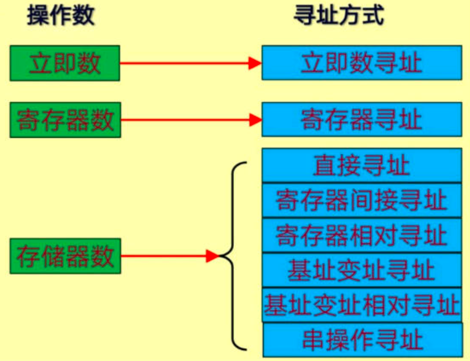
语法规则：
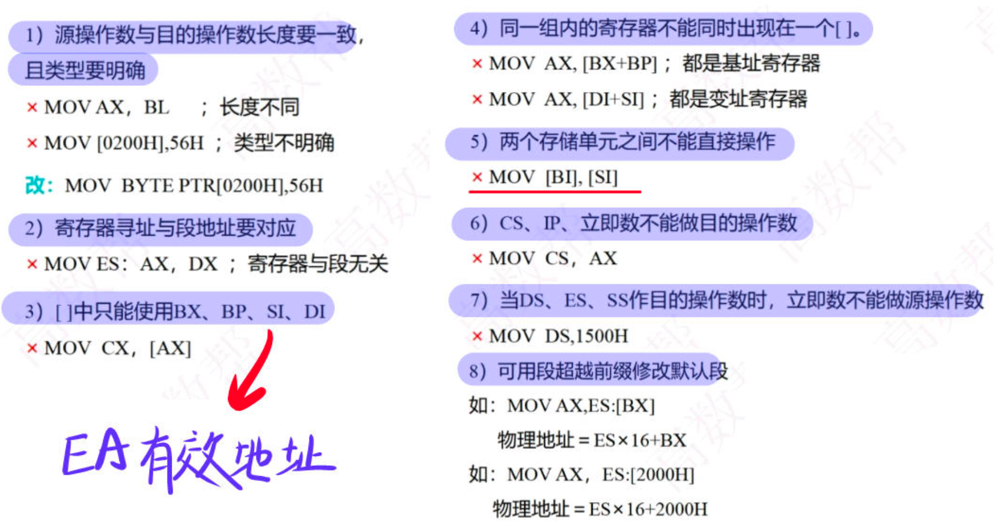

###  3.2 数据传送指令

#### 3.2.1 通用传送指令

##### MOV指令
MOV dest，src； dest←src   
传送的是字节还是字取决于指令中涉及的寄存器是8位还是16位。
具体来说可实现：   
1. MOV mem/reg1，mem/reg2
指令中两操作数中至少有一个为寄存器
2. MOV reg，data ;立即数送寄存器
3. MOV mem，data ;立即数送存储单元
4. MOV acc，mem ;存储单元送累加器
5. MOV mem，acc ;累加器送存储单元
6. MOV segreg，mem/reg ;存储单元/寄存器送段寄存器
7. MOV mem/reg，segreg ;段寄存器送存储单元/寄存器


**MOV 指令的使用规则**
1. IP 不能作目的寄存器  
2. 不允许mem←mem
3. 不允许segreg←segreg（段寄存器）
4. 立即数不允许作为目的操作数
5. 不允许segreg←立即数
6. 源操作数与目的操作数类型要一致
7. 当源操作数为**单字节**的立即数，而目的操作数为间址、变址、基址+变址的内存数时，必须用PTR 说明数据类型。如：MOV [BX]，12H 是错误的。


##### PUSH压栈指令
PUSH src ; src 为16 位操作数

PUSH AX ；将AX 内容压栈  
执行操作：
```
(SP)-1←高字节AH   
(SP)-2←低字节AL    
(SP)←（SP）- 2    
```

+ 注意进栈方向是高地址向低地址发展。   
+ 堆栈的空间最大为64k字节（64kB）
+ 堆栈操作必须以字为单位
+ 堆栈操作不影响标志位


##### POP弹出指令
POP dest

POP BX ；将栈顶内容弹至BX    
执行操作：
```
（BL）←（SP）    
（BH）←（SP）+1    
（SP）←（SP）+2
```
    
堆栈指令在使用时需注意的几点：    
1. **堆栈操作总是按字进行**    
2. 不能从栈顶弹出一个字给CS
3. 堆栈指针为SS:SP，SP 永远指向栈顶
4. SP自动进行增减量（-2，+2）
5. 堆栈操作不影响标志位

##### XCHG交换指令

格式：XCHG reg，mem/reg   
功能：交换两操作数的内容。   
要求：两操作数中必须有一个在寄存器中；
操作数不能为段寄存器和立即数；   
源和目地操作数类型要一致。    
举例：   
```
XCHG AX，BX   
XCHG [2000]，CL   
```


##### XLAT查表指令
执行的操作：AL←[(BX)+(AL)]
又叫查表转换指令，它可根据表项序号查出表中对应代码的内容。执行时先将表的首地址（偏移地址）送到BX 中，表项序号存于 AL 中。


#### 3.2.2 输入输出指令

##### IN输入指令

格式:    
IN acc,PORT ;PORT 端口号0～255H   
IN acc,DX ;DX 表示的端口范围达 64K     
例:  
```
IN AL，80H ;(AL)←(80H 端口)  
IN AL，DX ;(AL)←((DX))   
```

##### OUT输出指令
格式：
```
OUT port,acc
OUT DX,acc
```
例：
```
OUT 68H，AX ;(69H，68H)←（AX）
OUT DX，AL ;((DX))←(AL)
```
在使用间接寻址的IN/OUT 指令时，要事先用传送指令把I/O 端口号设置到DX 寄存器
如：

```
MOV DX，220H
IN AL，DX;将220H 端口内容读入AL
```

#### 3.2.3 目标地址传送指令
##### LEA传送偏移地址
LEA=load  effective address   

格式：
```
LEA reg，mem ; 将指定内存单元的偏移地址送到指定寄存器
```
要求：
1. 源操作数必须是一个存储器操作数；
2. 目的操作数必须是一个 16 位的通用寄存器。
例：
```
LEA BX，[SI+10H]
```
设：（SI）=1000H  
则执行该指令后，（BX）=1010H


注意以下二条指令差别：
```
LEA BX，BUFFER
MOV BX，BUFFER
```

**前者表示将符号地址为BUFFER 的存储单元的偏移地址取到 BX 中;后者表示将BUFFER 存储单元中的内容取到 BX 中。**

下面两条指令等效：
```
LEA BX，BUFFER
MOV BX, OFFSET BUFFER
```
其中OFFSET BUFFER 表示存储器单元BUFFER 的偏移地址。  
**二者都可用于取存储器单元的偏移地址，但 LEA 指令可以取动态的地址，OFFSET 只能取静态的地址。**


### 3.3 算术运算指令

#### 3.3.1 加法指令

##### ADD不带进位的加法指令
格式： 
```
ADD acc,data
ADD mem/reg,data
ADD mem/reg1,mem/reg2
```
实例：
```
ADD AL，30H
ADD SI，[BX+20H]
ADD CX，SI
ADD [DI]，200H
```

**ADD 指令对6 个状态标志均产生影响。**

例：已知(BX)=D75FH
指令 ADD BX,8046H 执行后，状态标志各是多少？
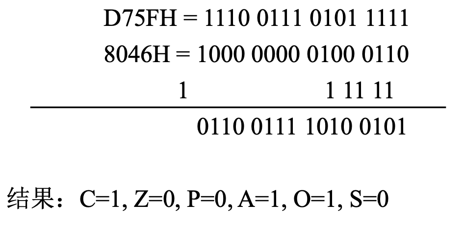

状态标志位复习：  
+ 进位标志位（CF）：运算结果的最高位有进位或有借位，则CF=1
+ 辅助进位标志位（AF）：运算结果的低四位有进位或借位，则AF=1
+ 溢出标志位（OF）：运算结果有溢出，则 OF=1
+ 零标志位（ZF）：反映指令的执行是否产生一个为零的结果
+ 符号标志位（SF）：指出该指令的执行是否产生一个负的结果
+ 奇偶标志位（PF）：表示指令运算结果的低8位“1”个数是否为偶数

判断溢出与进位  
从硬件的角度：默认参与运算的操作数都是有符号数，当两数的符号位相同，而和的结果相异时有溢出，则OF=1，否则OF=0


##### ADC带进位的加法
ADC 指令在形式上和功能上与ADD 类似，只是相加时还要包括进位标志CF 的内容，例如：
```
ADC AL，68H ; AL←(AL)+68H+(CF)
ADC AX，CX ;AX←(AX)+(CX)+(CF)
ADC BX，[DI] ;BX←(BX)+[DI+1][DI]+(CF)
```

##### INC加1指令
格式：
```
INC reg/mem
```
功能：类似于C 语言中的++操作：对指定的操作数加 1
例： 
```
INC AL
INC SI
INC BYTE PTR[BX+4]
```
注：本指令不影响CF 标志。


##### AAA非压缩BCD码加法调整指令

AAA 指令的操作：  
如果AL 的低4 位＞9 或 AF=1，则：  
1. AL←(AL)+6,(AH)←(AH)+1,AF←1
2. AL 高4 位清零
3. CF←AF

否则AL仅执行高4位清零操作


##### DAA压缩BCD码加法调整指令
两个压缩BCD码相加结果在AL中，通过DAA调整得到一个正确的压缩BCD码

指令操作(调整方法)：    
1. 若AL 的低4 位＞9 或AF=1   
2. 则(AL)←(AL)+6，AF←1   
3. 若AL 的高4 位＞9 或CF=1  
4. 则(AL)←(AL)+60H，CF←1  
5. 除OF 外，DAA 指令影响所有其它标志。 
6. DAA 指令应紧跟在ADD 或ADC 指令之后。 


#### 3.3.2 减法指令

##### SUB不考虑借位的减法指令
格式：
``` 
SUB dest, src
```
操作： 
```
dest←(dest)-(src)
```
注：
1. 源和目的操作数不能同时为存储器操作数
2. 立即数不能作为目的操作数
指令例子：
```
SUB AL，60H
SUB [BX+20H]，DX
SUB AX，CX
```

##### SBB考虑借位的减法指令
SBB指令主要用于多字节的减法。  
格式： 
```
SBB dest, src
```
操作： 
```
dest←(dest)-(src)-(CF)
```
指令例子：
```
SBB AX，CX
SBB WORD PTR[SI]，2080H
SBB [SI],DX
```


##### DEC减1指令
作用类似于 C语言中的”－－”操作符。
格式：
```
DEC opr
```
操作：
```
opr←(opr)-1
```
指令例子：
```
DEC CL
DEC BYTE PTR[DI+2]
DEC SI
```

##### NEG求补指令
格式： 
```
NEG opr
```
操作： 
```
opr← 0-(opr)
```
对一个操作数取补码相当于用 0 减去此操作数，故利用NEG 指令可得到负数的绝对值。  

例：若(AL)=0FCH，则执行 NEG AL 后，
(AL)=04H，CF=1


##### CMP比较指令
格式： 
```
CMP dest, src
```
操作： 
```
(dest)-(src)
```
CMP 也是执行两个操作数相减,但结果不送目标操作数,其结果只反映在标志位上。

指令例子：
```
CMP AL，0AH
CMP CX，SI
CMP DI，[BX+03]
```

##### AAS非压缩BCD码减法调整指令
对 AL中由两个非压缩的BCD码相减的结果进行调整。调整操作为：
若 AL的低4 位＞9或AF=1,则：
1. AL←(AL)-6,AH←(AH)-1,AF←1
2. AL的高4 位清零
3. CF←AF  

否则：AL的高4位清零


##### DAS压缩BCD码减法调整指令
对 AL中由两个压缩BCD码相减的结果进行调整。调整操作为：
1. 若 AL的低4 位＞9或AF=1,则：
2. AL←(AL)-6, 且 AF←1
3. 若 AL的高4 位＞9或CF=1,则：
4. AL←(AL)-60H，且 CF←1
DAS对OF无定义,但影响其余标志位。   
DAS指令要求跟在减法指令之后。


#### 3.3.3 乘法指令
进行乘法时：  
8位 * 8位→16 位乘积  
16位 * 16位→32 位乘积  


##### MUL符号数的乘法指令(MEM/REG)
格式： MUL src  
操作：字节操作数 (AX)←(AL) × (src)  
字操作数 (DX, AX)←(AX) × (src)  

指令例子：
```
MUL BL ；(AL)×(BL),乘积在 AX中
MUL CX ；(AX)×(CX),乘积在 DX,AX 中
MUL BYTE PTR[BX]
```
##### IMUL有符号数乘法指令
格式与MUL 指令类似，只是要求两操作数均为有符号数。  

指令例子：
```
IMUL BL ；(AX)←(AL)×(BL)
IMUL WORD PTR[SI]；
(DX,AX)←(AX)×([SI+1][SI])
```

注意：MUL/IMUL 指令中  
+ AL(AX)为隐含的乘数寄存器；
+ AX(DX,AX)为隐含的乘积寄存器；
+ SRC 不能为立即数；
+ 除CF和 OF外，对其它标志位无定义。


#### 3.3.4 除法指令
进行除法时：   
16 位/8 位→8 位商  
32 位/16 位→16 位商  

对被除数、商及余数存放有如下规定：


##### DIV无符号数除法指令
格式： DIV src   
操作：
1. 字节操作 (AL)←(AX) / (SRC) 的商    
2. (AH)←(AX) / (SRC) 的余数   
3. 字操作 (AX) ←(DX, AX) / (SRC) 的商
4. (DX) ←(DX, AX) / (SRC) 的余数   
指令例子：
```
DIV CL
DIV WORD PTR[BX]
```

##### IDIV有符号数除法指令
格式：   IDIV src  
操作与DIV 类似。商及余数均为有符号数,且余数符号总是与被除数符号相同。  
注意: 
对于DIV/IDIV 指令
+ AX(DX,AX)为隐含的被除数寄存器。
+ AL(AX)为隐含的商寄存器。
+ AH(DX)为隐含的余数寄存器。
+ src 不能为立即数。
+ 对所有条件标志位均无定


关于除法操作中的字长扩展问题
+ 除法运算要求被除数字长是除数字长的两倍,若不满足则需对被除数进行扩展,否则产生错
误。
+ 对于无符号数除法扩展，只需将AH 或DX 清零即可。
+ 对有符号数而言,则是符号位的扩展。可使用前面介绍过的符号扩展指令CBW 和CWD


### 3.4 逻辑运算和移位指令


#### 3.4.1 逻辑运算指令


##### AND逻辑与 
对两个操作数进行按位逻辑“与”操作。  
格式：AND dest, src   
用途：保留操作数的某几位，清零其他位。   

例 1：保留AL中低4 位，高4 位清 0。
```
AND AL,0FH
```

##### OR逻辑或
对两个操作数进行按位逻辑”或”操作。   
格式：OR dest, src   
用途：对操作数的某几位置 1；对两操作数进行组合。   
例1：把AL 中的非压缩BCD 码变成相应十进制数的 ASCII 码。
```
OR AL, 30H
```


##### NOT逻辑非
对操作数进行按位逻辑”非”操作。   
格式：NOT mem/reg

例：
```
NOT CX
NOT BYTE PTR[DI]
```


##### XOR逻辑异或
对两个操作数按位进行”异或”操作。    
格式：XOR dest, src    
用途：对 reg清零(自身异或)     
把 reg/mem的某几位变反(与’1’异或)    


例 1：把 AX 寄存器清零有以下的办法。   
1. MOV AX,0    
2. XOR AX,AX   
3. AND AX,0   
4. SUB AX,AX   


##### TEST测试指令
操作与AND指令类似,但不将”与”的结果送回,只影响标志位。   
TEST 指令常用于位测试,与条件转移指令一起用。
例：测试AL 的内容是否为负数。
```
TEST AL,80H ；检查AL 中D7=1？
JNZ MINUS ；是1(负数)，转MINUS
… … ；否则为正数
```


#### 3.4.2 移位指令

##### 非循环移位指令
+ 算术左移指令 SAL(Shift Arithmetic Left)
+ 算术右移指令 SAR(Shift Arithmetic Right)
+ 逻辑左移指令 SHL(Shift Left)
+ 逻辑右移指令 SHR(Shift Right)

**重要总结**：
1. **SAL和SHL执行动作一样，操作数的各位向左移动指定的位数，低位补0，最高位移入进位标志CF。**（同时适用于无符号数和有符号数）
2. 逻辑右移不考虑符号位，高位补0，低位依次右移，移出的位进入进位标志CF。算术右移保持符号位不变，低位依次右移，移出的位进入进位标志CF。**对于无符号数，算术右移和逻辑右移的结果是一样的 。**

这4条指令的格式相同,以SAL为例：


算术移位——把操作数看做有符号数；  
逻辑移位——把操作数看做无符号数。  

移位位数放在CL 寄存器中，如果只移 1 位,也可以直接写在指令中。   

例如：
```
MOV CL,4
SHR AL,CL ；AL中的内容右移4位
```
影响C,P,S,Z,O 标志。   

结果未溢出时：    
**左移1位≡操作数*2**  
**右移1位≡操作数/2**  


例：把AL中的数x乘10   

因为10=8+2，所以可用移位实现乘 10 操作。程序如下：
```
MOV CL,3
SAL AL,1 ; 2x
MOV AH,AL
SAL AL,1 ; 4x
SAL AL,1 ; 8x
ADD AL,AH ; 8x+2x = 10x
```

##### 


### 3.5 控制转移指令

#### 3.5.1 转移指令


##### JMP无条件转移指令
格式：JMP label
本指令无条件转移到指定的目标地址,以执行从该地址开始的程序段。


##### 条件转移指令
**根据单个标志位设置的条件转移指令**   
+ `JB/JC`**(Jump if Below/ Jump if Carry)**:低于,或CF=1,则转移
+ `JNB/JNC/JAE`**(Jump if Not Below/ Jump if Not Carry/ Jump if Above or Equal)**:高于或等于,或CF=0,则转移
+ `JP/JPE`**(Jump if Parity/ Jump if Parity Even)**:奇偶标志PF=1(偶),则转移
+ `JNP/JPO`**(Jump if Not Parity/ Jump if Parity Odd)**:奇偶标志PF=0(奇),则转移
+ `JZ/JE`**(Jump if Zero/ Jump if Equal)**：结果为零(ZF=1),则转移
+ `JNZ/JNE`**(Jump if Not Zero/Jump if Not Equal)** ；结果不为零(ZF=0),则转移
+ `JS`**(Jump if Sign)**:SF=1,则转移
+ `JNS`**(Jump if Not Sign)**:SF=0,则转移
+ `JO`**(Jump if Overflow)**；OF=1,则转移
+ `JNO`**(Jump if Not Overflow)**；OF=0,则转移

详细介绍：

1. `JB/JC`:假设有两个无符号数 num1 和 num2 进行比较（通过减法操作 sub num1, num2 实现），若 num1 < num2，减法操作会产生借位，CF 置 1，使用 JB 指令可以在 num1 小于 num2 时执行特定的代码块。


2. `JNB/JNC/JAE`:当进位标志 CF = 0 时，程序发生转移。它与 JB/JC 刚好相反，表示无符号数比较中高于或等于的情况。即当无符号数相减没有借位（CF = 0）时，说明被减数大于或等于减数。

3. `JP/JPE`:当奇偶标志 PF = 1 时，程序发生转移。PF 标志用于反映运算结果中低 8 位里 1 的个数的奇偶性，若 1 的个数为偶数，PF置1。


4. `JNP/JPO`:当奇偶标志 PF = 0 时，程序发生转移。即当运算结果低 8 位中 1 的个数为奇数时，满足跳转条件。


5. `JZ/JE`:当零标志 ZF = 1 时，程序发生转移。ZF 标志在运算结果为 0 时被置 1，在比较操作中也常用于判断两个操作数是否相等（若相减结果为 0，则二者相等）。


6. `JNZ/JNE`:当零标志 ZF = 0 时，程序发生转移。表示运算结果不为 0 或者两个操作数不相等的情况。


7. `JS`:当符号标志 SF = 1 时，程序发生转移。SF 反映了有符号数运算结果的符号位，SF = 1 表示结果为负数。在处理有符号数的程序中，当需要对负数结果进行特殊处理时，使用 JS 指令跳转到相应的处理代码。

8. `JNS`:当符号标志 SF = 0 时，程序发生转移。表示运算结果为正数或者零的情况。

9. `JO`:当溢出标志 OF = 1 时，程序发生转移。OF 标志用于表示有符号数运算中是否发生了溢出（即运算结果超出了有符号数的表示范围）。在进行有符号数的算术运算（如加法、减法）时，若可能产生溢出，使用 JO 指令可以在溢出发生时跳转到错误处理或特殊逻辑的代码段。

10. `JNO`:当溢出标志 OF = 0 时，程序发生转移。表示运算结果没有发生溢出的情况。


**根据组合条件设置的条件转移指令**   

这类指令主要用来判断两个数的大小。 

**无符号数**：  
+ `JA`**(Jump if Above)**:高于则转移，条件为: CF=0∧ZF=0，即A＞B
+ `JNA/JBE`**(Jump if Not Above/ Jump if Below or Equal)**:低于或等于则转移，条件为: CF=1∨ZF=1，即A ≤ B
+ `JB`**(Jump if Below)**:A < B 则转移
+ `JNB`**(Jump if Not Below)**:A≥B 则转移


1. `JA`:高于则转移。条件为 CF = 0 且 ZF = 0，即表示无符号数 A > B。在无符号数减法 A - B 操作后，如果没有产生借位（CF = 0）且结果不为零（ZF = 0），说明 A 大于 B，此时满足 JA 的跳转条件。
2. `JNA/JBE`:低于或等于则转移。条件为 CF = 1 或 ZF = 1，即 A ≤ B。当无符号数相减产生借位（CF = 1）或者结果为零（ZF = 1）时，满足跳转条件。这意味着 A 小于 B 或者 A 等于 B 时，程序会执行跳转。

3. `JB`:低于则转移，表示无符号数 A < B。在无符号数减法中，如果产生借位（CF = 1），说明 A 小于 B，满足 JB 的跳转条件。

4. `JNB`:不低于则转移，即 A ≥ B。当无符号数减法没有借位（CF = 0）时，说明 A 大于或等于 B，满足 JNB 的跳转条件。


**有符号数**：
+ `JG`**(Jump if Greater)**:大于则转移(A＞B)，条件为: (SF⊕OF=0)∧ZF=0
+ `JGE`**(Jump if Greater or Equal)**；大于或等于则转移(A≥B)，条件为: (SF⊕OF=0)∨ZF=1
+ `JLE`**(Jump if Less or Equal)**；小于或等于则转移(A≤B)，条件为: (SF⊕OF=1)∨ZF=1
+ `JL`**(Jump if Less)**；小于则转移(A＜B)，条件为: (SF⊕OF=1)∧ZF=0

1. `JG`:大于则转移，即 A > B。条件为 (SF ⊕ OF = 0) 且 ZF = 0。这里 SF ⊕ OF 表示符号标志和溢出标志的异或运算。当有符号数 A - B 的结果没有溢出（OF = 0）且符号位正确反映了差值的正负（SF 为 0 表示结果为正），或者结果溢出但符号位与溢出情况相符（异或结果为 0），并且结果不为零（ZF = 0）时，说明 A 大于 B，满足 JG 的跳转条件。

2. `JGE`:大于或等于则转移，即 A ≥ B。条件为 (SF ⊕ OF = 0) 或 ZF = 1。只要有符号数相减的结果满足没有溢出且符号正确，或者发生溢出但符号位与溢出情况相符（异或为 0），或者结果为零（ZF = 1），就满足跳转条件。


3. `JLE`:小于或等于则转移，即 A ≤ B。条件为 (SF ⊕ OF = 1) 或 ZF = 1。当有符号数相减结果的符号标志和溢出标志异或为 1（表示结果的符号与正常情况不符，可能存在溢出导致符号错误），或者结果为零（ZF = 1）时，满足跳转条件。


4. `JL`:小于则转移，即 A < B。条件为 (SF ⊕ OF = 1) 且 ZF = 0。当有符号数减法结果的符号标志和溢出标志异或为 1，并且结果不为零（ZF = 0）时，说明 A 小于 B，满足 JL 的跳转条件。


#### 3.5.2 循环控制指令
+ 用在循环程序中以确定是否要继续循环。
+ 循环次数通常置于 CX 中。
+ 转移的目标应在距离本指令-128～+127 的范围之内。
+ 循环控制指令不影响标志位。


##### LOOP
格式：LOOP label   
操作：
(CX)-1→CX；
若(CX)≠0,则转至label 处执行；
否则退出循环,执行LOOP 后面的指令。
LOOP 指令与下面的指令段等价：
```
DEC CX
JNZ label
```


#### 3.5.3 过程调用指令

##### CALL调用指令
一般格式：CALL sub ;sub 为子程序的入口


#### 3.5.4 中断指令

INT n 执行类型n 的中断服务程序，N=0～255


### 3.6 处理器控制指令

#### 3.6.1 标志位操作

##### CF 设置指令
CLC 0→CF STC 1→CF CMC CF 变反

##### DF 设置指令
CLD 0→DF (串操作的指针移动方向从低到高)
STD 1→DF (串操作的指针移动方向从高到低)


##### IF 设置指令
CLI 0→IF (禁止INTR 中断) STI 1→IF (开放INTR 中断)

#### 3.6.2 HLT（halt）
执行HLT 指令后，CPU 进入暂停状态。


## 四 8086 汇编语言程序设计

引入：汇编语言和c语言的编译汇编链接过程有什么不同，c语言会在过程中转变为汇编语言吗？   


### 4.1 汇编语言和C语言的区别

#### 4.1.1 C语言的处理流程

典型的C语言程序会经历以下过程：
```
C源代码 (.c) → 预处理 → 编译为汇编代码 (.s) → 汇编为目标文件 (.o) → 链接为可执行文件
```

1. **预处理**  
   - 处理 `#include`, `#define`, `#ifdef` 等预处理指令。
   - 输出：`.i` 文件（纯C代码，已展开头文件和宏）。

2. **编译**  
   - **编译器（如GCC的`cc1`组件）** 将预处理后的C代码翻译为**汇编代码**。
   - 输出：`.s` 文件（汇编语言，与CPU架构相关）。  
   - **示例命令**:  
       ```bash
       gcc -S hello.c  # 生成 hello.s（汇编文件）
       ```

3. **汇编**  
   - **汇编器（如GAS）** 将汇编代码翻译为机器码，生成目标文件（`.o`）。  
   - **输出逻辑相同**：最终生成的 `.o` 文件格式与汇编语言直接生成的目标文件格式一致。

4. **链接**  
   - **链接器（如`ld`）** 将多个 `.o` 文件和库合并为可执行文件（如 `a.out`）。

---

#### 4.1.2 汇编语言的处理流程

汇编语言的流程更简化：
```
汇编源代码 (.asm/.s) → 汇编为目标文件 (.o) → 链接为可执行文件
```
- **无预处理和编译**：直接通过汇编器（如NASM）生成 `.o` 文件。
- **汇编语言到机器码是一一对应**：每条汇编指令直接映射到机器码。

---

#### 4.1.3 关键差异

| **步骤**       | **C语言**                 | **汇编语言**           |
|----------------|--------------------------|----------------------|
| **预处理**      | ✔️ 处理宏和头文件        | ❌ 无               |
| **编译**        | ✔️ 生成汇编代码中间文件 | ❌ 无               |
| **汇编**        | ✔️ 由汇编器处理         | ✔️ 直接处理源文件   |
| **链接**        | ✔️ 与目标文件合并       | ✔️ 相同            |


### 4.2 汇编语言程序的结构

汇编语言源程序通常由一个或几个程序模块组成,每个模块一般由三个逻辑段组成：  
+ 数据段——存放数据、变量
+ 堆栈段——堆栈区域
+ 代码段——存放程序指令

**汇编语言程序的基本结构**

```asm
stack  SEGMENT 
     DB 100 DUP(0)
stack  ENDS

data  SEGMENT
    <数据、变量在此定义>
data   ENDS

code  SEGMENT
      ASSUME  CS:code, DS:data, ES:data
start:  MOV  AX, data
        MOV  DS, AX
        <此处加入你自己的程序段>
        MOV  AL, 4CH
        INT  21H
code  ENDS
    END  start       
```


#### 4.2.1 汇编语言的语句与格式


**汇编语言的语句有三种**：
+ 指令语句——由8086指令助记符构成的语句
+ 伪指令语句——由伪指令构成的语句
+ 宏指令语句——以宏名字定义的一段指令序列（宏本质上也是伪指令）  


**CPU 指令与伪指令之间的区别**：  
1. CPU 指令是给 CPU 的命令，在运行时由 CPU 执行，每条指令对应 CPU 的一种特定的操作。而伪指令是给汇编程序的命令，在汇编过程中由汇编程序进行处理。
2. 汇编以后，每条CPU 指令产生一一对应的目标代码；它指出汇编程序应如何对源程序进行汇编，如何定义变量、分配存储单元以及指示程序开始和结束等。而伪指令则不产生与之相应的目标代码。

> **指令语句汇编时生成机器码；伪指令语句汇编时不生成机器码。**


**指令语句和伪指令格式的区别**：
+ 指令语句的格式为：
  + 标号:  指令助记符  目的操作数，源操作数  ;注释
+ 伪指令语句的格式为：
  + 名字 伪指令 操作数1,操作数2,…,操作数n   ;注释


一个实例：
```asm
data    SEGMENT
Hello   DB 13H,45H,0BCH,9AH 
data    ENDS
prog    SEGMENT
        ASSUME  CS:prog,DS:data
start:  MOV  AX,data
        MOV  DS,AX
        LEA  DI,hello	;取偏移地址
        MOV  DX,[DI]
        ADD  DX,[DI+2]		
        MOV  AH,4CH
        INT  21H		;退回DOS
prog    ENDS
        END  start
```


### 4.3 运算符


#### 4.3.1 SEG、OFFSET 取地址运算符
+ SEG：取变量/标号的段地址
+ OFFSET：取变量/标号的偏移地址


```asm
VAR DB 12H
  ……
MOV  BX，OFFSET	VAR ；取变量VAR的偏移地址    
MOV  AX，SEG VAR；取变量VAR的段地址
```

#### 4.3.2 TYPE、LENGTH、SIZE 取值运算符
+ TYPE     取变量的类型（1，2，4）
+ LENGTH   取所定义变量的长度（即变量中元素的个数）
+ SIZE     取所定义存储区的字节数（=TYPE*LENGTH）

```
VAR   DW   1，2，3，4，5   
```
则TYPE VAR = 2   
LENGTH VAR = 5    
SIZE VAR  = 10   

#### 4.3.3 PTR 属性运算符
格式：<类型>  PTR <地址操作数>   
类型∈{BYTE, WORD, DWORD, NEAR, FAR}    

用来指定地址操作数的类型。      
```
MOV	BYTE PTR[DI],0 ;字节类型
MOV	WORD PTR[DI],0 ;字类型
MOV	[DI],0B5H      ;类型不定
```


### 4.4 伪指令
由汇编程序执行的指令，它本身不被汇编成机器指令。常用的伪指令有：
+ 数据定义伪指令
+ 符号定义伪指令
+ 段定义和段寄存器指定伪指令
+ 过程定义伪指令
+ 结束伪指令


#### 4.4.1 数据定义伪指令
用于定义变量，即内存单元或数据区。数据定义伪指令的格式为：    


[变量名] 伪指令 操作数[，操作数…]   
DB 用来定义字节（BYTE）   
DW 用来定义字（WORD）    
DD 用来定义双字（DWORD）

操作数可以是常数、变量或表达式


##### **常数或常数表达式**
```
DATA_BYTE  DB 10,5,10H
DATA_WORD  DW 100H,100,-4
DATA_DWORD  DD 2*30,0FFFBH
```

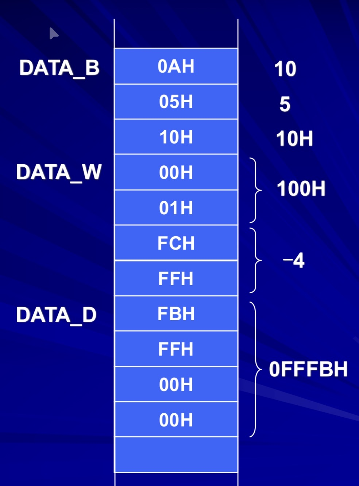


##### **字符串**
```
char1 DB 'AB'
```


##### **`？`占位符**
```
X DB 5,?,6
```
`?`的作用是给变量保留相应的存储单元，而不赋予变量某个确定的初值。

##### **N DUP（初值[,初值...]）复制**
```
ZERO DB 2 DUP (3，5)
XYZ DB 2 DUP (0，2 DUP(1，3)，5)
```

##### **$ 地址计数器的当前值**  
表示的是地址计数器的当前值。

+ $-变量名 — 计算某区域长度
+ 变量名+$ — 作为某数据的偏移量

```
TABLE DB 10 DUP(?)
BUFFER DW TABLE,$+3
```

设TABLE的偏移地址为0080H,则汇编后如下图所示：

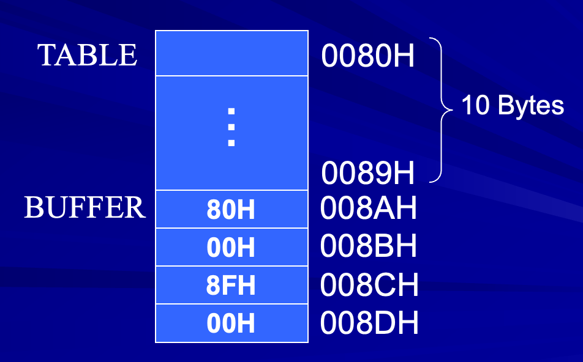


#### 4.4.2 符号定义伪指令
符号定义伪指令有两种：EQU，=    

二者均不占用存储空间,仅是给符号赋值


#### 4.4.3 段定义伪指令

三类段：代码(程序)、数据、堆栈

段定义伪指令：SEGMENT、ENDS、ASSUME、ORG

定义一个段的基本格式：
```
段名 SEGMENT [定位类型][组合方式][类别]
    < 汇编语言语句 >
段名 ENDS
```


##### ASSUME伪指令
在代码段中，还必须明确段和段寄存器的关系，这由ASSUME语句来指定。如
```
ASSUME CS:code, DS:data, ES:data
```
语句中的code和data为段名。

这个语句说明：
1. CS将指向名字为code的代码段
2. DS和ES将指向名字为data的数据段


##### ORG伪指令
ORG规定了段内的指令或数据存放的开始地址(偏移地址的初值)，其格式为：
```
ORG <表达式>
```
表达式的值即为开始地址，从此地址起连续存放程序或数据。
```
ABC SEGMENT
    ORG 100H
begin: …
       …

ABC ENDS
```
指令从100H开始存放


##### PROC、ENDP过程定义伪指令
过程就是子程序。一个过程可以被其它程序所调用(用CALL指令)，过程的最后一条指令一般是返回指令(RET)。   
过程定义伪指令的格式为:
```
<过程名>    PROC  [类型]
            …
            …   
<过程名>    ENDP
```

注意：PROC和ENDP必须成对出现。


类型:
+ NEAR（默认）：过程与主程序在同一段，可用短调用(CALL只传偏移)。
+ FAR：过程在不同段（跨段调用），会传递段地址和偏移。


调用一个过程的格式为：  
```
  CALL  <过程名>
```

##### END汇编结束伪指令
汇编语言源程序的最后，要加汇编结束伪指令END，以使汇编程序结束汇编。
```
格式： END [表达式]
```
END后跟的表达式通常就是程序第一条指令的标号，指示程序的启动地址(要执行的第一条指令的地址)。


+ END：表示整个源程序结束。
+ ENDS：表示一个段（segment）定义结束。
+ ENDP：表示一个过程（procedure）定义结束。


### 4.5 汇编语言程序设计基本方法
源程序的基本结构：顺序、分支、循环


#### 4.5.1 顺序结构程序
例：对两个８字节无符号数求和，这两个数分别用变量Ｄ１及Ｄ２表示。将两数之和的最高位进位放在ＡL中，两数之和的其他位按从高到低顺序依次放在ＳＩ，ＢＸ，ＣＸ，ＤＸ中。

```
D SEGMENT
    D1 DB 12H,34H,56H,78H,9AH,0ABH,0BCH,0CDH
    D2 DB 0CDH,0BCH,0ABH,9AH,78H,56H,34H,12H
D ENDS
C SEGMENT
    ASSUME CS:C,DS:D ;说明代码段、数据段
BG: MOV AX,D
    MOV DS,AX ;给DS赋段值
    LEA DI,D1 ;将D1表示的偏移地址送DI
    MOV DX,［DI］ ;取第1操作数到寄存器中
    MOV CX,［DI+2］
    MOV BX,［DI+4］
    MOV SI,［DI+6］
    LEA DI,D2 ;将D2表示的偏移地址送DI
    ADD DX,［DI］
    ADC CX,［DI+2］
    ADC BX,［DI+4］
    ADC SI,［DI+6］
    MOV AL,0
    ADC AL,0
    MOV AH,4CH
    INT 21H
C ENDS
    END BG
```


#### 4.5.2 分支结构程序

##### IF...THEN结构

1. 先执行**测试/比较指令**，例如`TEST`或`CMP`（比较变量或标志位）
2. 再使用**条件转移指令**（如`Jx`，这里Jx可能是JE/JNE/JG等，x代表条件类型，后接转移目标标号）
3. 如果条件满足，转移到“处理体”（即要执行的操作代码）
4. 如果条件不满足，直接顺序执行下一个指令（跳过“处理体”）


```assembly
    ...              ; 前置代码
    CMP  A, B        ; 比较A与B
    JNE  SKIP        ; 如果A!=B，则跳到SKIP（即条件不满足则跳过处理）
    ; --- 处理体 ---
    ...              ; 满足A==B才会执行的操作
SKIP:
    ...              ; 后续代码
```

##### IF...THEN...ELSE结构

1. 先用**TEST/CMP指令**做条件判断
2. 用**条件转移指令Jx**，当条件满足时跳转执行P1（如JZ/JNZ/JG/JL等）
3. 否则顺序执行“处理P2”
4. “处理P1”末尾加**JMP指令**，无条件跳到结构结尾，避免P2也被执行
5. 紧接Jx跳转标号1为“处理P2”开始
6. 结构结尾（标号2）为所有分支的共同出口

```
    CMP  A, B          ; 比较A与B
    JE   THEN_PART     ; 如果A==B，跳转到THEN_PART（处理P1）

    ; --- ELSE部分 ---
    ...                ; 处理P2
    JMP  END_IF        ; 执行完P2后无条件跳出

THEN_PART:             ; --- THEN部分 ---
    ...                ; 处理P1
END_IF:
    ...                ; 后续代码
```

##### 举例
例：比较以存储器变量Ｄ１和Ｄ２表示的两个有符号字数据的大小，将其中较大数据放在ＢＸ寄存器中
```
DATA SEGMENT
    D1 DW -123H ;补码为FF85H
    D2 DW -120H ;补码为FF88H
DATA ENDS

CODE SEGMENT
    ASSUME CS:CODE,DS:DATA ;说明代码段、数据段

BEGIN: MOV AX,DATA
    MOV DS,AX ;给DS赋段值
    MOV BX,D1
    CMP BX,D2
    JGE NEXT ;若D1≥D2，则不交换，转NEXT
    MOV BX,D2 ;若D1<D2，则交换

NEXT: MOV AH,4CH
    INT 21H        
CODE ENDS
    END BEGIN
```


#### 4.5.3 循环结构程序

例：找出从无符号字节数据存储变量ＶＡＲ开始存放的Ｎ个数中的最大数放在ＢＨ中

注意：循环可以嵌套(多重循环)，但多个循环体之间不能交叉，控制条件不能混淆。


冒泡法——实例：3,7,2,8,6→2, 3, 6,7,8 。

+ 内外两层循环；
+ 每轮内循环使一个最大的数沉底，因为最大的数沉底，下轮内循环就不用再比较最底下的数，所以内循环的循环次数每一轮比上一轮要逐次减 1；
+ 外循环用于控制有多少轮内循环。若有 n个数据，则外循环次数为 n-1。

```
DSEG SEGMENT 
    VAR DB 5,7,19H,23H,0A0H
    N   EQU $-VAR
DSEG ENDS
    
CSEG SEGMENT
    ASSUME  CS:CSEG,DS:DSEG     ;说明代码段、数据段
BG: MOV AX,DSEG
    MOV DS,AX        ;给DS赋段值
    MOV CX,N-1       ;置循环控制数
    MOV SI,0
    MOV BH,VAR［SI］  ;取第1字节数到BH
    JCXZ LAST        ;如果CX=0则转
AGIN: INC SI
    CMP BH,VAR［SI］
    JAE NEXT
    MOV BH,VAR［SI］ 
NEXT: LOOP AGIN       ;CX←CX-1,若CX不等 于0则转
LAST: MOV AH,4CH
    INT 21H
CSEG  ENDS
    END  BG 

```


### 4.6 DOS及BIOS中断调用
系统功能调用——由DOS提供的一组实现特殊功能的子程序供程序员在程序中调用，以减轻编程工作量。   
+ DOS功能（DOS Functions）是DOS操作系统封装好的一系列系统服务（如键盘输入、屏幕输出、文件读写、程序终止等）。   
+ 每个功能通过功能号（存储在 AH 寄存器）区分。

系统功能调用有两种：
+ DOS功能调用
+ BIOS功能调用。

用户程序在调用这些系统服务程序时，不是用CALL命令，而是采用软中断指令INT n来实现。在DOS系统中，功能调用都是用软中断指令INT 21H来实现的。

   


#### 4.6.1 中断调用及中断服务子程序返回
中断调用是一种内部中断方式，它是通过执行INT n 指令来实现的，即执行INT n指令，使CPU根据中断类型号(或向量号)“ｎ”找中断向量表中第ｎ项作为此服务程序的入口（０段相对地址４×ｎ＋0处的字为IP，０段相对地址４×ｎ＋２处的字为CS）。


INT n指令功能：     
1. 当前标志寄存器的内容压栈，保存TF    
2. TF ←0， IF ←０   
3. 当前断点的CS值压栈，当前IP值压栈    
4. IP，CS←中断向量第ｎ项的4字节内容

20H～3FH是DOS的中断向量号。   
通常，一个中断服务程序有多种功能，对每一种功能用一个相应的编号表示，称为功能号。对应某一中断向量的某一功能，往往要指出其规定的输入参数，中断服务完毕后，服务程序会有相应的输出。


当中断服务子程序返回时，要执行IRET指令。其功能是：
1. 栈顶弹出一个字到IP
2. 栈顶弹出一个字到CS
3. 栈顶弹出一个字到标志寄存器


##### **案例场景**
```assembly
; 程序片段（用户代码）
MOV AH, 02H     ; 准备调用DOS功能号02H（显示字符）
MOV DL, 'A'     ; 要显示的字符存入DL
INT 21H         ; 触发中断21H（进入DOS服务程序）
MOV BX, 1234H   ; 中断返回后继续执行此指令
```


**步骤1：执行 `INT 21H` 前**
- **当前状态**：
  - `CS:IP` 指向 `INT 21H` 下一条指令 `MOV BX, 1234H`（即断点地址）。
  - 所有通用寄存器（AX、BX等）和标志寄存器（FLAGS）保存了程序的当前状态。

---
**步骤2：执行 `INT 21H` 时，CPU自动保护现场**
1. **压栈当前标志寄存器（FLAGS）**  
   - `FLAGS` 包含程序当前的标志位（如ZF、CF、IF等）。
   - **栈变化**：栈顶指针 `SP` 减少2字节，存储旧FLAGS值。
     ```
     SP ← SP - 2  
     [SS:SP] ← FLAGS
     ```

2. **清除 `TF` 和 `IF`（关闭单步和中断允许）**  
   - **`TF`（Trap Flag）= 0**：禁用单步调试。
   - **`IF`（Interrupt Flag）= 0**：禁止其他可屏蔽中断响应（避免中断嵌套破坏现场）。


3. **压栈当前 `CS`（代码段地址）和 `IP`（断点偏移）**  
   - **先压栈 `CS`，再压栈 `IP`**  
     ```
     SP ← SP - 2  
     [SS:SP] ← CS     ; 保存代码段地址
     SP ← SP - 2  
     [SS:SP] ← IP     ; 保存偏移地址（即`MOV BX,1234H`的地址）
     ```

4. **加载中断服务程序入口地址（0:21H * 4）**  
   - **中断向量地址 = 中断号 `21H` × 4** = 0:0084H。
   - 从内存地址 `0:0084H` 处读取4字节（低字为IP，高字为CS）：
     ```
     IP ← [0:0084H]   ; 中断服务程序的偏移地址
     CS ← [0:0085H]   ; 中断服务程序的段地址
     ```

---

**步骤3：中断服务程序执行**
- CPU此时跳转到中断服务程序代码（如DOS内核代码）。
- 中断服务程序开始执行，通过 `AH=02H` 完成输出字符功能。

---

**步骤4：中断返回（执行 `IRET` 恢复现场）**
中断服务程序结束时执行 `IRET` 指令，流程如下：


1. **弹出 `IP` 和 `CS`**  
   - 恢复断点地址，使程序回到 `MOV BX,1234H` 继续执行。
     ```
     IP ← [SS:SP]  
     SP ← SP + 2    ; 弹出IP
     CS ← [SS:SP]  
     SP ← SP + 2    ; 弹出CS
     ```

2. **弹出标志寄存器（FLAGS）**  
   - 恢复原始标志状态（包括之前被清除的 `IF` 和 `TF`）。
     ```
     FLAGS ← [SS:SP]  
     SP ← SP + 2
     ```

---
##### 堆栈情况


 **执行 `INT 21H` 时的栈变化**
```
   |   旧栈顶    |  
   |   FLAGS    | ← SP-2  
   |     CS      | ← SP-4  
   |     IP      | ← SP-6  → 新栈顶
```

---

**执行 `IRET` 后的栈恢复**
```
   |    空      |  
   |    空      |  
   |   旧栈顶    | ← SP+6
```

---

##### 关键点总结

1. **CPU自动保护的内容**
| **保护内容**       | **压栈顺序** | **恢复顺序** | **作用**                         |
|--------------------|--------------|--------------|----------------------------------|
| **FLAGS（标志寄存器）** | 第一步压入    | 最后弹出     | 保存程序运行状态（如CF、ZF、IF等）|
| **CS:IP（断点地址）**  | CS先压，IP后压 | IP先弹，CS后弹 | 确保正确返回原程序断点           |

2. **中断调用与普通子程序调用的区别**
| **行为**          | **CALL 指令**               | **INT n 指令**                     |
|-------------------|-----------------------------|------------------------------------|
| **保存的返回地址**  | 仅保存 `CS:IP`              | 保存 `FLAGS` + `CS:IP`             |
| **标志位处理**     | 不影响 `IF` 或 `TF`         | 强制清除 `IF` 和 `TF`              |
| **用途**           | 用户自定义子程序            | 系统级服务（如操作系统功能）        |

3. **现场保护的实际意义**
- 保证中断服务程序执行时，**用户程序的寄存器和状态不被破坏**。
- 中断返回后，用户程序可以**无缝继续执行**，所有寄存器值（除中断服务程序修改的）均保留原值。

---

##### 结合具体寄存器值的模拟案例

**假设执行 `INT 21H` 时的初始状态**
- **断点地址**：`CS=1000H`, `IP=0020H`（指向 `MOV BX,1234H`）
- **栈顶指针**：`SS=2000H`, `SP=0FFEH`
- **标志寄存器**：`FLAGS=0246H`（包含ZF=0、CF=0、IF=1等）

执行 `INT 21H` 后栈内存变化：
| 地址（SS:SP） | 值       | 说明               |
|---------------|----------|--------------------|
| 2000:0FFEH    | 0246H    | FLAGS             |
| 2000:0FFCH    | 1000H    | CS                |
| 2000:0FFAH    | 0020H    | IP                |

恢复时（`IRET`）：  
- 弹出 `IP=0020H`, `CS=1000H`, `FLAGS=0246H`，CPU继续从 `1000:0020H` 执行。

---


**可屏蔽中断与非可屏蔽中断的区别？**    
`INT 21H` 是软中断（不可屏蔽），而硬件中断（如键盘输入）可能被 `IF=0` 屏蔽。


#### 4.6.2 D0S系统功能调用使用方法

1. AH←功能号；
2. 设置该功能所要求的其他入口参数；
3. 执行INT 21H指令；
4. 分析出口参数。

以下介绍INT 21H的几个最常用的功能。

##### **AH=01H：从键盘读入一个字符并显示**   
程序中有时需要用户对提示做出应答。
```
GET_KEY: MOV AH,1 ;等待键入字符
         INT 21H ;结果在AL中
         CMP AL,’Y’ ;是’Y’?
         JZ YES ;是,转YES
         CMP AL,’N’ ;是’N’?
         JZ NO ;是,转NO
         JMP GET_KEY ;否则继续等待输入
YES: …
…
NO: …
```

##### **AH=08H：从键盘读入一个字符但是不显示** 
该功能输入一字符，其ASCLL码存放在AL中，但不显示。这种功能往往在设置口令时使用。    

```
MOV AH,08H
INT 21H ;从键盘读入一个字符
```


##### **AH=02H：向屏幕输出一个字符**
入口参数：DL＝待显示字符的ASCLL码, 该功能显示DL中的字符。

  
##### **AH=09H：显示字符串**
入口参数：DS:DX 指向字符串的首地址

例:在显示器上显示“How are you？”，然后读一个字符，但不显示此字符。若读入字符是‘Y’，则显示“OK”。
```
D   SEGMENT
    D1  DB ′HOW ARE YOU?′,0DH,0AH,′$′
    D2  DB ′OK′,0DH,0AH,′$′
D   ENDS
C   SEGMENT
    ASSUME CS:C,DS:D；说明代码段、数据段
BG: MOV AX,D
    MOV DS,AX;给DS赋段值
    MOV DX,OFFSET D1
    MOV AH,9
    INT 21H;显示“HOW ARE YOU?”
    MOV AH,8
    INT 21H;不显示方式读一字符到AL
    CMP AL,′Y′
    JNE NEXT;不等则转
    LEA DX,D2
    MOV AH,9
    INT 21H
 NEXT: MOV AH,4CH
    INT 21H
 C  ENDS
    END  BG 
```


##### **AH=4CH：终止程序并返回DOS**
该功能终止当前程序的执行，并返回DOS。告诉操作系统结束当前进程，释放资源，返回DOS命令行。
```
MOV AH,4CH
INT 21H      
```


##### INT 21H 的本质

**INT 21H 是DOS的软中断入口，触发后CPU切换到内核态，执行DOS的中断服务程序。**

流程：   
1. CPU保存现场（标志寄存器、CS、IP入栈）
2. 根据中断向量表跳转到 INT 21H 的处理程序
3. DOS内核根据 AH 的值执行对应的功能
4. 执行完毕后恢复现场，返回用户程序继续执行


###  4.7 一些题目

#### 题目一

为下述情况各举一例。
1. 寄存器与存储单元内容相加送寄存器_______
2. 寄存器互送_______
3. 将标志寄存器进栈_______
4. 立即数与寄存器内容相加送寄存器_______
5. 将48H、5AH存入字节数据区_______
ARRAYB_______


1. 寄存器与存储单元内容相加送寄存器
```assembly
DATA SEGMENT
    NUM DB 10H  ; 定义一个字节存储单元NUM，初始值为10H
DATA ENDS

CODE SEGMENT
    ASSUME CS:CODE, DS:DATA
START:
    MOV AX, DATA
    MOV DS, AX
    MOV AL, 5H  ; 将5H送入寄存器AL
    ADD AL, NUM  ; 将AL中的内容与存储单元NUM的内容相加，结果送回AL
    ; 此时AL = 5H + 10H = 15H
CODE ENDS
END START
```
这里使用了 `ADD` 指令，将寄存器 `AL` 的内容与数据段中名为 `NUM` 的存储单元的内容相加，结果存回 `AL`。

2. 寄存器互送
```assembly
MOV AX, 1234H  ; 将1234H送入AX寄存器
MOV BX, AX  ; 将AX寄存器的内容传送给BX寄存器
; 执行完后，BX = 1234H，AX的值保持为1234H
```
通过 `MOV` 指令，实现了将一个寄存器（`AX`）的内容传送给另一个寄存器（`BX`）。

3. 将标志寄存器进栈
```assembly
PUSHFD  ; 将标志寄存器EFLAGS（在16位模式下为FLAGS）的内容压入堆栈
```
`PUSHFD` 是专门用于将标志寄存器内容压栈的指令，在16位汇编语言中也可以使用 `PUSHF` 指令来将16位的标志寄存器 `FLAGS` 压入堆栈。

4. 立即数与寄存器内容相加送寄存器
```assembly
MOV CX, 5H  ; 将5H送入CX寄存器
ADD CX, 3H  ; 将立即数3H与CX寄存器的内容相加，结果送回CX
; 此时CX = 5H + 3H = 8H
```
使用 `ADD` 指令，将立即数 `3H` 与寄存器 `CX` 的内容相加，结果存回 `CX`。

5. 将48H、5AH存入字节数据区ARRAYB
```assembly
DATA SEGMENT
    ARRAYB DB?,?  ; 预留两个字节空间
DATA ENDS

CODE SEGMENT
    ASSUME CS:CODE, DS:DATA
START:
    MOV AX, DATA
    MOV DS, AX
    MOV BYTE PTR ARRAYB, 48H  ; 将48H存入ARRAYB的第一个字节
    MOV BYTE PTR ARRAYB + 1, 5AH  ; 将5AH存入ARRAYB的第二个字节
CODE ENDS
END START
```
这里使用 `MOV` 指令，并结合 `BYTE PTR` 操作符来明确指定操作的是字节类型数据，将 `48H` 和 `5AH` 分别存入 `ARRAYB` 数据区。 


#### 题目二

MOV AX，3456
XCHG AX，BX
MOV AX，3456
SUB AX，BX
JE DONE
    KK： ADD AX，BX
...
    DONE:

该程序段执行完JE DONE语句后，AX=_______，ZF=_______，IP=_______。

**AX = 0，ZF = 1，IP 指向 DONE 标号处指令的偏移地址**
#### 题目三

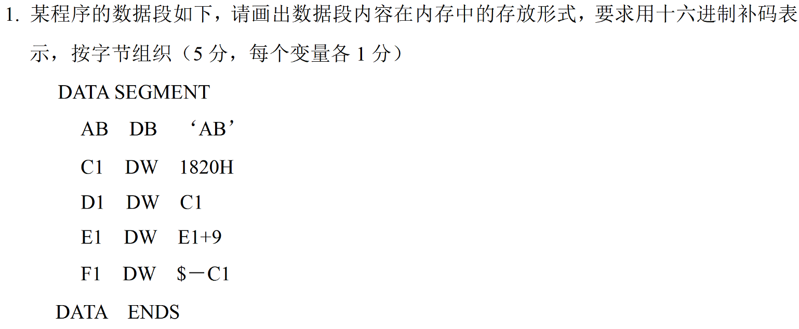


假设数据段的起始地址为`DS:0000H`（这里`DS`为数据段寄存器），按照字节组织，数据在内存中的存放如下：

| 内存地址（DS:偏移量） | 内容（十六进制补码表示） | 说明 |
| ---- | ---- | ---- |
| 0000H | 41H | `AB`变量的第一个字符`'A'`的ASCII码 |
| 0001H | 42H | `AB`变量的第二个字符`'B'`的ASCII码 |
| 0002H | 20H | `C1`变量的低字节 |
| 0003H | 18H | `C1`变量的高字节 |
| 0004H | 02H | `D1`变量，假设`C1`相对数据段起始地址的偏移为`0002H`，这里存储低字节 |
| 0005H | 00H | `D1`变量的高字节 |
| 0006H | XXH | `E1`变量，由于是向前引用`E1+9`，汇编时无法确定，先记为不确定值`XXH` |
| 0007H | XXH | `E1`变量的高字节 |
| 0008H | 06H | `F1`变量，假设数据段从`0000H`开始，`C1`在`0002H`，当前地址为`0008H`，则`$ - C1 = 0008H - 0002H = 06H`，存储低字节 |
| 0009H | 00H | `F1`变量的高字节 |


## 五 微机的存储器


### 5.1 存储器的分类与组成


#### 5.1.1 内存与外存（按连接方式）
- **内存（主存）**  
  - **特点**：高速、容量小、CPU直接访问。  
  - **实现**：**半导体存储器（RAM、ROM）**。  
  - **作用**：存储当前运行的程序和数据。


- **外存（辅存）**  
  - **特点**：低速、容量大、**需调入内存使用**。  
  - **实现**：磁/光存储设备（磁盘、光盘、SSD）。  
  - **作用**：存储非当前使用的程序和数据。  


#### 5.1.2 存储器的其他分类
| **分类依据**       | **类型**                                                                 |
|--------------------|--------------------------------------------------------------------------|
| **制造工艺**       | 双极型（速度快、功耗大）、MOS型（速度慢、集成度高）                     |
| **存储介质**       | 半导体存储器、磁存储器、光存储器                                        |
| **存取方式**       | 随机存取存储器（RAM）、只读存储器（ROM）、顺序存取存储器（磁带等）      |


#### 5.1.3 RAM与ROM的特性对比
| **特性**           | **RAM**                  | **ROM**                  |
|--------------------|--------------------------|--------------------------|
| **读写能力**       | 可读可写                 | 只读（编程后固定）       |
| **易失性**         | 断电丢失数据             | 断电不丢失               |
| **典型应用**       | 程序运行时临时存储       | 固件（如BIOS、引导程序） |
| **子类**           | SRAM、DRAM              | PROM、EPROM、EEPROM      |

---


### 5.2 半导体存储器芯片的结构


#### 5.2.1 核心组件
1. **存储体（存储矩阵）**  
   - **功能**：存储二进制数据。  
   - **结构**：由多个存储单元构成，每个单元存储1位或多位数据。  
2. **地址译码电路**  
   - **作用**：根据输入地址选中特定存储单元。  
   - **译码方式**：  
     - **单译码**：适用于小容量存储器，直接译码所有地址线。  
     - **双译码**：行译码+列译码，减少译码器复杂度，适用于大容量存储器。  
3. **控制逻辑**  
   - **片选信号（CS/CE）**：选中芯片进行读写。  
   - **读写控制（OE、WE）**：控制数据的输入/输出（OE为输出使能，WE为写使能）。  


#### 5.2.2 存储容量计算
- **公式**：`容量 = 存储单元数 × 存储单元位数 = 2^M × N`  
  - **M**：地址线数量。  
  - **N**：数据线数量。  
- **示例**：  
  - 地址线10根（A0~A9）+ 数据线8根（D0~D7） → 容量为 `2^10 × 8 = 1KB`。  


这样计算芯片存储容量，背后道理基于地址线和数据线的功能特性：
1. **地址线决定存储单元数量**
地址线用于传输地址信号，以选定存储芯片中的特定存储单元 。1根地址线有0、1两种状态，可对应2个存储单元；2根地址线有00、01、10、11四种状态，对应 \(2^2\) 个存储单元；以此类推，M根地址线的状态组合数为 \(2^M\) ，所以能表示 \(2^M\) 个不同存储单元，即地址线根数M决定了存储单元的数量为 \(2^M\)  。 
2. **数据线决定存储单元位数**
数据线用于传输数据 ，每根数据线每次传输1位二进制数据 。N根数据线，一次就能传输N位数据 ，这就意味着每个存储单元可存储N位二进制数 ，即数据线根数N决定了存储单元的位数 。 
3. **容量计算原理**
芯片存储容量本质是存储单元数量与每个存储单元存储位数的乘积 。存储单元数量由地址线决定为 \(2^M\) ，每个存储单元位数由数据线决定为N ，所以芯片的存储容量 = \(2^M×N\)  ，也就是存储单元数×存储单元的位数。 

---


### 5.3 随机存取存储器（RAM）

**SRAM和DRAM通常是MOS型**


#### 5.3.1 静态RAM（SRAM）
- **存储单元**：基于触发器电路，6晶体管结构。  
- **特点**：  
  - 无需刷新，速度快，功耗较高。  
  - 用于高速缓存（Cache）。  
  - SRAM的基本存储单元是触发器电路，每个基本存储单元存储二进制数一位
  - 许多个基本存储单元形成行列存储矩阵
  - SRAM一般采用“字结构”存储矩阵：每个存储单元存放多位（4、8、16等）
  - 每个存储单元具有一个地址
  
  
- **示例芯片**：6116（2K×8位）  
  - **引脚**：11位地址线（A0~A10）、8位数据线、片选（CE）、读写控制（OE、WE）。  

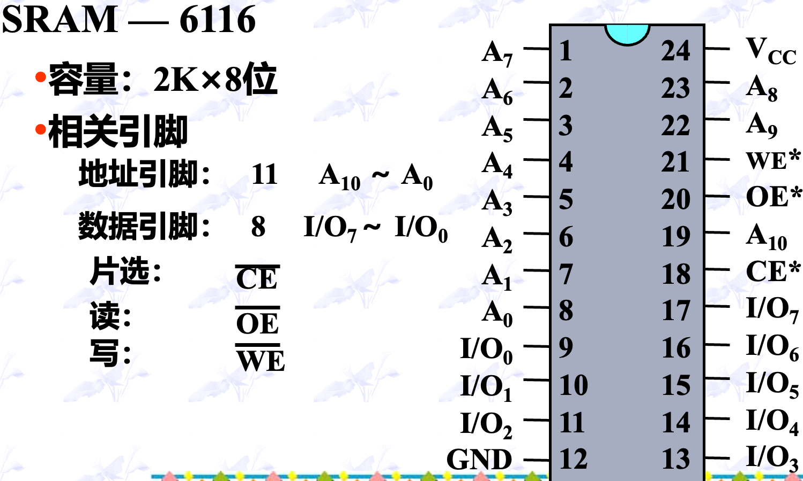


#### 5.3.2 动态RAM（DRAM）
- **存储单元**：基于电容存储电荷，1晶体管+电容结构。  
- **特点**：  
  - 需要周期性刷新（防电容漏电），集成度高，成本低。  
  - 用于主存（如DDR4内存条）。  
  - DRAM一般采用“位结构”存储体：
  - 每个存储单元存放一位
  - 需要8个存储芯片构成一个字节单元
  - 每个字节存储单元具有一个地址
  
- **示例芯片**：2116（16K×1位）  
  - **引脚**：分时复用地址线（行地址+列地址）、RAS（行选通）、CAS（列选通）。  


+ 存储地址需要分两批传送，行地址选通信号RAS*有效，开始传送行地址
+ 随后，列地址选通信号CAS*有效，传送列地址，CAS*相当于片选信号
+ 读写信号WE*读有效
+ 数据从DOUT引脚输出

---

### 5.4 只读存储器（ROM）

#### 5.4.1 ROM类型
| **类型**   | **编程方式**                        | **擦除方式**               | **应用场景**               |
|------------|-------------------------------------|---------------------------|---------------------------|
| **掩膜ROM** | 出厂时写入，不可更改              | 不可擦除                  | 批量生产的固定程序        |
| **PROM**   | 用户一次性编程（熔断丝）          | 不可擦除                  | 定制化设备                |
| **EPROM**  | 紫外光擦除，可重复编程            | 紫外光照射（10~30分钟）   | 固件升级（需专用编程器）  |
| **EEPROM** | 电信号擦写，支持在线操作          | 加电擦除                  | 频繁修改的小容量数据存储  |


#### 5.4.2 EPROM芯片示例：2716（2K×8位）
- **特点**：顶部有石英窗口，紫外光擦除。  
- **引脚**：  
  - 11位地址线（A0~A10）、8位数据线、片选（CS）、编程电压（VPP）。  

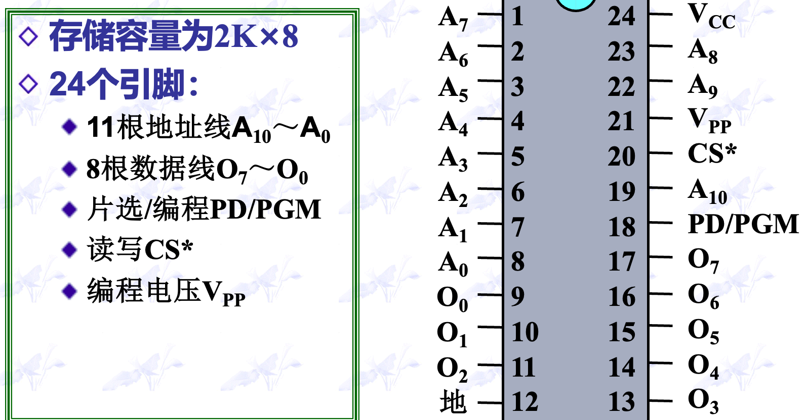


---

### 5.5 存储器的连接


#### 5.5.1 容量扩展方法

1. **位扩展**  
   - **目标**：增加数据位宽（如多片1位芯片拼成8位）。  
   - **方法**：各芯片数据线分别连接数据总线的不同位，地址线和控制线并联。  
   - **示例**：8片1K×1芯片 → 1K×8存储器。
  
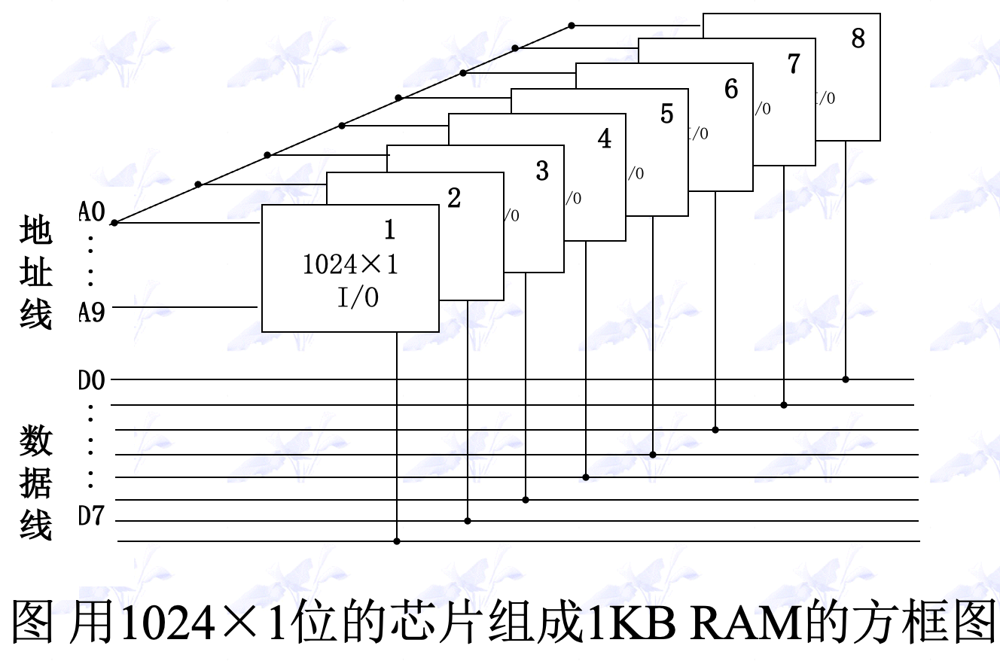

1. **地址扩展**  
   - **目标**：增加存储单元数量（如多片8位芯片拼成更大容量）。  
   - **方法**：使用译码器（如74LS138）生成片选信号，分配不同的地址范围。  
   - **示例**：4片16K×8芯片 → 64K×8存储器。  

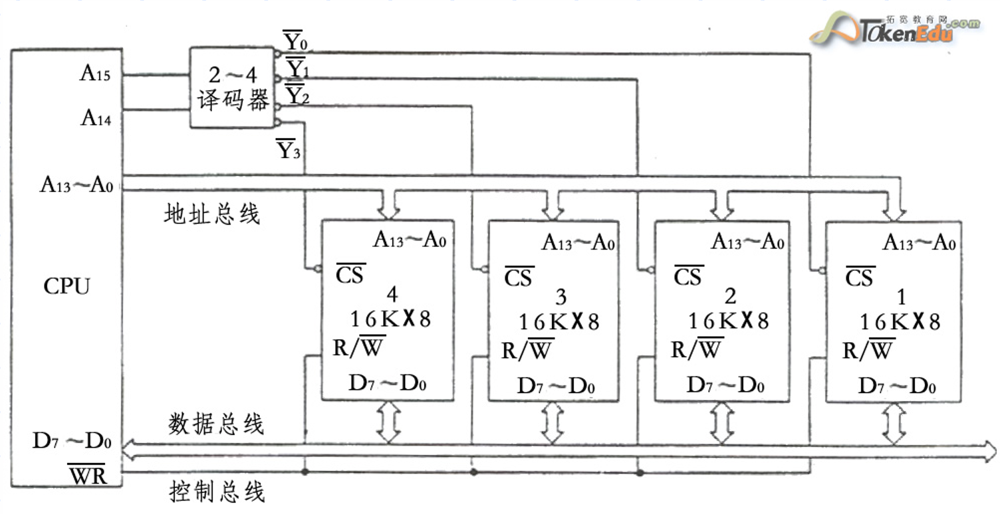

#### 5.5.2 连接CPU的关键步骤

1. **数据线连接**：芯片数据线直连CPU数据总线（如D0~D7）。  
2. **地址线连接**：低位地址线接芯片地址引脚，高位地址线用于片选译码。  
3. **控制信号连接**：  
   - **片选（CS）接译码器输出**。  
   - 读写控制（OE、WE）接CPU的读写信号。  

**示例电路**：  
使用3-8译码器将两片6116 SRAM映射至地址范围 `7C000H~7CFFFH`。  

---

### 5.6 新型存储器

#### 5.6.1 主要类型
| **类型**        | **特点**                                                                 |
|-----------------|--------------------------------------------------------------------------|
| **CDRAM**       | 集成高速缓存（Cache）的DRAM，减少访问延迟。                             |
| **DRDRAM**      | 采用Rambus总线技术，高带宽（如Intel Pentium 4时代内存）。               |
| **DDR DRAM**    | 双倍数据速率，每个时钟周期传输两次数据（如DDR4、DDR5）。                 |
| **VCM**         | 虚拟通道技术，优化多任务访问效率。                                      |
| **FCRAM**       | 快速循环结构，适用于网络设备等需要低延迟的场景。                        |

---

### 5.7 磁表面存储器与光盘存储器

#### 5.7.1 磁表面存储器（硬盘）
- **原理**：利用磁头改变磁性介质的磁化方向存储数据。  
- **结构**：  
  - **磁头**：读写数据。  
  - **盘片**：涂覆磁性材料的金属/玻璃盘。  
  - **马达**：驱动盘片高速旋转（7200 RPM）。  
- **类型**：HDD（机械硬盘）、SSD（固态硬盘）。  

#### 5.7.2 光盘存储器
- **原理**：激光照射盘面，通过反射光强变化读取数据（凹坑与平面代表0/1）。  
- **类型**：  
  - **只读光盘**：CD-ROM、DVD-ROM。  
  - **一次性刻录光盘**：CD-R、DVD-R。  
  - **可擦写光盘**：CD-RW、DVD-RAM。  

---

### 5.8 关键总结


#### 5.8.1 存储器核心参数对比
| **参数**         | **SRAM**          | **DRAM**           | **ROM**            |
|------------------|--------------------|---------------------|---------------------|
| **速度**         | 快（无需刷新）    | 较慢（需刷新）      | 中（读取时间固定） |
| **功耗**         | 高                 | 低                  | 极低               |
| **集成度**       | 低                 | 高                  | 高                 |
| **典型应用**     | 高速缓存（Cache） | 主内存（内存条）   | 固件存储           |


#### 5.8.2 存储器扩展技术
- **位扩展**：增加数据位宽（芯片数据线并联）。  
- **地址扩展**：增加存储单元数量（通过译码器生成片选信号）。  

---


## 六 输入输出与中断


### 6.1 输入输出接口概述

#### 6.1.1 接口电路的基本结构

- **核心组件**：  
  - **数据寄存器**：存储外设与CPU交互的数据。  
  - **状态寄存器**：保存外设状态（如是否就绪）。  
  - **控制寄存器**：配置外设工作模式（如启动/停止）。  
- **端口类型**：  
  - **数据端口**：存放实际数据。  
  - **状态端口**：反馈设备状态。  
  - **控制端口**：发送控制命令。  

#### 6.1.2 I/O指令与端口编址
- **8086/8088的I/O指令**：  
  ```assembly
  IN AL, 60H     ; 从端口60H读取数据到AL
  OUT 80H, AL    ; 将AL数据写入端口80H
  ```
- **编址方式**：  
  - **独立编址**：I/O端口与内存地址空间分离（64K端口）。  
  - **端口号范围**：0000H~FFFFH。  

---

### 6.2 CPU与外设数据传送方式

#### 6.2.1 无条件传送（同步传送）
- **适用场景**：外设状态固定且稳定（如LED、按键）。  
- **特点**：无需查询状态，直接传输。  
- **示例**：  
  ```assembly
  MOV AL, DATA   ; 数据准备
  OUT PORT, AL   ; 直接输出到端口
  ```


#### 6.2.2 查询传送（异步传送）
- **流程**：  
  1. **查询状态**：检测外设是否就绪（如`IN AL, STATUS_PORT`）。  
  2. **数据传输**：就绪后执行数据读写。  
- **代码示例（输入）**：  
  ```assembly
  POLL:  IN AL, STATUS_PORT  ; 读取状态
         TEST AL, 80H        ; 检测D7位是否为1（就绪）
         JZ POLL             ; 未就绪则循环查询
         IN AL, DATA_PORT    ; 读取数据
  ```
- **特点**：可靠性高，但效率低（需轮询等待）。  


#### 6.2.3 中断传送
- **流程**：  
  - **中断请求**：外设主动触发中断信号。  
  - **响应中断**：CPU暂停当前任务，跳转至中断服务程序（ISR）。  
  - **中断返回**：执行完毕后恢复原任务。  
- **优势**：  
  - CPU与外设并行工作，无需轮询。  
  - 实时性强，适用于紧急事件处理。  


#### 6.2.4 DMA传送（直接存储器存取）
- **特点**：  
  - 由DMA控制器（如8237）接管总线，实现外设与内存高速传输。  
  - 适用于大数据块传输（如硬盘、显卡）。  
- **流程**：  
  1. **请求总线**：外设通过DMAC向CPU申请总线控制权。  
  2. **数据传输**：DMAC直接管理内存与外设间的数据流。  
  3. **释放总线**：传输完成后返还总线控制权给CPU。  

---


### 6.3 中断机制详解


#### 6.3.1 中断处理流程
1. **中断请求**：外设通过INTR（Interrupt Request）或NMI（Non - Maskable Interrupt）引脚发起。  
2. **中断响应**：  
   - 检测到有效请求且CPU内部开中断（IF=1，Interrupt Flag）。  
   - 完成当前指令后保存现场（FLAGS、CS、IP压栈）。  
3. **中断服务程序（ISR）（Interrupt Service Routine）**：  
   - 执行设备特定操作（如数据读写）。  
   - 结尾需恢复现场（IRET（Interrupt Return）指令）。


#### 6.3.2 中断向量表
- **位置**：内存最低1KB（00000H~003FFH）。  
- **结构**：  
  - 每个中断类型号对应4字节入口地址（CS:IP）。  
  - **公式**：入口地址存放位置 = 中断类型号 × 4。  
- **示例**：  
  - 类型号21H的入口地址存放在0000:0084H~0000:0087H。  


#### 6.3.3 中断优先级与嵌套
- **优先级**：  
  - 内部中断 > NMI > INTR > 单步中断。  
  - 多个中断请求时，优先级高的先响应。  
- **中断嵌套**：  
  - 允许高优先级中断打断低优先级ISR（Interrupt Service Routine）。  
  - ISR需在适当位置开中断（STI指令）。  


---

### 6.4 8086/8088中断系统

#### 6.4.1 中断分类
| **类型**       | **触发方式**                  | **典型应用**                   |
|----------------|------------------------------|--------------------------------|
| **内部中断（软件中断）**   | 指令触发（INT n）或异常       | 软件调试、系统调用             |
| **外部中断（硬件中断）**   | INTR（可屏蔽）、NMI（不可屏蔽）| 硬件事件（如键盘、定时器）     |


##### 外部中断

**外部中断的引入**
+ 由CPU的NMI引脚引入不可屏蔽中断请求
  + 边沿触发方式，上升沿有效
  + CPU执行完当前指令后立即响应
  + 统只允许一个不可屏蔽中断源
+ 由CPU的INTR引脚引入可屏蔽中断请求
  + 电平触发方式，高电平有效
  + CPU执行完当前指令后，若内部开中断则响应
  + CPU只有一个INTR引脚，但系统允许多个可屏蔽中断源，由中断控制器管理。


**CPU对可屏蔽中断的响应过程**

1. 两个中断响应周期：CPU读取中断类型号n
2. 一个写总线周期:FLAGS内容入栈
3. 清IF和TF位：关中断及禁止单步中断
4. 两个写总线周期：保护断点
5. 两个读总线周期：中断服务入口地址送IP、CS
6. 中断处理及返回


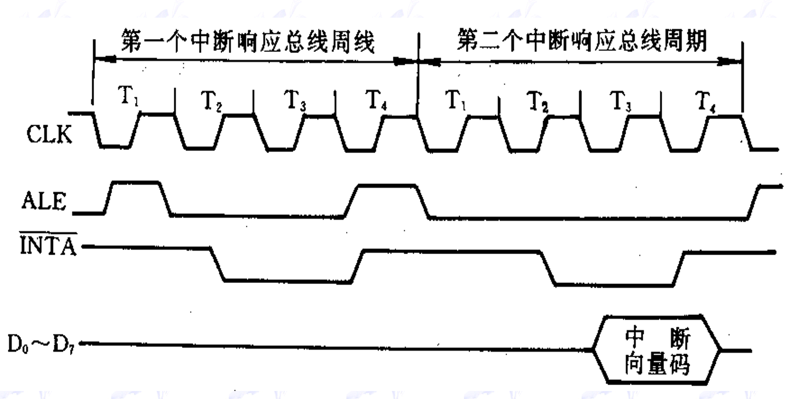

+ CLK（时钟信号 ）
CLK是系统的基本时钟信号，为整个系统的操作提供时间基准。图中的 \( T_1 - T_4 \) 是时钟周期，用于划分和同步总线操作的不同阶段 。一个总线周期通常包含若干个时钟周期，不同的操作在相应的时钟周期内完成。 

+ ALE（地址锁存允许信号 ）
ALE是输出信号。在总线周期的 \( T_1 \) 状态时，ALE有效（一般为高电平 ），它的作用是将CPU输出到地址总线上的地址信息锁存到外部地址锁存器中。这样可以保证在后续总线周期中，地址信息稳定，以便进行数据传输等操作 。在中断响应过程中，ALE用于锁存与中断响应相关的地址信息 。

+ \(\overline{INTA}\)（中断响应信号 ）
\(\overline{INTA}\) 是CPU发出的低电平有效的中断响应信号 。在中断响应时，CPU通过连续两个中断响应总线周期发出 \(\overline{INTA}\) 信号 。第一个 \(\overline{INTA}\) 信号通知中断源，告知其CPU已响应中断，第二个 \(\overline{INTA}\) 信号用于让中断源将中断向量码（中断类型号 ）送到数据总线上供CPU读取 。 

+ \(D_0 - D_7\)（数据总线 ）
数据总线用于在CPU和其他部件之间传输数据。在中断响应的第二个总线周期中，中断源通过 \(D_0 - D_7\) 将中断向量码发送给CPU 。CPU读取该中断向量码后，可根据它找到对应的中断处理程序入口地址 。 


##### 内部中断
**除了单步中断以外，所有内部中断都不能被屏蔽**


**内部中断响应过程中不执行中断响应总线周期：**
对于内部中断（软件中断 ），如 INT n 指令、断点中断、溢出中断、除法出错中断、单步中断等，其触发是由执行指令或指令执行结果导致 。与可屏蔽中断不同，内部中断不需要通过外部硬件中断源申请并经中断响应总线周期来获取中断类型号。内部中断的类型号是固定的或由指令指定（如 INT n 指令中的 n ），所以不需要执行上述中断响应总线周期去获取中断类型号。


**什么是单步中断？**    
单步中断是每条指令执行结束后产生的中断（当 TF = 1 时 ）。在中断处理过程中，若不禁止单步中断，每条指令执行完都会触发单步中断，使中断处理过程变得极为复杂且混乱，严重影响处理效率。禁止单步中断可让中断处理程序按正常流程执行 。


+ 在执行单步中断服务程序时CPU自动将FLAGS寄存器内容入栈，并清IF和TF，因此中断服务程序期间非单步。中断子程序结束时，自动恢复FLAGS，又转入单步。
+ 如何对TF标志置位或复位？


```
PUSHF     ;FLAGS入栈
POP AX       ;FLAGS→AX
AND AX,OFEFEH     ;置TF=0
PUSH AX     ;新标志值入栈
POPF       ;新标志值-> FLAGS
```


**内部中断的其他步骤和外部中断是一致的。**


 


#### 6.4.2 中断类型号分配
- **固定中断**：  
  - **INT 0**：除法错误。  
  - **INT 1**：单步中断。  
  - **INT 3**：断点中断。
  - **INT 4**：溢出中断。  
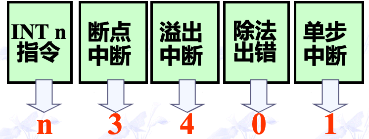

- **可编程中断**：通过8259A控制器管理（IRQ0~IRQ7）。  


#### 6.4.3 8086中断响应流程
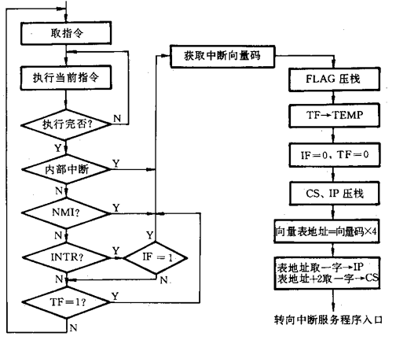


1. **指令执行阶段**：CPU先进行取指令操作，然后执行当前指令。执行完指令后，判断指令是否执行完毕。若未执行完，继续执行；若执行完，进入中断判断流程。
2. **内部中断判断**：判断是否为内部中断（如INT n指令、断点中断等 ）。若是，直接获取中断向量码，进入中断处理流程；若不是，继续下一步判断。 
3. **非屏蔽中断（NMI）判断**：判断是否有非屏蔽中断请求。非屏蔽中断优先级高且不可屏蔽，若有NMI请求，获取中断向量码，进入中断处理流程；若没有，继续下一步判断。 
4. **可屏蔽中断（INTR）判断**：判断是否有可屏蔽中断请求（INTR ），同时检查中断允许标志位IF是否为1（即CPU是否允许响应可屏蔽中断 ）。若INTR有请求且IF = 1 ，获取中断向量码，进入中断处理流程；若不满足条件，继续下一步判断。 
5. **单步中断判断**：检查单步标志位TF是否为1 。若TF = 1 ，表示是单步中断，获取中断向量码，进入中断处理流程；若TF ≠ 1 ，则返回继续取指令执行。 
6. **中断处理流程** ：
    - 获取中断向量码后，将标志寄存器FLAG压栈保存。
    - 将TF值暂存到TEMP中，然后将中断允许标志位IF和单步标志位TF都清0 ，防止处理中断时被新中断干扰。 
    - 将代码段寄存器CS和指令指针寄存器IP压栈，保存断点。
    - 根据中断向量码计算向量表地址（向量表地址 = 向量码×4 ）。
    - 从向量表地址取一字内容送IP ，从向量表地址 + 2取一字内容送CS ，从而获取中断服务程序入口地址，转向中断服务程序入口执行中断处理。 


---

### 6.5 中断服务程序设计

#### 6.5.1 关键步骤

1. **保护现场**：保存寄存器内容（PUSH指令）。  
2. **处理中断**：执行设备相关操作（如读取数据）。  
3. **恢复现场**：恢复寄存器内容（POP指令）。  
4. **中断返回**：通过IRET指令恢复CS:IP和FLAGS。  


#### 6.5.2 示例代码（数据采集系统）
```assembly
START:  MOV DL, 0F8H        ; 设置初始通道和控制信号
        MOV AX, SEGDSTOR    ; 设置数据缓冲区段地址
        MOV ES, AX
        LEA DI, DSTOR       ; 设置缓冲区偏移地址
AGAIN:  MOV AL, DL
        OUT 04H, AL         ; 启动A/D转换
POLL:   IN AL, 02H          ; 查询转换状态
        TEST AL, 01H        ; 检测就绪标志（D0位）
        JZ POLL             ; 未就绪则继续查询
        IN AL, 03H          ; 读取转换结果
        STOSB               ; 存储到缓冲区
        INC DL              ; 切换至下一通道
        JNZ AGAIN           ; 循环至所有通道完成
```

---

### 6.6 DMA传送方式对比与总结

#### 6.6.1 DMA传送概述
1. 外设、DMAC和CPU三者通过应答信号（HOLD和HLDA）建立联系：CPU将总线交给DMAC控制
2. DMA传送
DMA读存储器：存储器 → 外设      
DMA写存储器：存储器 ← 外设    
   


#### 6.6.2 数据传送方式对比
| **方式**       | **优点**                   | **缺点**               | **适用场景**           |
|----------------|--------------------------|----------------------|-----------------------|
| **无条件传送** | 实现简单，实时性强         | 外设必须随时就绪     | 简单设备（LED、按键） |
| **查询传送**   | 可靠性高                   | CPU利用率低          | 低速外设（打印机）    |
| **中断传送**   | 高效并行，实时响应         | 频繁中断开销大       | 实时系统（传感器）    |
| **DMA传送**    | 高速传输，不占用CPU时间    | 需要专用硬件支持     | 大数据块（磁盘I/O）  |


#### 6.6.3 关键术语速查表
- **中断向量**：指向ISR入口地址的指针。  
- **IRET**：中断返回指令，恢复现场并返原程序。  
- **8259A**：中断控制器，管理多级中断优先级。  
- **HLDA**：总线保持响应信号，用于DMA控制权切换。  

---
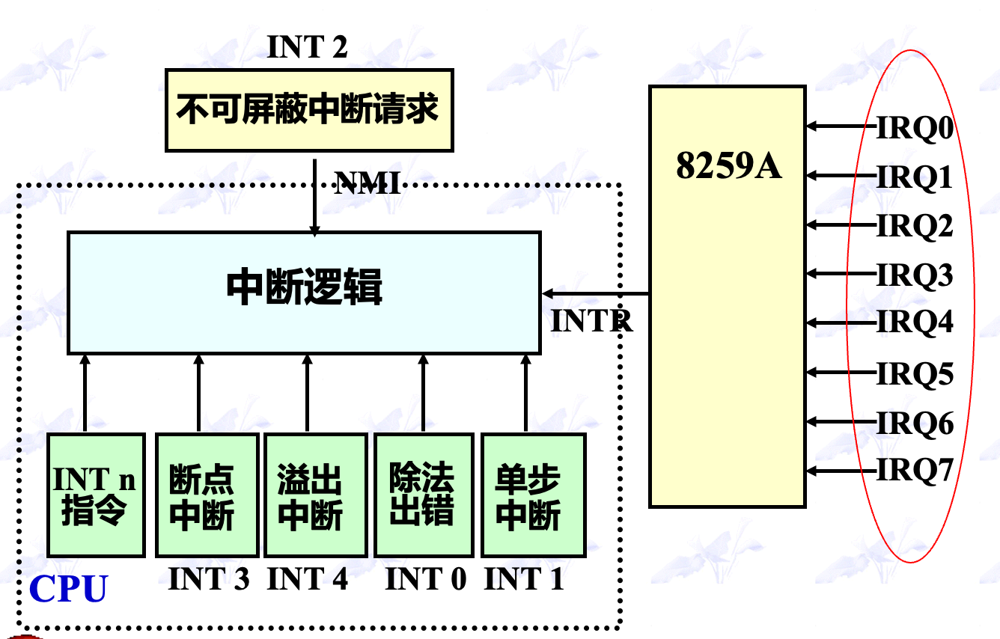


